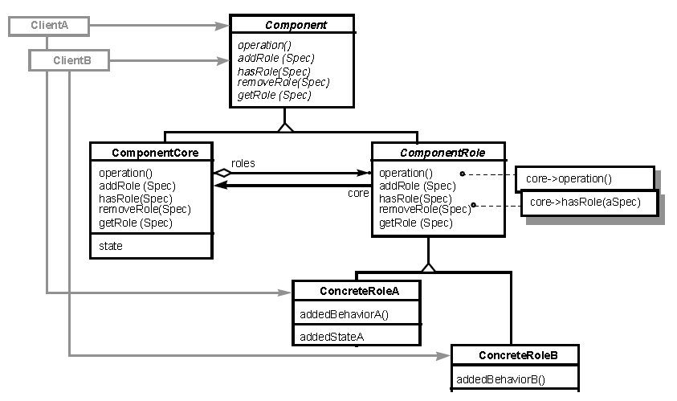

**索引**

-   意图

-   结构

-   参与者

-   适用性

-   效果

-   相关模式

-   实现

    -   实现方式（一）：Role Object 的示例实现。

**意图**

通过明确地附加角色对象到目标对象中，以使对象可以适配不同的客户需求。每个角色对象都代表着目标对象在客户上下文中的一种角色。每种上下文都存在于特定的应用程序中，因此可使对象在不同的应用程序间解耦。

Adapt an object to different client’s needs through transparently attached role
objects, each one representing a role the object has to play in that client’s
context. Each context may be its own application, which therefore gets decoupled
from the other applications.

**结构**

**参与者**

Component

-   定义关键的抽象接口。

-   定义添加、删除、测试和查询角色对象的接口协议。Client 可以指定一个
    specification 来获取一个 ConcreteRole 实例。

ComponentCore

-   实现 Component 接口，包括角色管理协议。

-   负责创建 ConcreteRole 实例。

-   管理角色对象。

ComponentRole

-   存储一个经过装饰的 ComponentCore 对象的引用。

-   实现 Component 接口，并将接口请求转发到 ComponentCore 中。

ConcreteRole

-   定义和实现特定上下文的 Component 接口的实现。

-   构造函数包含一个 ComponentCore 参数。

Client

-   请求协作对象。

**适用性**

当以下情况成立时可以使用 Role Object 模式：

-   你需要在不同的客户上下文间保持关键的抽象定义，每种抽象定义的实现都存在于其特定的应用范围内，同时你不想将这些与客户上下文相关的接口耦合在同一个接口内。

-   你需要能够动态的处理角色，以便可以在运行时按需的添加或移除角色，而不是在编译时使用固定的对象定义。

-   你需要保持角色与客户成对儿关系，在不同的角色与客户对之间保持独立性，当更改一个角色时并不影响其他客户。

**效果**

-   可以简洁地定义对象的关键抽象。Component
    接口仅需关注必要的状态的行为，而不会涉及具体上下文中的职责。

-   角色对象易于演进，彼此之间保持独立。

-   角色对象可以动态的添加和移除。

-   应用程序可以更好的解耦和。

**相关模式**

-   Decorator 模式与 Role Object 模式有着类似的结构，但行为不同。Decorator
    模式使开发人员可以对一个对象进行链式的装饰，而 Role Object
    模式则不允许这样。并且，Decorator 通常不会扩大对象的功能，而 Role Object
    会引入新的操作。

-   Extension Object
    模式也在解决类似的问题，通过对对象的扩展来满足特定的客户上下文的需求。尽管如此，Extension
    Object 并没有考虑透明性（Transparently），即保持对象关键抽象（Key
    Abstraction）的定义，而 Role Object 则正是强调了这一点。

**实现**

**实现方式（一）：Role Object 的示例实现。**

复制代码

1 namespace RoleObjectPattern.Implementation1 2 { 3 public abstract class
Customer 4 { 5 public abstract CustomerRole GetRole(string spec); 6 public
abstract void AddRole(string spec); 7 public abstract void RemoveRole(string
spec); 8 public abstract bool HasRole(string spec); 9 public abstract void
SomeCommonOperation1(); 10 } 11 12 public class CustomerCore : Customer 13 { 14
private Dictionary\<string, CustomerRole\> \_roles 15 = new Dictionary\<string,
CustomerRole\>(); 16 private CustomerRoleFactory \_roleFactory; 17 18 public
CustomerCore(CustomerRoleFactory roleFactory) 19 { 20 \_roleFactory =
roleFactory; 21 } 22 23 public override CustomerRole GetRole(string spec) 24 {
25 if (\_roles.ContainsKey(spec)) 26 return \_roles[spec]; 27 else 28 return
null; 29 } 30 31 public override void AddRole(string spec) 32 { 33 CustomerRole
role = GetRole(spec); 34 if (role == null) 35 { 36 role =
\_roleFactory.CreateRole(spec, this); 37 if (role != null) 38 { 39
\_roles.Add(spec, role); 40 } 41 } 42 } 43 44 public override void
RemoveRole(string spec) 45 { 46 \_roles.Remove(spec); 47 } 48 49 public override
bool HasRole(string spec) 50 { 51 return \_roles.ContainsKey(spec); 52 } 53 54
public override void SomeCommonOperation1() 55 { 56 // do some business logic 57
} 58 } 59 60 public class CustomerRole : Customer 61 { 62 private CustomerCore
\_decoratedCore; 63 64 public CustomerRole(CustomerCore core) 65 { 66
\_decoratedCore = core; 67 } 68 69 public override CustomerRole GetRole(string
spec) 70 { 71 return \_decoratedCore.GetRole(spec); 72 } 73 74 public override
void AddRole(string spec) 75 { 76 \_decoratedCore.AddRole(spec); 77 } 78 79
public override void RemoveRole(string spec) 80 { 81
\_decoratedCore.RemoveRole(spec); 82 } 83 84 public override bool HasRole(string
spec) 85 { 86 return \_decoratedCore.HasRole(spec); 87 } 88 89 public override
void SomeCommonOperation1() 90 { 91 \_decoratedCore.SomeCommonOperation1(); 92 }
93 } 94 95 public class Borrower : CustomerRole 96 { 97 public
Borrower(CustomerCore core) 98 : base(core) 99 { 100 } 101 102 public void
SomeOperationForBorrower() 103 { 104 // do something for borrower105 } 106 } 107
108 public class Investor : CustomerRole 109 { 110 public Investor(CustomerCore
core) 111 : base(core)112 { 113 } 114 115 public void SomeOperationForInvestor()
116 { 117 // do something for investor118 } 119 } 120 121 public class
CustomerRoleFactory 122 { 123 public CustomerRole CreateRole(string spec,
CustomerCore core) 124 { 125 CustomerRole newRole = null;126 127 if (spec ==
"Borrower")128 { 129 newRole = new Borrower(core); 130 } 131 else if (spec ==
"Investor")132 { 133 newRole = new Investor(core); 134 } 135 136 return newRole;
137 } 138 } 139 140 public class Client 141 { 142 public void TestCase1() 143 {
144 Customer customer = new CustomerCore(new CustomerRoleFactory()); 145
customer.AddRole("Borrower");146 customer.AddRole("Investor");147 148
CustomerRole customerRole1 = customer.GetRole("Borrower");149 Borrower borrower
= (Borrower)customerRole1; 150 borrower.SomeCommonOperation1(); 151
borrower.SomeOperationForBorrower(); 152 153 CustomerRole customerRole2 =
customer.GetRole("Investor");154 Investor investor = (Investor)customerRole2;
155 investor.SomeCommonOperation1(); 156 investor.SomeOperationForInvestor();
157 } 158 } 159 }
