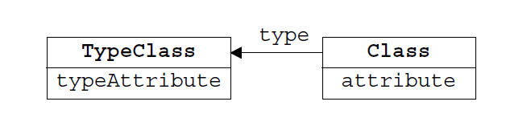
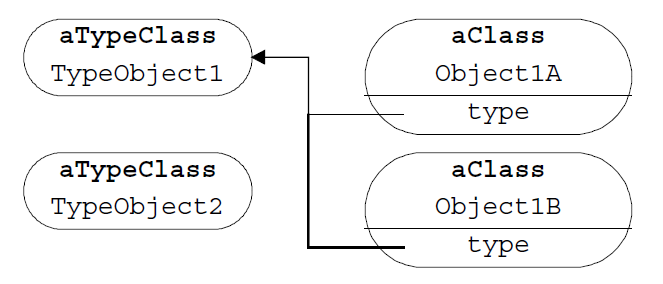

**索引**

-   意图

-   结构

-   参与者

-   适用性

-   效果

-   相关模式

-   实现

    -   实现方式（一）：Type Object 的经典介绍。

    -   实现方式（二）：Type Object 在游戏设计中的使用。

**意图**

允许在运行时动态灵活的创建新的 "类"，而这些类的实例代表着一种不同的对象类型。

Allow the flexible creation of new “classes” by creating a single class, each
instance of which represents a different type of object.

**结构**

Type Object
模式包含两个具体类。一个用于描述对象，另一个用于描述类型。每个对象都包含一个指向其类型的指针。

**参与者**

TypeClass

-   是 TypeObject 的种类。

-   每个种类都会有一个单独的类。

TypeObject

-   是 TypeClass 的实例。

-   代表着一种对象。定义一种对象所包含的属性和行为。

**适用性**

当以下情况成立时可以使用 Type Object 模式：

-   类的实例需要根据它们的通用属性或者行为进行分组。

-   类需要为每个分组定义一个子类来实现该分组的通用属性和行为。

-   类需要大量的子类或者多种变化的子类甚至无法预期子类的变化。

-   你需要有能力在运行时创建一些无法在设计阶段预测的新的分组。

-   你需要有能力在类已经被实例化的条件下更改一个对象的子类。

**效果**

-   运行时创建新的类型对象。

-   避免子类膨胀。

-   客户程序无需了解实例与类型的分离。

-   可以动态的更改类型。

**相关模式**

-   Type Object 模式有些类似于
    [Strategy ](http://www.cnblogs.com/gaochundong/p/design_pattern_strategy.html)和
    [State ](http://www.cnblogs.com/gaochundong/p/design_pattern_state.html)模式。这三种模式都是通过将对象内部的一些行为代理到外部的对象中。Stategy
    和 State 通常是纯行为的代理，而 Type Object 则包含更多个共享数据状态。State
    可以被频繁的更改，Type Object 则很少被改变。Strategy
    通常仅包含一个职责，Type Object 则通常包含多个职责。

-   Type Object 的实现与
    [Bridge ](http://www.cnblogs.com/gaochundong/p/design_pattern_bridge.html)模式中的
    Abstraction 和 Implementor 的关系很像。区别在于，客户程序可以与 Type Object
    直接协作，而不会直接与 Implementor 进行交互。

-   Type Object 有点像
    [Flyweight ](http://www.cnblogs.com/gaochundong/p/design_pattern_flyweight.html)一样处理它的对象。两个对象使用相同的
    Type Object 可能看起来是使用的各自的实例，但实际是共享的对象。

-   Type Object 可以解决多个对象共享数据和行为的问题。类似的问题也可以用
    [Prototype ](http://www.cnblogs.com/gaochundong/p/design_pattern_prototype.html)模式来解决。

**实现**

**实现方式（一）：Type Object 的经典介绍。**

-   **TypeClass** - Movie

-   **TypeObject** - Star Wars, The Terminator, Independence Day

-   **Class** - Videotape

-   **Object** - John's Star Wars, Sue's Star Wars

复制代码

1 namespace TypeObjectPattern.Implementation1 2 { 3 public class Movie 4 { 5
public string Title { get; set; } 6 public float RentalPrice { get; set; } 7 } 8
9 public class Videotape 10 { 11 public Videotape(Movie movie) 12 { 13
this.Movie = movie;14 } 15 16 public Movie Movie { get; private set; }17 18
public Customer Renter { get; private set; }19 public bool IsRented { get;
private set; }20 21 public void RentTo(Customer customer) 22 { 23 IsRented =
true;24 Renter = customer; 25 Renter.ChargeForRental(this.Movie.RentalPrice);26
} 27 } 28 29 public class Customer 30 { 31 public string Name { get; set; }32 33
public void ChargeForRental(float rental) 34 { 35 // pay money36 } 37 } 38 39
public class Client 40 { 41 public void TestCase1() 42 { 43 Customer john = new
Customer() { Name = "John" }; 44 Customer sue = new Customer() { Name = "Sue" };
45 46 Movie starWars = new Movie() 47 { 48 Title = "Star Wars",49 RentalPrice =
100,50 }; 51 Movie terminator = new Movie() 52 { 53 Title = "The Terminator",54
RentalPrice = 200,55 }; 56 57 Videotape starWarsVideotapeForJohn = new
Videotape(starWars); 58 starWarsVideotapeForJohn.RentTo(john); 59 60 Videotape
starWarsVideotapeForSue = new Videotape(starWars); 61
starWarsVideotapeForSue.RentTo(john); 62 63 Videotape terminatorVideotapeForJohn
= new Videotape(terminator); 64 terminatorVideotapeForJohn.RentTo(john); 65 } 66
} 67 }

复制代码

**实现方式（二）：Type Object 在游戏设计中的使用。**

想象我们正在制作在一个虚拟角色扮演游戏。我们的任务是设计一些邪恶的怪兽(Monster)来试图杀掉我们的英雄(Hero)。怪兽有着一些不同的属性，例如生命值（Health）、攻击力（Attacks）、图像、声音等，但以举例为目的我们仅考虑前两个属性。

游戏中的每个怪兽都有自己的生命值。生命值从满血开始，每次怪兽被创伤，生命值减少。怪兽会有一个用于描述攻击的字符串，当怪兽攻击英雄时，这个字符串会被显示到用户屏幕上。

游戏设计师告诉我们，怪兽会有不同的品种（Breed），例如：猛龙（Dragon）和巨魔（Troll）。每个怪兽品种都描述了一种怪兽，在一个场景下会有多个同一种的怪兽遍布在地牢（Dungeon）中。

怪兽的品种（Breed）决定的怪兽的起始生命值，比如猛龙（Dragon）的生命值会比巨魔（Troll）的高，以使猛龙更难被杀掉。同时，同一个品种的怪兽的攻击字符串也是相同的。

通过典型的 OO 设计，我们能得到下面这段代码：

复制代码

1 namespace TypeObjectPattern.Implementation2 2 { 3 public abstract class
Monster 4 { 5 public Monster(int startingHealth) 6 { 7 Health = startingHealth;
8 } 9 10 public int Health { get; private set; }11 public abstract string
AttackString { get; }12 } 13 14 public class Dragon : Monster 15 { 16 public
Dragon() 17 : base(500)18 { 19 } 20 21 public override string AttackString 22 {
23 get { return "The dragon breathes fire!"; }24 } 25 } 26 27 public class Troll
: Monster 28 { 29 public Troll() 30 : base(300)31 { 32 } 33 34 public override
string AttackString 35 { 36 get { return "The troll clubs you!"; }37 } 38 } 39
40 public class Client 41 { 42 public void TestCase2() 43 { 44 Monster dragon =
new Dragon(); 45 Monster troll = new Troll(); 46 } 47 } 48 }

复制代码

这段代码浅显易懂，使用继承的方式设计类的层级结构。一个 Dragon 是一个
Monster，满足了 "is a" 的关系。每一个怪物的品种都会用一个子类来实现。

如果游戏中有成百上千的怪物种类，则类的继承关系变得庞大。同时也意味着，增加新的怪物品种就需要增加新的子类代码。

这是可以工作的，但并不是唯一的选择。我们可以尝试另外一种架构。

因为变化较多的部分是品种（Breed）的属性配置，包括生命值和攻击字符串。

所以我们可以将品种（Breed）抽取成单独的类，每个怪物类（Monster）包含一个品种类（Breed）。

Breed 类用于定义 Monster 的 "type"。每一个 Breed 的实例描述着一种 Monster
对象的概念上的 "type"。

复制代码

1 namespace TypeObjectPattern.Implementation3 2 { 3 public class Breed 4 { 5
public int Health { get; set; } 6 public string AttackString { get; set; } 7 } 8
9 public class Monster 10 { 11 private Breed \_breed; 12 13 public Monster(Breed
breed) 14 { 15 \_breed = breed; 16 } 17 18 public int Health 19 { 20 get {
return \_breed.Health; } 21 } 22 23 public string AttackString 24 { 25 get {
return \_breed.AttackString; } 26 } 27 } 28 29 public class Client 30 { 31
public void TestCase3() 32 { 33 Breed dragonBreed = new Breed() 34 { 35 Health =
500,36 AttackString = "The dragon breathes fire!",37 }; 38 Breed trollBreed =
new Breed() 39 { 40 Health = 300,41 AttackString = "The troll clubs you!",42 };
43 44 Monster dragon = new Monster(dragonBreed); 45 Monster breed = new
Monster(trollBreed); 46 } 47 } 48 }

复制代码

Type Object
在这里的优势在于，我们可以定义新的类型的怪物，而不用修改代码。并且可以在运行时动态生成新的对象和修改对象的属性。
