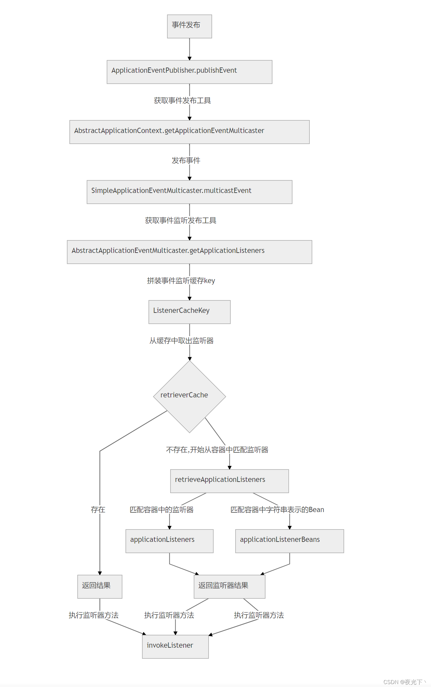

# 事件驱动和订阅发布模式

## 1 事件驱动/订阅发布模式

> 参考文献：https://blog.csdn.net/weixin_46058921/article/details/126978976

### 简介

事件驱动一个常见的形式就是 发布-订阅 模式，在跨进程的通信间，我们常常使用 消息队列 来实现消息的发布订阅。目前主流的框架中，均采用消息的 发布-订阅 模式来进行大型分布式项目的解耦。使得数据生产方和发送方分离，同时 MQ 还能起到削峰的作用。同一进程内很多时候也需要这种事件驱动机制来进行解耦


### 原理

事件机制主要由三个部分组成：事件源、事件对象、监听器

* 事件源（订阅发布模式中的发布者）：事件发生的起源
* 事件对象（观察者模式中的主题）：事件实体，事件对象会持有一个事件源
* 监听器（观察者模式中的观察者、订阅发布模式中的订阅者）：监听事件对象，对事件对象进行处理
* 事件分发器（复杂事件模型中负责将将事件源发出的时间触发订阅者的行为，决定了是同步行为还是异步行为）


## 2 Java事件驱动


Java 提供了关于事件相关的两个接口：

* EventObject：事件对象，自定义事件需要继承该类
* EventListener：事件监听器接口


由于事件源 Source 不需要实现任何接口，所以 Java 中没有给出相应的定义

一个利用 Java 原生实现事件的例子：

* 事件。观察者模式中的主题。

```Java
import java.util.EventObject;
 
/**
 * @Author: chenyang
 * @DateTime: 2022/9/21 10:08
 * @Description: 事件对象
 */
public class JavaEvent extends EventObject {
 
    private String msg;
 
 
    /**
     * Constructs a prototypical Event.
     *
     * @param source The object on which the Event initially occurred.
     * @throws IllegalArgumentException if source is null.
     */
    public JavaEvent(Object source, String msg) {
        super(source);
        this.msg = msg;
    }
 
    public String getMsg() {
        return msg;
    }
}
```

* 事件监听器。观察者模式中的观察者、订阅发布模式中的订阅者

```
import com.yang.common.event.JavaEvent;
import java.util.EventListener;
 
/**
 * @Author: chenyang
 * @DateTime: 2022/9/21 10:09
 * @Description: 事件监听者，按照 Java 规范应实现 EventListener 接口
 */
public class JavaListener implements EventListener {
 
    public void handlerEvent(JavaEvent event){
        System.out.println("Java Event msg : " + event.getMsg());
    }
}
```

* 事件源发布事件

```java
import com.yang.common.event.JavaEvent;
import com.yang.common.listener.JavaListener;
import java.util.EventListener;
import java.util.HashSet;
 
/**
 * @Author: chenyang
 * @DateTime: 2022/9/21 10:12
 * @Description: 事件源
 */
public class JavaSource {
    private static HashSet<EventListener> set = new HashSet<>();
 
    public void addListener(EventListener listener){
        set.add(listener);
    }
 
    public void publishEvent(JavaEvent event){
        for (EventListener listener : set) {
            ((JavaListener)listener).handlerEvent(event);
      
        }
    }
}
```

* 组装并触发事件

```java
public class Main {
    public static void main(String[] args) {
        JavaSource source = new JavaSource();
        JavaListener listener = new JavaListener();
        source.addListener(listener);
        source.publishEvent(new JavaEvent(source, "SAY MY NAME !!!"));
    }
}
```

## 3 Spring事件驱动

Spring 提供了事件相关的接口和类，在 Spring 中可以通过实现接口来实现事件的 发布-订阅。Spring 的事件机制是以 Java 的事件机制为基础按需进行了扩展。

Spring 中与事件相关的定义如下：

* ApplicationEvent：继承 ObjectEvent 类，事件源应该继承该类。

* ApplicationListener：事件监听者，该类接受一个泛型，供 ApplicationEventPublisher 在发布事件时选择 EventListener。

* ApplicationEventPublisher：封装发布事件的方法，通知所有在 Spring 中注册的该事件的监听者进行处理。

* ApplicationEventPublisherAware：Spring 提供的 Aware 接口之一，实现该接口的 Bean 可以获取 ApplicationEventPublisher 并进行发布事件。

### 通过继承ApplicationEventPublisherAware发布事件

* 实现事件对象Event。观察者模式中的主题

```java
import org.springframework.context.ApplicationEvent;
 
/**
 * @Author: chenyang
 * @DateTime: 2022/9/21 11:07
 * @Description: 事件对象
 */
public class SpringEventAware extends ApplicationEvent {
 
    private String msg;
 
    public SpringEventAware(Object source, String msg) {
        super(source);
        this.msg = msg;
    }
 
    public SpringEventAware(Object source) {
        super(source);
    }
 
    public String getMsg() {
        return msg;
    }
}
```

* 创建监听器。观察者模式中的观察者，订阅发布模式中的订阅者。

```java
import com.yang.common.event.SpringEvent;
import org.springframework.context.ApplicationListener;
import org.springframework.stereotype.Component;
 
/**
 * @Author: chenyang
 * @DateTime: 2022/9/21 11:08
 * @Description: 事件监听者，事件监听者实现ApplicationListener<E extends ApplicationEvent>, 交由 Spring 进行管理,无需自己进行监听器的注册与通知过程
 */
@Component
public class SpringListenerAware implements ApplicationListener<SpringEventAware> {
    @Override
    public void onApplicationEvent(SpringEventAware event) {
        System.out.println("publish event, msg is : " + event.getMsg());
    }
}
```

* 事件源。观察者模式中的发布者。

```java
import com.yang.common.event.SpringEvent;
import org.springframework.context.ApplicationEventPublisher;
import org.springframework.context.ApplicationEventPublisherAware;
import org.springframework.stereotype.Component;
 
/**
 * @Author: chenyang
 * @DateTime: 2022/9/21 11:09
 * @Description: 事件源
 */
@Component
public class SpringPublishAware implements ApplicationEventPublisherAware {
 
    private ApplicationEventPublisher applicationEventPublisher;
 
    public void publishEvent(String msg){
        applicationEventPublisher.publishEvent(new SpringEventAware(this, msg));
    }
 
    @Override
    public void setApplicationEventPublisher(ApplicationEventPublisher applicationEventPublisher) {
        this.applicationEventPublisher = applicationEventPublisher;
    }
}


@Autowired
private SpringPublishAware springPublishAware;
 
@Test
void contextLoads2() {
    springPublishAware.publishEvent("通过 Spring 实现发布订阅");
}
```

### 通过注入ApplicationEventPublisher发布事件

* 事件。观察者模式中的主题

```java
@Data
public class Task {
    private String name;
    private String address;
}
 
 
public class SpringEvent extends ApplicationEvent {
    private Task task;
 
    public SpringEvent(Task task) {
        super(task);
        this.task = task;
    }
 
    public Task getTask() {
        return task;
    }
}
```

* 事件监听器。观察者、订阅者。

```java
@Component
public class SpringListener implements ApplicationListener<SpringEvent> {
    @Override
    public void onApplicationEvent(SpringEvent event) {
        Task task = event.getTask();
        System.err.println("事件接受任务");
        System.err.println(task);
        System.err.println("任务完成");
    }
}
```

* 事件源。通过注入对象发布事件。

```java
@Autowired
private ApplicationEventPublisher publisher;

@Test
void contextLoads3() {
    Task task = new Task();
    task.setName("admin");
    task.setAddress("unknown area");
    SpringEvent event = new SpringEvent(task);
    System.out.println("开始发布任务");
    publisher.publishEvent(event);
    System.out.println("发布任务完成");
}
```


以上代码中，可以看到。在 Spring 框架使用事件与在 Java 中使用时间机制其实并没有什么不同，均由 事件源、事件对象以及事件监听者组成。与 Java 原生提供的事件机制不同的是，Spring 中提供了 ApplicationEvent 类作为基类，开发者可以以此为基础定义自己的自定义事件。

    在 Spring 中，继承自 ApplicationEvent 的事件对象的监听者，可以由 Spring 容器进行管理，并在发布时通过 ApplicationEventPublisher 进行发布。这就避免了我们自己实现监听者的注册和通知过程，免去了很多繁杂的过程，使得更专心于业务本身。

## 4 Spring事件分发框架原理

### ApplicationEvent

* ApplicationEvent 继承了 JDK 中的事件对象 EventObject，在 Spring 中所有事件对象均应继承自 ApplicationEvent。在Spring基础上，其增加了事件发生时的时间戳属性以及序列化ID，并提供了通过事件源进行构建的构造方法。 Spring 中的 ApplicationEvent 设置成抽象类，由于一个单独的 ApplicationEvent 是没有任何语义的，所以需要根据不同场景进行扩展，在其之上为事件赋予意义。此类的说明中，作者也很好的说明了这一点。

```java
/**
 * Class to be extended by all application events. Abstract as it
 * doesn't make sense for generic events to be published directly.
 *
 * @author Rod Johnson
 * @author Juergen Hoeller
 */
public abstract class ApplicationEvent extends EventObject {
 
    /** use serialVersionUID from Spring 1.2 for interoperability */
    private static final long serialVersionUID = 7099057708183571937L;
 
    /** System time when the event happened */
    private final long timestamp;
 
 
    /**
     * Create a new ApplicationEvent.
     * @param source the object on which the event initially occurred (never {@code null})
     */
    public ApplicationEvent(Object source) {
        super(source);
        this.timestamp = System.currentTimeMillis();
    }
 
 
    /**
     * Return the system time in milliseconds when the event happened.
     */
    public final long getTimestamp() {
        return this.timestamp;
    }
}
```


### EventListener

* JDK 中提供了 EventListener 接口，作为事件监听者标记。Spring 在 EventListener 接口的基础上，提供了 ApplicationListener 接口。该接口接收一个 ApplicationEvent 的子类，完成事件的监听流程。具体源代码如下ApplicationEvent 继承了 JDK 中的事件对象 EventObject，在 Spring 中所有事件对象均应继承自 ApplicationEvent。在Spring基础上，其增加了事件发生时的时间戳属性以及序列化ID，并提供了通过事件源进行构建的构造方法。 Spring 中的 ApplicationEvent 设置成抽象类，由于一个单独的 ApplicationEvent 是没有任何语义的，所以需要根据不同场景进行扩展，在其之上为事件赋予意义。此类的说明中，作者也很好的说明了这。该接口是一个函数型接口，提供了一个 `onApplicationEvent(E extends Application)` 方法定义，所有自行实现的监听者均需要实现该接口，并在该方法中进行事件的处理。

```java

/**
 * Interface to be implemented by application event listeners.
 * Based on the standard {@code java.util.EventListener} interface
 * for the Observer design pattern.
 *
 * <p>As of Spring 3.0, an ApplicationListener can generically declare the event type
 * that it is interested in. When registered with a Spring ApplicationContext, events
 * will be filtered accordingly, with the listener getting invoked for matching event
 * objects only.
 *
 * @author Rod Johnson
 * @author Juergen Hoeller
 * @param <E> the specific ApplicationEvent subclass to listen to
 * @see org.springframework.context.event.ApplicationEventMulticaster
 */
@FunctionalInterface
public interface ApplicationListener<E extends ApplicationEvent> extends EventListener {
 
    /**
     * Handle an application event.
     * @param event the event to respond to
     */
    void onApplicationEvent(E event);
 
}
```

### ApplicationEventMulticast

ApplicationEventMulticaster是Spring中事件核心，通知中心，负责将指定的事件类型发布给订阅者。主要包括以下内容。提供一个发布事件的接口multicastEvent

* 构建并维护事件类型和监听器关系。
* 解析事件类型resolveDefaultEventType
* 根据事件类型获取监听器列表getApplicationListeners。
* 实现了事件执行器。事件执行器可以有多种：同步执行器、异步执行器、消息队列异步执行器

```java
@Override
public void multicastEvent(final ApplicationEvent event, @Nullable ResolvableType eventType) {
   ResolvableType type = (eventType != null ? eventType : resolveDefaultEventType(event));
   Executor executor = getTaskExecutor();
   for (ApplicationListener<?> listener : getApplicationListeners(event, type)) {
      if (executor != null) {
         executor.execute(() -> invokeListener(listener, event));
      }
      else {
         invokeListener(listener, event);
      }
   }
}


protected Collection<ApplicationListener<?>> getApplicationListeners(
      ApplicationEvent event, ResolvableType eventType) {
 
   Object source = event.getSource();
   Class<?> sourceType = (source != null ? source.getClass() : null);
   ListenerCacheKey cacheKey = new ListenerCacheKey(eventType, sourceType);
 
   // Potential new retriever to populate
   CachedListenerRetriever newRetriever = null;
 
   // Quick check for existing entry on ConcurrentHashMap
   CachedListenerRetriever existingRetriever = this.retrieverCache.get(cacheKey);
   if (existingRetriever == null) {
      // Caching a new ListenerRetriever if possible
      if (this.beanClassLoader == null ||
            (ClassUtils.isCacheSafe(event.getClass(), this.beanClassLoader) &&
                  (sourceType == null || ClassUtils.isCacheSafe(sourceType, this.beanClassLoader)))) {
         newRetriever = new CachedListenerRetriever();
         existingRetriever = this.retrieverCache.putIfAbsent(cacheKey, newRetriever);
         if (existingRetriever != null) {
            newRetriever = null;  // no need to populate it in retrieveApplicationListeners
         }
      }
   }
 
   if (existingRetriever != null) {
      Collection<ApplicationListener<?>> result = existingRetriever.getApplicationListeners();
      if (result != null) {
         return result;
      }
      // If result is null, the existing retriever is not fully populated yet by another thread.
      // Proceed like caching wasn't possible for this current local attempt.
   }
 
   return retrieveApplicationListeners(eventType, sourceType, newRetriever);
}

```

大致流程： 通过时间类型和事件中的数据源类型，构建一个缓存key，先去缓存中获取有无此key对应的事件处理器。 如果不存在则构建一个新的 `ListenerRetriever`,然后调用 `retrieveApplicationListeners`方法获得监听的listener

此处以 SimpleApplicationEventMulticaster 中的方法定义为例，作为默认注入的类型，通常我们在默认情况下的事件发布流程均遵循该实现。 从程序中可以看出，multicastEvent的主要逻辑可以分为三部分：

* 获取事件类型，主要用来获得Spring Event的实际类型。resolveDefaultEventType(event))

* getApplicationListeners(event, type)根据事件和事件类型去获得此事件和事件类型的监听器

* 遍历监听者集合，通过 multicaster 内持有的 Executor 进行通知，此处最后调用了 ApplicationListener 中的 onApplicationEvent 方法，这一方法正是我们在自定义 ApplicationListener 时必须要覆写的方法。


### 自动注册事件监听关系

* Spring 中，不需要我们手动进行监听器注册。ApplicationListener 对象一旦在 Spring 容器中被注册，Spring 会进行监听器的注册，实现事件的监听。在介绍监听者注册流程之前，
* 首先需要介绍介绍一下org.springframework.context.event.ApplicationEventMulticaster，其主要定义了管理事件监听者，与发布事件到监听者的相关操作，若没有定义，Spring 容器将默认实例化 SimpleApplicationEventMulticaster 。
* 在 Spring 中，初始化容器时会调用 org.springframework.context.ConfigurableApplicationContext 接口中的 reFresh() 方法进行 Bean的加载，该方法会进行事件的监听注册。具体代码如下：

  * 调用 `initApplicationEventMulticaster()` 方法初始化一个 ApplicationEventMulticaster，默认情况下初始化为 SimpleApplicationEventMulticaster。
  * 调用 `registerListeners()` 方法进行事件监听者的注册。

```java
@Override
public void refresh() throws BeansException, IllegalStateException {
   synchronized (this.startupShutdownMonitor) {
      StartupStep contextRefresh = this.applicationStartup.start("spring.context.refresh");
 
      // Prepare this context for refreshing.
      prepareRefresh();
 
      // Tell the subclass to refresh the internal bean factory.
      ConfigurableListableBeanFactory beanFactory = obtainFreshBeanFactory();
 
      // Prepare the bean factory for use in this context.
      prepareBeanFactory(beanFactory);
 
      try {
         // Allows post-processing of the bean factory in context subclasses.
         postProcessBeanFactory(beanFactory);
 
         StartupStep beanPostProcess = this.applicationStartup.start("spring.context.beans.post-process");
         // Invoke factory processors registered as beans in the context.
         invokeBeanFactoryPostProcessors(beanFactory);
 
         // Register bean processors that intercept bean creation.
         registerBeanPostProcessors(beanFactory);
         beanPostProcess.end();
 
         // Initialize message source for this context.
         initMessageSource();
 
         // Initialize event multicaster for this context.
         initApplicationEventMulticaster();
 
         // Initialize other special beans in specific context subclasses.
         onRefresh();
 
         // Check for listener beans and register them.
         registerListeners();
 
         // Instantiate all remaining (non-lazy-init) singletons.
         finishBeanFactoryInitialization(beanFactory);
 
         // Last step: publish corresponding event.
         finishRefresh();
      }
 
      catch (BeansException ex) {
         if (logger.isWarnEnabled()) {
            logger.warn("Exception encountered during context initialization - " +
                  "cancelling refresh attempt: " + ex);
         }
 
         // Destroy already created singletons to avoid dangling resources.
         destroyBeans();
 
         // Reset 'active' flag.
         cancelRefresh(ex);
 
         // Propagate exception to caller.
         throw ex;
      }
 
      finally {
         // Reset common introspection caches in Spring's core, since we
         // might not ever need metadata for singleton beans anymore...
         resetCommonCaches();
         contextRefresh.end();
      }
   }
}
	protected void initApplicationEventMulticaster() {
		ConfigurableListableBeanFactory beanFactory = getBeanFactory();
		if (beanFactory.containsLocalBean(APPLICATION_EVENT_MULTICASTER_BEAN_NAME)) {
			this.applicationEventMulticaster =
					beanFactory.getBean(APPLICATION_EVENT_MULTICASTER_BEAN_NAME, ApplicationEventMulticaster.class);
			if (logger.isTraceEnabled()) {
				logger.trace("Using ApplicationEventMulticaster [" + this.applicationEventMulticaster + "]");
			}
		}
		else {
			this.applicationEventMulticaster = new SimpleApplicationEventMulticaster(beanFactory);
			beanFactory.registerSingleton(APPLICATION_EVENT_MULTICASTER_BEAN_NAME, this.applicationEventMulticaster);
			if (logger.isTraceEnabled()) {
				logger.trace("No '" + APPLICATION_EVENT_MULTICASTER_BEAN_NAME + "' bean, using " +
						"[" + this.applicationEventMulticaster.getClass().getSimpleName() + "]");
			}
		}
	}

	protected void registerListeners() {
		// Register statically specified listeners first.
		for (ApplicationListener<?> listener : getApplicationListeners()) {
			getApplicationEventMulticaster().addApplicationListener(listener);
		}

		// Do not initialize FactoryBeans here: We need to leave all regular beans
		// uninitialized to let post-processors apply to them!
		String[] listenerBeanNames = getBeanNamesForType(ApplicationListener.class, true, false);
		for (String listenerBeanName : listenerBeanNames) {
			getApplicationEventMulticaster().addApplicationListenerBean(listenerBeanName);
		}

		// Publish early application events now that we finally have a multicaster...
		Set<ApplicationEvent> earlyEventsToProcess = this.earlyApplicationEvents;
		this.earlyApplicationEvents = null;
		if (!CollectionUtils.isEmpty(earlyEventsToProcess)) {
			for (ApplicationEvent earlyEvent : earlyEventsToProcess) {
				getApplicationEventMulticaster().multicastEvent(earlyEvent);
			}
		}
	}
```


由上文代码可见，注册监听者的过程主要可以分为以下三部分：

* 添加容器中指定的监听器，通常这部分添加的监听器由 Spring 控制；
* 从 BeanFactory 中获取全部实现了 ApplicationListener 接口的 BeanNames，并把其推送给 ApplicationEventMulticaster
* 若有需要立即执行的事件，直接执行这些事件的发布


### 事件发布的流程如下

