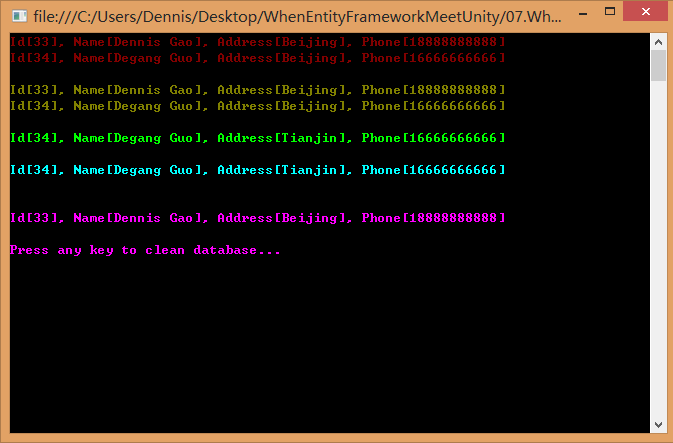
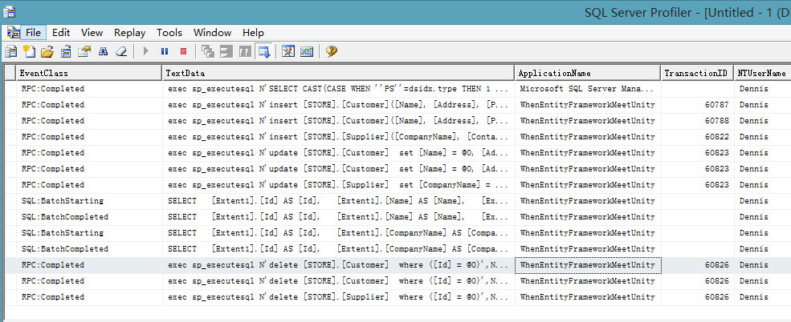

EntityFramework用法探索（四）Repository和UnitOfWork

以上一篇CodeFirst生成代码为基础，继续探索使用方式。

引入[Repository模式](http://msdn.microsoft.com/en-us/library/ff649690.aspx)，定义最简单的IRepository接口，仅包含增删改查接口，

复制代码

1 public interface IRepository\<T\> 2 where T : class3 { 4 IQueryable\<T\>
Query(); 5 void Insert(T entity); 6 void Update(T entity); 7 void Delete(T
entity); 8 }

复制代码

引入[UnitOfWork模式](http://martinfowler.com/eaaCatalog/unitOfWork.html)，因为EntityFramework会负责失败回滚，所以此处只定义提交方法。

1 public interface IUnitOfWork 2 { 3 void Commit(); 4 }

实现IRepository接口，

复制代码

1 public class Repository\<T\> : IRepository\<T\> where T : class 2 { 3 private
readonly IObjectSetFactory \_objectSetFactory; 4 private readonly
IObjectSet\<T\> \_objectSet; 5 6 public Repository(IObjectSetFactory
objectSetFactory) 7 { 8 \_objectSetFactory = objectSetFactory; 9 \_objectSet =
objectSetFactory.CreateObjectSet\<T\>(); 10 } 11 12 \#region IRepository\<T\>
Members 13 14 public IQueryable\<T\> Query() 15 { 16 return \_objectSet; 17 } 18
19 public void Insert(T entity) 20 { 21 \_objectSet.AddObject(entity); 22 } 23
24 public void Update(T entity) 25 { 26 \_objectSet.Attach(entity); 27
\_objectSetFactory.ChangeObjectState(entity, EntityState.Modified); 28 } 29 30
public void Delete(T entity) 31 { 32 \_objectSet.DeleteObject(entity); 33 } 34
35 \#endregion36 }

复制代码

实现IUnitOfWork接口，

复制代码

1 public class UnitOfWork : IUnitOfWork, IDisposable 2 { 3 private readonly
IObjectContext \_objectContext; 4 5 public UnitOfWork(IObjectContext
objectContext) 6 { 7 \_objectContext = objectContext; 8 } 9 10 \#region
IUnitOfWork Members 11 12 public void Commit() 13 { 14
\_objectContext.SaveChanges(); 15 } 16 17 \#endregion18 19 \#region IDisposable
Members 20 21 public void Dispose() 22 { 23 if (\_objectContext != null)24 { 25
\_objectContext.Dispose(); 26 } 27 28 GC.SuppressFinalize(this);29 } 30 31
\#endregion32 }

复制代码

CustomerRepository类的实现需要做一些配置，

复制代码

1 public CustomerRepository() 2 { 3 Mapper.CreateMap\<DomainModels.Customer,
Customer\>(); 4 Mapper.CreateMap\<Customer, DomainModels.Customer\>(); 5 6
DbContext context = new RETAILContext(); 7 DbContextAdapter contextAdaptor = new
DbContextAdapter(context); 8 9 IObjectSetFactory objectSetFactory =
contextAdaptor; 10 \_repository = new Repository\<Customer\>(objectSetFactory);
11 12 IObjectContext objectContext = contextAdaptor; 13 \_uow = new
UnitOfWork(objectContext); 14 }

复制代码

则具体增删改查的逻辑实现，

复制代码

1 public void InsertCustomer(DomainModels.Customer customer) 2 { 3 Customer
entity = Mapper.Map\<DomainModels.Customer, Customer\>(customer); 4 5
\_repository.Insert(entity); 6 \_uow.Commit(); 7 8 customer.Id = entity.Id; 9 }
10 11 public void UpdateCustomer(DomainModels.Customer customer) 12 { 13
Customer entity = \_repository.Query().Single(c =\> c.Id == customer.Id); 14 15
entity.Name = customer.Name; 16 entity.Address = customer.Address; 17
entity.Phone = customer.Phone; 18 19 \_repository.Update(entity); 20 21
\_uow.Commit(); 22 }

复制代码

在同样的示例下仍然可以工作，

复制代码

1 ICustomerRepository customerRepository = new CustomerRepository(); 2 3 //
=============== 增 =============== 4 Console.ForegroundColor =
ConsoleColor.DarkRed; 5 6 DomainModels.Customer customer1 = new
DomainModels.Customer() 7 { 8 Name = "Dennis Gao", 9 Address = "Beijing",10
Phone = "18888888888",11 }; 12 customerRepository.InsertCustomer(customer1); 13
Console.WriteLine(customer1);

复制代码

同时，UnitOfWork可以保证相关的业务操作在同一个Transaction中，

**完整代码和索引**

EntityFramework用法探索系列

-   （一）DatabaseFirst

-   （二）CodeFirst

-   （三）CodeFirst流畅API

-   （四）Repository和UnitOfWork

-   （五）引入Unity

-   （六）静态Repository

-   （七）线程安全实践

-   （八）事务处理

完整代码下载
