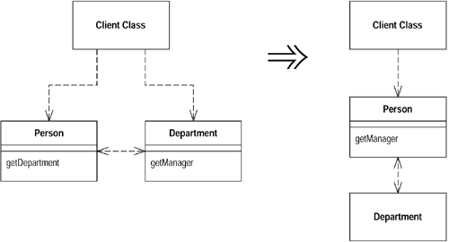

# 3 在对象之间搬移特性

## 1 Move Method（搬移函数）
如果某个函数使用另一个对象的次数比使用自己所驻对像的次数多，就可以使用Move Method将函数搬移到另一个对象。当函数中用到了原来对象的属性时，搬移后可以把原来对象this作为入参。

### 重构示例7
```C
// 重构前
class Account {
public:    
    double OverdraftCharge()
    {
        if (m_type->IsPremium()) {
            double result = 10;
            if (m_dayOverdrawn > 7) {
                result += (m_dayOverdrawn - 7) * 0.85;
            }
            return result;
        }
        return m_dayOverdrawn * 1.75;
    }
  
    double BankCharge()
    {
        double result = 4.5;
        if (m_dayOverdrawn > 0) {
            result += OverdraftCharge();
        }
        return result;
    }
private:
    AccountType* m_type;
    int m_dayOverdrawn;
}
```
```C
// 重构后
class Account {
public:
    double BankCharge()
    {
        double result = 4.5;
        if (m_dayOverdrawn > 0) {
            result += m_type->OverdraftCharge(this);
        }
        return result;
    }
private:
    AccountType* m_type;
    int m_dayOverdrawn;
}

class AccountType {
public:
    double OverdraftCharge(Account* account)
    {
        if (IsPremium()) {
            double result = 10;
            if (account->GetDayOverdrawn() > 7) {
                result += (account->GetDayOverdrawn() - 7) * 0.85;
            }
            return result;
        }
        return account->GetDayOverdrawn() * 1.75;
    }    
}
```

## 2 Move Field（搬移字段）

与Move Method类似，对于一个字段，如果在其所驻类之外的另一个类中有更多函数使用了它，就可以使用Move Field将该字段搬移到另一个对象中。需要注意的是，搬移之后需要在新的类中提供该字段的访问函数，否则原对象就无法访问到该字段了。

## 3 Extract Class（提炼类）
当一个类所承担的责任太多时，就可以使用Extract Class手法，根据单一职责原则，将类的一些函数和字段抽离出来，封装成一个新的类。

### 重构示例8
```C
// 重构前
class Person {
public:
    string GetName() 
    {
        return m_name;
    }

    string GetTelephoneNumber()
    {
        return "(" + m_officeAreaCode + ") " + m_officeNumber;
    }

    string GetOfficeAreaCode()
    {
        return m_officeAreaCode;
    }

    string GetOfficeNumber()
    {
        return m_officeNumber;
    }
private:
    string m_name;
    string m_officeAreaCode;
    string m_officeNumber;
}
```
```C
// 重构后
class Person {
public:
    string GetName() 
    {
        return m_name;
    }

    string GetTelephoneNumber()
    {
        return m_officeTelephone->GetTelephoneNumner();
    }

    TelephoneNumber* GetOfficeTelephone()
    {
        return m_officeTelephone;
    }
private:
    string m_name;
    TelephoneNumber* m_officeTelephone;
}

class TelephoneNumber {
public:
    string GetTelephoneNumner()
    {
        return "(" + m_areaCode + ") " + m_number;
    }

    string GetAreaCode()
    {
        return m_areaCode;
    }

    string GetNumber()
    {
        return m_number;
    }
private:
    string m_areaCode;
    string m_number;
}
```

## 4 Inline Class（将类内联化）
Inline Class与Extract Class相反，如果某个类所做的事情太少以至于不值得作为一个类存在，则将这个类的所有属性/函数搬移到另一个类中，然后删除原来的类。

## 5 Hide Delegate（隐藏“委托关系”）
Hide Delegate可以防止信息泄漏，避免模块之间的耦合。如果某个Client先通过服务对象A的字段得到另一个对象B，然后调用对象B的函数，那么Client就必须知晓这一层的委托关系。这时就产生了信息的泄漏，对象A将对象B泄漏给了Client。如果委托关系变了，Client也必须跟着改变，这样模块之间的耦合就太多了。

在服务类上建立Client所需的所有函数，可以隐藏委托关系。




### 重构示例9
```C
// 重构前
class Person {
public:
    Department* GetDepartment()
    {
        return m_department;
    } 
private:
    Department* m_department;
}

class Department {
public:
    Person* GetManager()
    {
        return m_manager;
    }
private:
    Person* m_manager;
}
// 如果需要知道Person* john的经理是谁，必须先取得Department对象
manager = john->GetDepartment()->GetManager();
```
```C
// 重构后
class Person {
public:
    Person* GetManager()
    {
        return m_department->GetManager();
    }
private:
    Department* m_department;
}

class Department {
public:
    Person* GetManager()
    {
        return m_manager;
    }
private:
    Person* m_manager;
}
// 现在可以通过Person* john直接知道经理了
manager = john->GetManager();
```
## 6 Remove Middle Man（移除中间人）
该重构手法与Hide Delegate刚好相反，如果某个类做了过多的简单委托动作，则把该类移除，让客户端直接调用受托类。