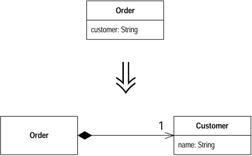
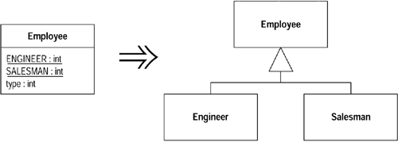
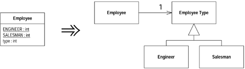

# 4 重新组织数据

## 1 Self Encapsulate Field（自封装字段）
直接访问一个字段，后面如果与该字段的耦合关系逐渐变得笨拙时，可以使用Self Encapsulate Field手法进行重构，为这个字段建立取值/设值函数，并且只以这些函数来访问字段。

### 重构示例10
```
// 重构前
class Range {
public:
    bool Includes(int arg)
    {
        return arg  >= m_low && arg <= m_high;
    }
private:
    int m_low;
    int m_high;
}
```
```
// 重构后
class Range {
public:
    bool Includes(int arg)
    {
        return arg  >= GetLow() && arg <= GetHigh();
    }
private:
    int GetLow()
    {
        return m_low;
    }
    int GetHigh()
    {
        return m_high;
    }
private:
    int m_low;
    int m_high;
}
```

应该更多的赋予对象业务行为函数而不是过多的使用getter/setter函数，否则对象就会变成领域驱动设计里面所提到的贫血模型。

## 2 Replace Data Value with Object（以对象取代数据值）
软件开发初期，你往往会以简单的基本类型来表示某一概念，随着开发的迭代，这些概念不再是简单的基本类型就能表示的，这时就需要使用Replace Data Value with Object进行重构，封装一个新的对象来取代原有的基本类型数据值。比如重构示例8中，刚开始使用一个字符串来表示“电话号码”的概念，但随后就会发现，电话号码需要“格式化”、“抽取区号”之类的特殊行为，这些就需要将“电话号码”封装成一个对象了。



> 更好的方法是在设计阶段对通用语言进行领域建模，并赋予对象业务行为函数，这样可以使复杂的系统更加清晰。


## 3 Replace Type Code with Subclasses（以子类取代类型码）
如果一个类中有一个不可变的类型码，而且它会影响到类的行为，这时就可以以子类来取代这个类型码。一般来说，这种情况的标志就是出现switch或if/else结构，它们检查类型码的值，并根据不同的值执行不同的动作。

Replace Type Code with Subclasses的好处在于，它把“对不同行为的了解”从类用户转移到了类自身。如果需要加入新的行为变化，只需添加一个子类即可。如果没有多态机制，就必须找到所有的条件表达式，并逐一修改它们。


### 重构示例11
```C
// 重构前
class Employee {
public:
    Employee(int type) : m_type(type) {}
    int GetType()
    {
        return m_type;
    }
public:
    static constexpr int ENGINEER = 0;
    static constexpr int SALESMAN = 1;
    static constexpr int MANAGER = 2;
private:
    int  m_type;
}
```
```C
// 重构后
class Employee {
public:
    static Employee* Create(int type)
    {
        switch (type) {
        case ENGINEER:
            return new Engineer;
        case SALESMAN:
            return new Salesman;
        case MANAGER:
            return new Manager;
        default:
            return nullptr;
        }
    }
    virtual int GetType() = 0;
private:
    Employee() = default;
public:
    static constexpr int ENGINEER = 0;
    static constexpr int SALESMAN = 1;
    static constexpr int MANAGER = 2;
}

class Engineer : public Employee {
public:
    int GetType() override
    {
        return Employee::ENGINEER;
    }
}
```
## 4 Replace Type Code with State/Strategy（以State/Strategy取代类型码）
如果一个类中有一个不可变的类型码，而且它会影响到类的行为，但是无法通过继承手法消除它时，就可以使用Replace Type Code with State/Strategy进行重构。如果是通过重构来简化一个算法，则Strategy模式比较合适；如果是打算搬移与状态相关的数据，而且把新建对象视为一种变迁状态，则State状态比较合适。


### 重构示例12
```
// 重构前
class Employee {
public:
    Employee(int type) : m_type(type) {}
    int GetType()
    {
        return m_type;
    }
    int PayAmount()
    {
        switch (m_type) {
            case ENGINEER:
                return m_monthlySalary;
            case SALESMAN:
                return m_monthlySalary + m_commission;
            case MANAGER:
                return m_monthlySalary + m_bonus;
            default:
            		return -1;
        }
    }
public:
    static constexpr int ENGINEER = 0;
    static constexpr int SALESMAN = 1;
    static constexpr int MANAGER = 2;
private:
    int  m_type;
}
```
```C
// 重构后
class Employee {
public:
    Employee(int type) : m_type(EmployeeType::ValueOf(type)) {}
    int GetType()
    {
        return m_type->GetTypeCode();
    }
    int PayAmount()
    {
        switch (GetType()) {
            case EmployeeType::ENGINEER:
                return m_monthlySalary;
            case EmployeeType::SALESMAN:
                return m_monthlySalary + m_commission;
            case EmployeeType::MANAGER:
                return m_monthlySalary + m_bonus;
            default:
                return -1;
        }
    }
private:
    EmployeeType*  m_type;
}

class EmployeeType {
public:
    static EmployeeType* ValueOf(int code)
    {
        switch (code) {
            case ENGINEER:
                return new Engineer;
            case SALESMAN:
                return new Salesman;
            case MANAGER:
                return new Manager;
            default:
                return nullptr;
        }       
    }
    virtual int GetTypeCode() = 0;
public:
    static constexpr int ENGINEER = 0;
    static constexpr int SALESMAN = 1;
    static constexpr int MANAGER = 2;
}

class Engineer : public EmployeeType {
public:
    int GetTypeCode() override
    {
        return EmployeeType::ENGINEER;
    }
}
```