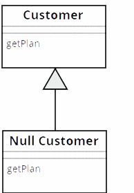

# 5 简化条件表达式

## 1 Decompose Conditional（分解条件表达式）
复杂的条件逻辑会降低代码的可读性，通过从if/else if/else三个段落中分别提炼出独立的函数，根据每一段落的用途命名函数，从而更清晰地表达自己的意图。

### 重构示例13

```
// 重构前
if (date.Before(SUMMER_START) || date.After(SUMMER_END)) {
    charge = quantity * m_winterRate + m_winterServiceCharge;
} else {
    charge = quantity * m_summerRate;
}
```
```C
// 重构后
if (NotSummer(date)) {
    charge = WinterCharge(quantity);
} else {
    charge = SummerCharge(quantity);
}

bool NotSummer(Date date)
{
    return date.Before(SUMMER_START) || date.After(SUMMER_END)
}

int WinterCharge(quantity)
{
    return quantity * m_winterRate + m_winterServiceCharge;
}

int SummerCharge(quantity)
{
    return quantity * m_summerRate;;
}
```

## 2 Consolidate Conditional Expression（合并条件表达式）
有时候，一系列的条件分支都得到相同的结果，可以用Consolidate Conditional Expression手法将这些条件分支合为一个条件表达式，并提炼成一个独立的函数。

### 重构示例14
```
// 重构前
double DisabilityAmount()
{
    if (m_seniority < 2) {
        return 0;
    }
    if (m_monthsDisabled > 12) {
        return 0;
    }
    if (m_isPartTime) {
        return 0;
    }
    // ...
}
```
```C
// 重构后
double DisabilityAmount()
{
    if (IsNotEligibleForDisability()) {
        return 0;
    }
    // ...
}

bool IsNotEligibleForDisability()
{
    return m_seniority < 2 || m_monthsDisabled > 12 || m_isPartTime;
}
```
## 3 Consolidate Duplicate Conditional Fragments（合并重复的条件片段）
如果在条件表达式的每个分支上有着相同的一段代码，可以使用Consolidate Duplicate Conditional Fragments将这段重复代码搬移到条件表达式之外。

### 重构示例15
// 重构前
if（IsSpecialDeal()) {
    total = price * 0.95;
    Send();
} else {
    total = price * 0.98;
    Send();
}
```
```C
// 重构后
if（IsSpecialDeal()) {
    total = price * 0.95;
} else {
    total = price * 0.98;
}
Send();
```
## 4 Remove Control Flag （移除控制标记）
在一系列的条件表达式中，常常存在一个用于判断何时停止条件检查的控制标志。这源于结构化编程原则的“每个子程序只能有一个入口和一个出口”，但这样也降低了代码的可读性。可以通过break/continue/return来替换掉控制标志，提升代码可读性。

### 重构示例16
```
// 重构前
void CheckSecurity(vector<string>& peoples)
{
    bool isFound = false;
    for (auto& people : peoples) {
        if (!isFound) {
            if (people == "Don") {
                SendAlert();
                isFound = true;
            }
            if (people == "John") {
                SendAlert();
                isFound = true;
            }
        }
    }
}
```
```
// 重构后
void CheckSecurity(vector<string>& peoples)
{
    for (auto& people : peoples) {
        if (people == "Don") {
            SendAlert();
            break;
        }
        if (people == "John") {
            SendAlert();
            break;
        }
    }
}
```

## 5 Replace Nested Conditional with Guard Clauses（以卫语句取代嵌套条件表达式）
嵌套的if/else语句式造成代码可读性差的罪魁祸首之一，它让人难以看清正常的执行路径。这时，可以通过使用卫语句表现所有特殊情况（最常见的就是对条件进行反转）来消除嵌套的条件表达式，提高代码可读性。

### 重构示例17
```
// 重构前
double GetAdjustedCapital()
{
    double result = 0.0;
    if (m_capital > 0.0) {
        if (m_intRate > 0.0 && m_duration > 0.0) {
            result = (m_income / m_duration) * ADJ_FACTOR;
        }
    }
    return result;
}
```
```C
// 重构后
double GetAdjustedCapital()
{
    if (m_capital <= 0.0) {
        return 0.0;
    }
    if (m_intRate <= 0.0 || m_duration <= 0.0) {
        return 0.0;
    }
    return (m_income / m_duration) * ADJ_FACTOR;
}
```

## 6 Replace Conditional with Polymorphism（以多态取代条件表达式）
该手法有点类似于Replace Type Code with Subclasses，如果有个条件表达式，根据类型码的不同而选择不同的行为。这时可以通过Replace Conditional with Polymorphism，将这个条件表达式的每一个分支放进一个子类内的覆写函数中，然后将原市函数声明为抽象函数。继续以重构示例12中的代码示例为例子，我们采用Move Method将PayAmount()函数迁移到EmployeeType，并以多态来取代在其中的switch语句。

### 重构示例18

```
// 重构前
class Employee {
public:
    Employee(int type) : m_type(EmployeeType::ValueOf(type)) {}
    int GetType()
    {
        return m_type->GetTypeCode();
    }
    int PayAmount()
    {
        switch (GetType()) {
            case EmployeeType::ENGINEER:
                return m_monthlySalary;
            case EmployeeType::SALESMAN:
                return m_monthlySalary + m_commission;
            case EmployeeType::MANAGER:
                return m_monthlySalary + m_bonus;
            default:
                return -1;
        }
    }
private:
    EmployeeType*  m_type;
}

class EmployeeType {
public:
    static EmployeeType* ValueOf(int code)
    {
        switch (code) {
            case ENGINEER:
                return new Engineer;
            case SALESMAN:
                return new Salesman;
            case MANAGER:
                return new Manager;
            default:
                return nullptr;
        }       
    }
    virtual int GetTypeCode() = 0;
public:
    static constexpr int ENGINEER = 0;
    static constexpr int SALESMAN = 1;
    static constexpr int MANAGER = 2;
}

class Engineer : public EmployeeType {
public:
    int GetTypeCode() override
    {
        return EmployeeType::ENGINEER;
    }
}
```
```C
// 重构后
class Employee {
public:
    Employee(int type) : m_type(EmployeeType::ValueOf(type)) {}
    int GetType()
    {
        return m_type->GetTypeCode();
    }
    int PayAmount()
    {
        return m_type->PayAmount();
    }
private:
    EmployeeType*  m_type;
}

class EmployeeType {
public:
    static EmployeeType* ValueOf(int code)
    {
        switch (code) {
            case ENGINEER:
                return new Engineer;
            case SALESMAN:
                return new Salesman;
            case MANAGER:
                return new Manager;
            default:
                return nullptr;
        }       
    }
    virtual int GetTypeCode() = 0;
    virtual int PayAmount() = 0;
public:
    static constexpr int ENGINEER = 0;
    static constexpr int SALESMAN = 1;
    static constexpr int MANAGER = 2;
}

class Engineer : public EmployeeType {
public:
    int GetTypeCode() override
    {
        return EmployeeType::ENGINEER;
    }
    int PayAmount() override
    {
        return m_monthlySalary;
    }
}
```
## 7 Introduce Null Object（引入Null对象）
引入Null对象主要是为了消除随处可见的判空逻辑，通过新建一个Null对象，并在原来返回Null的地方改成返回新建的Null对象。



> Java 8中新增了一个Optional接口，相对于新建一个Null对象，更推荐使用Optional，除了可以表示Null对象的语义之外，它还提供了很多很强大的功能。C++14中也新增了std::optional，提供了类似的功能。

