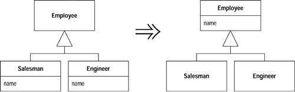
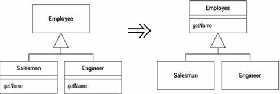
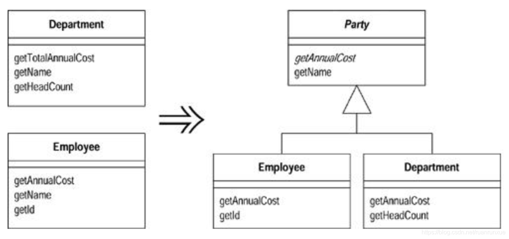
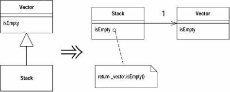

# 7 处理继承关系
## 1 Pull Up Field（字段上移）
如果两个子类有相同的字段，则将该字段上移至超类中。



## 2 Pull Up Method（函数上移）
如果两个子类有相同的函数而且产生完全相同的结果，则将该函数上移至超类。



## 3 Extract Superclass（提炼超类）
如果两个类有相似特性，可以为这两个类建立一个超类，将相同特性移至超类。如果继承不合适，可以使用[Extract Class](#Extract Class)来提取重复代码。



## 4 Form Template Method（塑造模板函数）
该重构的手法其实就是设计模式中的模板模式，如果有一些子类，其中对应的某些函数以相同顺序执行类似的操作，但在各个操作的细节上有所不同。可以将这些操作分别放到独立的函数中，替换在原函数中原有的操作代码，并上移至超类。

### 重构示例22
```
// 重构前
class Site {
public:
    virtual double GetBillableAmount() = 0;
    // ...
}

class ResidentialSite : public Site {
public:
    double GetBillableAmount() override
    {
        double base = m_units * m_rate;
        double tax = base * Site::TAX_RATE;
        return base + tax;
    }
    // ...
}

class LifelineSite : public Site {
public:
    double GetBillableAmount() override
    {
        double base = m_units * m_rate * 0.5;
        double tax = base * Site::TAX_RATE * 0.2;
        return base + tax;
    }
    // ...
}
```
```C++
// 重构后
class Site {
public:
    virtual double GetBaseAmount() = 0;
    virtual double GetTaxAmount() = 0;
    double GetBillableAmount()
    {
        return GetBaseAmount() + GetTaxAmount();
    }
    // ...
}

class ResidentialSite : public Site {
public:
    double GetBaseAmount() override
    {
        return m_units * m_rate;
    }
    double GetTaxAmount() override
    {
        return GetBaseAmount() * Site::TAX_RATE;
    }
    // ...
}

class LifelineSite : public Site {
public:
    double GetBaseAmount() override
    {
        return m_units * m_rate * 0.5;
    }
    double GetTaxAmount() override
    {
        return GetBaseAmount() * Site::TAX_RATE * 0.2;
    }
    // ...
}
```

## 5 Replace Inheritance with Delegation（以委托取代继承）
有时候继承会使代码变得复杂，特别是继承层次很深时，这时通过组合来取代继承（用has-a取代is-a）更加合适。如果某个类只使用了超类接口中的一部分或者根本就不需要继承而来的数据，就可以使用Replace Inheritance with Delegation进行重构了。



## 6 Collapse Hierarchy（折叠继承体系）
如果超类和子类实现的功能没有太大的差别，则使用Collapse Hierarchy将它们合并成一个类。