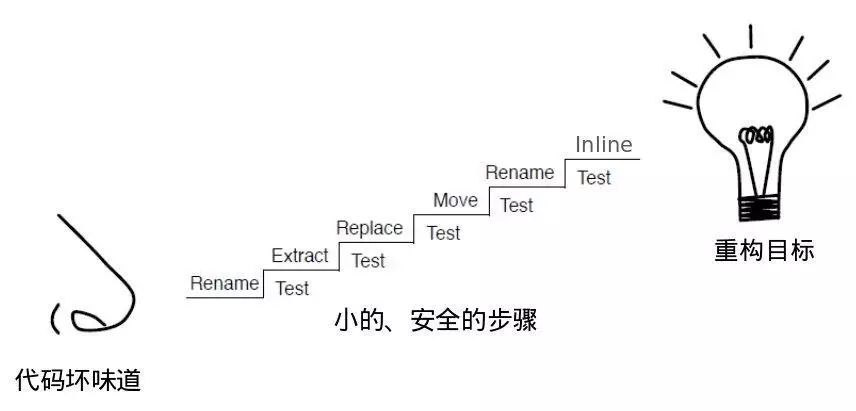

# 重构
> 参考文献
> * [https://www.cnblogs.com/ranjiewen/p/5912259.html](https://www.cnblogs.com/ranjiewen/p/5912259.html)
> * [https://blog.csdn.net/ruanrunxue/article/details/102945431](https://blog.csdn.net/ruanrunxue/article/details/102945431)
## 1 什么是重构?

### 重构的定义

Martin Fowler在《重构：改善既有代码的设计》一书中给出了重构的两个定义.

* 第一个是名词形式:Refactoring: 对软件内部结构的一种调整，目的是在不改变软件可观察行为的前提下，提高其可理解性，降低其修改成本.
* 第二个是动词形式:Refactor: 使用一系列重构手法，在不改变软件可观察行为的前提下，调整其结构.

### 重构的目标
重构的目标是什么? 重构的目标绝不是将代码从别人的taste改成自己的taste，也不是将代码从一种坏味道改到另一种坏味道!Matin Fowler利用上面两个定义，指出了重构的目标:
1. 不改变软件可观察行为
2. 提高软件可理解性
3. 降低软件修改成本

而对于上述目标，我们再深入一点分析，发现其实已经有更经典的定义. 那就是Kent Beck的简单设计四原则:

1. Pass All Test: 通过全部测试;
2. No Duplication: 没有重复(DRY)
3. Reveals Intent: 程序表达意图，易于理解
4. Has no superfluous parts: 没有冗余，或者YAGNI原则

上述四条的重要程度依次降低.到目前为止，简单设计四原则是对”什么是好的软件设计”最好的定义!

## 2 从哪里开始?

### 重构的原因
对于重构的目标达成一致后，我们回到起点:什么样的软件需要重构? 以及什么时候进行重构?

对于第一个问题，由于我们重构的目标是使软件满足简单设计四原则，那么任何违反简单设计四原则的代码都应该是我们重构的目标.例如1)代码很容易出现bug，导致测试失败! 或者 2)代码存在知识重复使得不易修改! 或者 3)代码写的晦涩非常难以理解! 或者 4)代码存在过度设计，存在冗余导致复杂!

现实中可能有一堆的代码问题等待我们解决，而时间、成本、人力是有限的，所以我们需要从最有价值，最没有争议的部分开始重构. 由于简单设计四原则的重要程度是依次降低的，对于四条原则的判定从上往下也是逐渐主观化，所以我们选择重构的代码的优先级顺序也是按照它们破坏简单四原则的顺序依次降低! 如果一坨代码存在很多重复，另外一坨代码不易理解，那么我们优先选择去解决重复代码的问题，因为按照简单四原则消除重复更重要，也更容易被客观评价.

在《重构》一书中Martin为了避免引起所谓编程美学的含混争辩，总结了代码的22条坏味道. 在实践中我们一般都是从某一代码坏味道着手重构的，但是对于优先重构哪个坏味道，我们遵守上面描述的原则.

### 重构的时机
对于进行重构的时机，Matin给出:

1. 重复地做某一件事情的时候 (三次法则)

1. 添加新功能的时候

2. 修改Bug的时候

3. Code Review的时候

事实上在我的工作过程中，重构是随时随地进行的. 尤其对于采用演进式设计方法论，重构和代码开发是紧密结合难以分割的，甚至很多时候只有依托重构才能完成代码的开发.

### 重构的手法
明白了起点和目标，下来最重要的就是掌握完成这一过程的手段! 而重构的手法则是带领我们正确到达目标的工具.

很多人认为学习重构只要掌握背后的思想就足够了，其详细繁琐的操作手法并不重要.于是乎现实中我们看到很多人在实际操作重构的过程中章法全无，一旦开始半天停不下来，代码很多时候处于不可编译或者测试不能通过的状态，有时改的出错了很难再使代码回到初始状态，只能推倒重来! 实际上重构是一项非常实践性的技术，能够正确合理地使用重构操作，安全地，小步地，高效地完成代码修改，是评价重构能力的核心标准.

那么什么才是正确的重构手法?

Martin对重构的第二个定义中提到使用一系列的重构手法，但是对这一系列的重构手法却没有概括.

而William Opdyke在他的论文”Refactoring Objected-Oriented Frameworks”里面对重构给出了如下定义:

重构：行为保持（Behavior Preservation）的程序重建和程序变换.

在论文里面将重构手法定义为一些程序重建或者程序变换的操作，这些操作满足行为保持(Behavior Preservation)的要求. 论文里面对行为保持的定义如下:

Behavior Preservation ： For the same set of input values，the resulting set of output values should be the same before and after the refactoring.

也就是说存在一系列代码变换的操作，应用这些操作之后，在相同的输入条件下，软件的输出不会发生变化. 我们把满足上述要求的代码操作称之为代码等价变换操作. 在William Opdyke的论文中针对C++提出了26种低层次的代码等价变换操作(例如: 重命名变量，为函数增加一个参数，删除一个不被引用的类…). 按照一定设计好的顺序组合上述低层次的代码等价变换操作，我们可以完成一次安全的代码重构，保证代码重构前后的行为保持要求.

这里代码等价变换的过程. 类似于初等数学中的多项式变换.例如对于如下公式变化:

每一步我们运用一次多项式等价变换公式，一步一步地对多项式进行化简，每次变换前后多项式保持等价关系.

在多项式化简的这个例子中，承载简化过程的是已经被数学证明过的多项式等价变换的公式. 同理承载重构的则是被证明过的一个个代表代码等价变换操作的重构手法.

另外，由于完成一项重构需要使用一系列的重构手法，这些手法的使用顺序也是至关重要的!

我们学习重构，就是要来学习每种场景下所使用的小步安全的重构手法及其使用顺序，并不断加以练习! 能够灵活而流畅地使用一系列重构手法完成一项重构，是衡量重构能力的一个非常重要的指标.

而本文后面的一个重点就是对常用的重构手法以及运用顺序进行提炼，降低大家的学习难度.

最后，既然重构中使用的是安全小步的代码等价变换手法，为什么我们还需要测试? 首先是因为我们是人，我们总会犯错! 另外由于编程语言的复杂性导致所谓的等价变换是受上下文约束的，例如在C++中为一个存在继承关系的类的成员方法重命名，有可能导致新的方法名和它某一父类中有默认实现的虚方法重名，而即使编译器也不能发现该错误.

### 高效地重构
虽然我们了解了如何/何时开始，目标，以及重构的手法，但是如果我们有了下面这些因素的辅助，会让我们更加安全和高效.

1. 覆盖良好高效的自动化测试
2. 合适的IDE，最好提供基本的自动化重构菜单
3. 良好的工程设置
4. 高效的构建环境
5. 良好的编码习惯

对于上面这些，不同语言面临的现状不同，针对C++语言我们后面会专门总结.

### 哪些不是重构?
针对上面的讨论，我们站在严格的重构定义上来看看下面这些反模式:

“我把bug重构掉了!”

“Debug一下刚才的重构那里出错了”

“昨晚重构出来的Bug到现在还没有查出来”

“先把代码重构好，再看测试为啥不过”

“我把软件架构由集中式重构成分布式了”

想想上面的场景哪里存在问题?

在实际的开发过程中，我们还经常面临另外一种场景，那就是对某一已经开发完成的软件模块进行整体重构. 在这样的过程中，虽然也存在频繁地使用重构手法对原有模块代码进行修改，但是更多的是进行大量的架构和设计方案上的修改.为了与我们要讨论的重构进行区分，对于这样的过程，我们称其为reengineering(软件重建).

软件重建一般是站在之前开发、测试的基础上，伴随着对软件要解决的问题和解决方式本身有了更深入的理解，通过修改软件把这些学习成果反映到软件的结构中去，使得软件可以更好、更精炼的解决业务问题。站在DDD（领域驱动设计）的角度，软件重建一般是对领域模型的进一步精练，使得软件更加贴合业务的本质！虽然成功的软件重建往往能对组织带来较大的收益，但是由于软件重建的开销普遍较大，而软件开发又是一项商业活动，所以需要对软件重建谨慎评估其成本收益比以及过程风险后才能决定是否启动。而本文中的重构技术，则只是一项日常编码中频繁使用的安全、高效的代码修改技术，被普遍认为是现代软件开发技术中必备的一项基本技能，是演进式软件设计或者软件重建目标达成的一项必要手段！

### 关于本文
我们总结一下，重构有三个要点，见下图:

 

你要有一个敏感的鼻子，能够嗅出代码中的坏味道; 一般只要发现不符合简单设计四原则的Code，就是我们需要重构的目标对象. 而Martin总结的22条代码坏味道给我们一个很好的实践起点.

你要知道重构的目标，就是让代码逐渐靠近简单设计四原则.

需要掌握小的安全的重构手法，以及在不同场景下合理的使用顺序，以便安全高效地承载重构目标的达成.

 

由于重构手法和实施顺序是学习重构的关键，所以本文后面会重点讲述这个主题. 另外，在实践中如何高效和安全的进行重构，和具体使用的编程语言及其开发、构建、测试环境关系也很密切.本文最后会针对C++语言总结这方面相关问题.