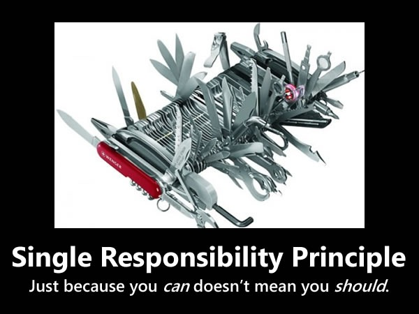
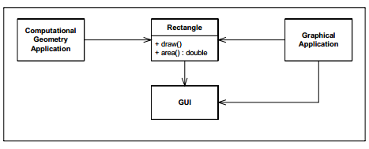
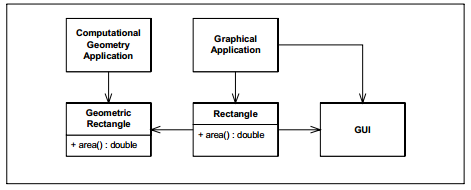
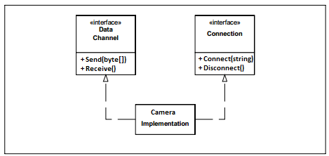

单一职责原则（Single Responsibility Principle）

**单一职责原则（SRP：The Single Responsibility Principle）**

>   一个类应该有且只有一个变化的原因。

>   **There should never be more than one reason for a class to change.**

为什么将不同的职责分离到单独的类中是如此的重要呢？

因为每一个职责都是一个变化的中心。当需求变化时，这个变化将通过更改职责相关的类来体现。

如果一个类拥有多于一个的职责，则这些职责就耦合到在了一起，那么就会有多于一个原因来导致这个类的变化。对于某一职责的更改可能会损害类满足其他耦合职责的能力。这样职责的耦合会导致设计的脆弱，以至于当职责发生更改时产生无法预期的破坏。

例如，考虑下图中的设计。类图中显示 Rectangle
类包含两个方法，一个方法（Draw）负责在显示屏幕上绘制矩形，另一个方法（Area）负责计算矩形图形面积。

有两个不同的应用程序均使用了 Rectangle 类。一个应用为计算几何程序，它使用了
Rectangle
中的数学几何模型，但不会在显示屏幕上绘制矩形。另一个应用是一个图形界面程序（GUI），它可能会做一些计算几何方面的工作，但主要功能是在屏幕上绘制矩形。

复制代码

1 public class Rectangle 2 { 3 public int Height { get; set; } 4 public int
Width { get; set; } 5 6 public double Area() 7 { 8 return Width \* Height; 9 }
10 11 public void Draw(Form form) 12 { 13 SolidBrush brush = new
SolidBrush(Color.Red); 14 Graphics formGraphics = form.CreateGraphics(); 15
formGraphics.FillRectangle(brush, 16 new System.Drawing.Rectangle( 17 new
Point(0, 0), new Size(Width, Height))); 18 } 19 }

复制代码

这个设计侵犯了 SRP 原则。Rectangle
类包含了两个职责。第一个职责是提供矩形几何计算的数学模型，第二个职责是在 GUI
上渲染矩形。

对 SRP 原则的侵犯会导致诸多难以解决的问题：

首先，我们必须在计算几何应用中包含对 GUI
库的引用。这导致应用程序无谓的消耗了链接时间、编译时间、内存空间和存储空间等。

再者，如果因为某些原因对 GraphicalApplication 的一个更改导致 Rectangle
类也相应做了更改，这将强制我们对 ComputationalGeometryApplication
进行重新编译、重新测试和重新部署等。如果我们忘了做这些事情，那么应用程序可能以无法预期的方式而崩溃。

复制代码

1 public class ComputationalGeometryApplication 2 { 3 public double
CalculateArea(Rectangle rectangle) 4 { 5 double area = rectangle.Area(); 6
return area; 7 } 8 } 9 10 public class GraphicalApplication 11 { 12 public Form
form { get; set; }13 14 public void DrawOnScreen(Rectangle rectangle) 15 { 16
rectangle.Draw(form); 17 } 18 }

复制代码

一个较好的设计是将这两个职责完全地隔离到不同的类当中，如下图所示。这个设计将
Rectangle 中关于几何计算的职责移到了 GeometricRectangle 类中，而 Rectangle
类中仅保留矩形渲染职责。

复制代码

1 public class GeometricRectangle 2 { 3 public int Height { get; set; } 4 public
int Width { get; set; } 5 6 public double Area() 7 { 8 return Width \* Height; 9
} 10 } 11 12 public class Rectangle 13 { 14 public void Draw(Form form,
GeometricRectangle geometric) 15 { 16 SolidBrush brush = new
SolidBrush(Color.Red); 17 Graphics formGraphics = form.CreateGraphics(); 18
formGraphics.FillRectangle(brush, 19 new System.Drawing.Rectangle( 20 new
Point(0, 0),21 new Size(geometric.Width, geometric.Height))); 22 } 23 }

复制代码

然后，如果我们再对 Rectangle 中渲染职责进行更改时将不会再影响到
ComputationalGeometryApplication 了。

复制代码

1 public class ComputationalGeometryApplication 2 { 3 public double
CalculateArea(GeometricRectangle geometric) 4 { 5 double area =
geometric.Area(); 6 return area; 7 } 8 } 9 10 public class GraphicalApplication
11 { 12 public Form form { get; set; }13 14 public void DrawOnScreen(Rectangle
rectangleDraw, GeometricRectangle rectangleShape) 15 { 16
rectangleDraw.Draw(form, rectangleShape); 17 } 18 }

复制代码

**那么，职责（Responsibility）到底是什么？**

**在**[**单一职责原则（SRP：Single Responsibility
Principle）**](http://www.cnblogs.com/gaochundong/p/single_responsibility_principle.html)**的概念中，我们将职责（Responsibility）定义为
"一个变化的原因（a reason for
change）"。如果你能想出多于一种动机来更改一个类，则这个类就包含多于一个职责。**

职责的耦合有时很难被发现，因为我们习惯于将多个职责一起来考虑。例如，我们考虑下面定义的
Camera 接口，可能会认为这个接口看起来是非常合理的。接口中声明的 4
个方法从属于一个 Camera 接口定义。

复制代码

1 public interface Camera 2 { 3 void Connect(string host); 4 void Disconnect();
5 void Send(byte[] data);6 byte[] Receive();7 }

复制代码

然而，它确实耦合了 2 个职责。第一个职责是连接管理，第二个职责是数据通信。Connect
和 Disconnect 方法负责管理 Camera 与管理端 Host 的连接，而 Send 和 Receive
方法则负责收发通信数据。

这两个职责应该被分离吗？答案基本上是肯定的。这两组方法基本上没有任何交集，它们都可以依据不同的原因而变化。进一步说，它们将在应用程序中完全不同的位置被调用，而那些不同的位置将同样会因不同的原因而变化。

因此，下图中的设计可能会好一些。它将这两个职责分别隔离到不同的接口定义中，这至少使应用程序从两个职责中解耦。

然而，我们注意到这两个职责又重新被耦合进了一个 CameraImplementation
类中。这可能不是我们想要的，但却有可能是必须的。通常有很多原因会强制我们将一些职责耦合在一起。尽管如此，我们使得应用程序的其他部分得益于这个接口的隔离。

CameraImplementation
类在我们看来是一个组合出来的但确实包含一些缺点的类。但需要注意到的是，所有其他需要使用
CameraImplementation
类的地方已经可以被接口进行隔离，我们仅需依赖所定义的单一职责的接口。而
CameraImplementation
仅在被实例化的位置才会出现。我们将丑陋的代码限制在一定的范围内，而不会泄露或污染应用程序的其他部分。

**总结**

单一职责原则（SRP：Single Responsibility Principle）可表述为
"一个类应该有且只有一个变化的原因（There should never be more than one reason
for a class to
change.）"。单一职责原则是一个非常简单的原则，但通常也是最难做的正确的一个原则。职责的联合是在实践中经常碰到的事情，从这些各不相同的职责中发现并隔离职责就是软件设计的真谛所在。我们所讨论的其他设计原则最终也会回归到这个原则上来。

**面向对象设计的原则**

|  SRP |  [单一职责原则](http://www.cnblogs.com/gaochundong/p/single_responsibility_principle.html) |  [Single Responsibility Principle](http://www.cnblogs.com/gaochundong/p/single_responsibility_principle.html) |
|------|--------------------------------------------------------------------------------------------|---------------------------------------------------------------------------------------------------------------|
|  OCP |  [开放封闭原则](http://www.cnblogs.com/gaochundong/p/open_closed_principle.html)           |  [Open Closed Principle](http://www.cnblogs.com/gaochundong/p/open_closed_principle.html)                     |
|  LSP |  [里氏替换原则](http://www.cnblogs.com/gaochundong/p/liskov_substitution_principle.html)   |  Liskov Substitution Principle                                                                                |
|  ISP |  [接口分离原则](http://www.cnblogs.com/gaochundong/p/interface_segregation_principle.html) |  [Interface Segregation Principle](http://www.cnblogs.com/gaochundong/p/interface_segregation_principle.html) |
|  DIP |  [依赖倒置原则](http://www.cnblogs.com/gaochundong/p/dependency_inversion_principle.html)  |  [Dependency Inversion Principle](http://www.cnblogs.com/gaochundong/p/dependency_inversion_principle.html)   |
|  LKP |  [最少知识原则](http://www.cnblogs.com/gaochundong/p/least_knowledge_principle.html)       |  [Least Knowledge Principle](http://www.cnblogs.com/gaochundong/p/least_knowledge_principle.html)             |

**参考资料**

-   *SRP：The Single Responsibility Principle by Robert C. Martin “Uncle Bob”*

-   *The SOLID Principles, Explained with Motivational Posters*

-   *Dangers of Violating SOLID Principles in C\#*

-   *An introduction to the SOLID principles of OO design*

-   *10 Golden Rules Of Good OOP*

-   *10 Object Oriented Design principles Java programmer should know*

-   *SOLID Principles: Single Responsibility Principle*

-   *Object Oriented Design Principles*
