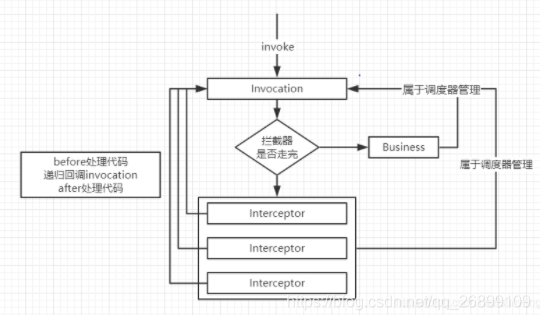

> https://blog.csdn.net/qq_26899109/article/details/113838471

拦截器模式应用非常广泛，适用场景一般在框架代码中的固定业务逻辑，这部分逻辑通常不会变化，比如：服务调用的拦截处理，拦截服务的参数，参数国际化处理，拦截服务的异常，记录服务的调用结果等等。

之所以要讲这个，是因为后面讲SpringAOP的时候会参考到！

拦截器模式有三个重要的元素：调度器，拦截器，业务逻辑，只要充分理解这三个元素，拦截器模式就很简单了。





* 调度器
一个业务逻辑可以有N个拦截器，这些拦截器是怎么运行的，自然是需要有一个调度器从中调度。

* 拦截器
拦截器就只是负责拦截业务代码，在业务代码前后做一些操作，至于拦截器和业务代码的关系，拦截器不会直接调用业务代码，因为会耦合，拦截器在处理完自己的逻辑，会通知调度器，由调度器负责后续的操作，是继续拦截，还是调用业务逻辑。

* 业务逻辑
业务代码这一块没啥好说的。


## 一个非常优秀的实例

通过调度器实现了拦截器和业务逻辑的解耦。拦截器只需要负责注册到调度器，业务逻辑也只需要注册到调度器中。调度器会执行拦截器。通过地柜的调用实现拦截任务。


既然有两个拦截器，自然要有一个拦截器接口。

### 1、拦截器接口
```java
public interface Interceptor {
    void before(Invocation invocation);
 
    String intercept(Invocation invocation);
 
    void after(Invocation invocation);
}
```
### 2、日志拦截器
```java
public class LogInterceptor implements Interceptor {
 
    @Override
    public void before(Invocation invocation) {
        System.out.println("LogInterceptor before...");
    }
 
    @Override
    public String intercept(Invocation invocation) {
        this.before(invocation);
        invocation.invoke();
        this.after(invocation);
        return null;
    }
 
    @Override
    public void after(Invocation invocation) {
        System.out.println("LogInterceptor after...");
    }
}
```
### 3，异常拦截器
```java
public class ExceptionInterceptor implements Interceptor {
 
    @Override
    public void before(Invocation invocation) {
        System.out.println("ExceptionInterceptor before...");
    }
 
    @Override
    public String intercept(Invocation invocation) {
        this.before(invocation);
        // 实际代码应该是try catch，在catch中做事情
        invocation.invoke();
        this.after(invocation);
        return null;
    }
 
    @Override
    public void after(Invocation invocation) {
        System.out.println("ExceptionInterceptor after...");
    }
}
```
### 4、调度器代码
```java
public class Invocation {
    int index = 0;
    // 调度器管理业务
    private BusinessService bs;
    // 调度器管理拦截器List
    private List<Interceptor> interceptions = new ArrayList<Interceptor>();
    
    public Invocation() {
        interceptions.add(new LogInterceptor());
        interceptions.add(new ExceptionInterceptor());
    }
    
    public void invoke() {
        if (index == interceptions.size()) {
            bs.perform();
        }
        else {
            Interceptor interceptor = interceptions.get(index);
            index++;
            interceptor.intercept(this); // 传this(调度器)用于回调
        }
    }
    
    public void setBusinessService(BusinessService bs) {
        this.bs = bs;
    }
}
```
### 5、业务代码
```java
public class BusinessService {
 
    public void perform() {
        System.out.println("服务调用。。。");
    }
}
```
### 6，测试方法

  public static void main(String[] args) {
        Invocation invocation = new Invocation(); // 直接在构造里面就把两个拦截器加上
        invocation.setBusinessService(new BusinessService()); // 加上业务逻辑
 
        invocation.invoke();
    }
```
输出结果：
```
LogInterceptor before...
ExceptionInterceptor before...
服务调用。。。
ExceptionInterceptor after...
LogInterceptor after...
```