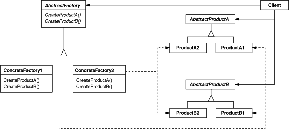

设计模式之美：Abstract Factory（抽象工厂）

**索引**

-   别名

-   意图

-   结构

-   参与者

-   适用性

-   缺点

-   效果

-   相关模式

-   命名约定

-   实现

    -   实现方式（一）：使用 Factory Method 来实现 Abstract Factory。

    -   实现方式（二）：使用 Prototype 来实现 Abstract Factory。

    -   实现方式（三）：定义可扩展的 Abstract Factory。

    -   实现方式（四）：使用模板以避免创建子类。

**别名**

-   Kit

**意图**

提供一个创建一系列相关或相互依赖对象的接口，而无需指定它们具体的类。

Provide an interface for creating families of related or dependent objects
without specifying their concrete classes.

**结构**

**参与者**

AbstractFactory

-   声明一个创建抽象产品对象的操作接口。

ConcreteFactory

-   实现创建具体产品对象的操作。

AbstractProduct

-   为一类产品对象声明一个接口。

ConcreteProduct

-   定义一个将被相应的具体工厂创建的产品对象。

-   实现 AbstractProduct 接口。

Client

-   仅适用由 AbstractFactory 和 AbstractProduct 类声明的接口。

**适用性**

在以下情况下可以使用 Abstract Factory 模式：

-   一个系统要独立于它的产品的创建、组合和表示时。

-   一个系统要由多个产品系列中的一个来配置时。

-   当你要强调一系列相关的产品对象的设计以便进行联合使用时。

-   当你提供一个产品类库，而只想显示它们的接口而不是实现时。

**缺点**

-   难以支持新种类的产品。支持新种类的产品就需要扩展 AbstractFactory
    接口，这将引起所有子类的改变。

**效果**

-   它分离了具体的类。

-   它使得易于交换产品系列。

-   它有利于产品的一致性。

**相关模式**

-   Abstract Factory 经常用 [Factory
    Method](http://www.cnblogs.com/gaochundong/p/design_pattern_factory_method.html)
    来实现。

-   Abstract Factory 也可以用
    [Prototype ](http://www.cnblogs.com/gaochundong/p/design_pattern_prototype.html)来实现。

-   一个具体的工厂可以是一个
    [Singleton](http://www.cnblogs.com/gaochundong/p/design_pattern_singleton.html)。

**命名约定**

使用命名约定是一个好习惯，例如，总是声明那些定义为抽象工厂的类为 XxxKit。

**实现**

**实现方式（一）：使用 Factory Method 来实现 Abstract Factory。**

一个具体的工厂将为每个产品重定义该工厂方法以指定产品。

复制代码

1 namespace AbstractFactoryPattern.Implementation1 2 { 3 public abstract class
AbstractOrInterfaceOfFactoryKit 4 { 5 public abstract
AbstractOrInterfaceOfProductA CreateProductA(); 6 public abstract
AbstractOrInterfaceOfProductB CreateProductB(); 7 } 8 9 public abstract class
AbstractOrInterfaceOfProductA 10 { 11 } 12 13 public abstract class
AbstractOrInterfaceOfProductB 14 { 15 } 16 17 public class ConcreteFactoryKit1 :
AbstractOrInterfaceOfFactoryKit 18 { 19 public override
AbstractOrInterfaceOfProductA CreateProductA() 20 { 21 return new
ConcreteProductA(); 22 } 23 24 public override AbstractOrInterfaceOfProductB
CreateProductB() 25 { 26 return new ConcreteProductB(); 27 } 28 } 29 30 public
class ConcreteProductA : AbstractOrInterfaceOfProductA 31 { 32 } 33 34 public
class ConcreteProductB : AbstractOrInterfaceOfProductB 35 { 36 } 37 38 public
class Client 39 { 40 public void TestCase1() 41 { 42
AbstractOrInterfaceOfFactoryKit kit = new ConcreteFactoryKit1(); 43
AbstractOrInterfaceOfProductA productA = kit.CreateProductA(); 44
AbstractOrInterfaceOfProductB productB = kit.CreateProductB(); 45 } 46 } 47 }

复制代码

**实现方式（二）：使用 Prototype 来实现 Abstract Factory。**

具体工厂使用产品系列中每一个产品的原型实例来初始化，且它通过复制它的原型来创建新的产品。

复制代码

1 namespace AbstractFactoryPattern.Implementation2 2 { 3 public abstract class
AbstractOrInterfaceOfFactoryKit 4 { 5 public abstract
AbstractOrInterfaceOfProductA CreateProductA(); 6 public abstract
AbstractOrInterfaceOfProductB CreateProductB(); 7 } 8 9 public abstract class
AbstractOrInterfaceOfProductA 10 { 11 public abstract
AbstractOrInterfaceOfProductA Clone(); 12 } 13 14 public abstract class
AbstractOrInterfaceOfProductB 15 { 16 public abstract
AbstractOrInterfaceOfProductB Clone(); 17 } 18 19 public class
ConcreteFactoryKit1 : AbstractOrInterfaceOfFactoryKit 20 { 21 public override
AbstractOrInterfaceOfProductA CreateProductA() 22 { 23 return new
ConcreteProductA(); 24 } 25 26 public override AbstractOrInterfaceOfProductB
CreateProductB() 27 { 28 return new ConcreteProductB(); 29 } 30 } 31 32 public
class ConcreteFactoryKit2 : AbstractOrInterfaceOfFactoryKit 33 { 34 private
AbstractOrInterfaceOfProductA \_prototypeOfProductA; 35 private
AbstractOrInterfaceOfProductB \_prototypeOfProductB; 36 37 public
ConcreteFactoryKit2( 38 AbstractOrInterfaceOfProductA prototypeOfProductA, 39
AbstractOrInterfaceOfProductB prototypeOfProductB) 40 { 41 \_prototypeOfProductA
= prototypeOfProductA; 42 \_prototypeOfProductB = prototypeOfProductB; 43 } 44
45 public override AbstractOrInterfaceOfProductA CreateProductA() 46 { 47 return
\_prototypeOfProductA.Clone(); 48 } 49 50 public override
AbstractOrInterfaceOfProductB CreateProductB() 51 { 52 return
\_prototypeOfProductB.Clone(); 53 } 54 } 55 56 public class ConcreteProductA :
AbstractOrInterfaceOfProductA 57 { 58 public override
AbstractOrInterfaceOfProductA Clone() 59 { 60 return new ConcreteProductA(); 61
} 62 } 63 64 public class ConcreteProductB : AbstractOrInterfaceOfProductB 65 {
66 public override AbstractOrInterfaceOfProductB Clone() 67 { 68 return new
ConcreteProductB(); 69 } 70 } 71 72 public class Client 73 { 74 public void
TestCase2() 75 { 76 AbstractOrInterfaceOfFactoryKit kit1 = new
ConcreteFactoryKit1(); 77 AbstractOrInterfaceOfProductA productA1 =
kit1.CreateProductA(); 78 AbstractOrInterfaceOfProductB productB1 =
kit1.CreateProductB(); 79 80 AbstractOrInterfaceOfFactoryKit kit2 = new
ConcreteFactoryKit2(productA1, productB1); 81 AbstractOrInterfaceOfProductA
productA2 = kit2.CreateProductA(); 82 AbstractOrInterfaceOfProductB productB2 =
kit2.CreateProductB(); 83 } 84 } 85 }

复制代码

**实现方式（三）：定义可扩展的 Abstract Factory。**

Abstract Factory
通常为每一种它可以生产的产品定义一个操作。产品的种类被编码在操作型构中。

增加一种新的产品要求改变 Abstract Factory 的接口以及所有与它相关的类。

一个更灵活但不太安全的设计是给创建对象的操作增加一个参数。该参数指定了将被创建的对象的种类。

该参数可以是一个类标识符、一个整数、一个字符串，或其他任何可以标识这种产品的东西。

这样改动之后，Abstract Factory 只需要一个 "Make"
操作和一个指示要创建对象的种类的参数。

复制代码

1 namespace AbstractFactoryPattern.Implementation3 2 { 3 public enum
ProductCategory 4 { 5 ProductA, 6 ProductB, 7 } 8 9 public abstract class
AbstractOrInterfaceOfFactoryKit 10 { 11 public abstract object
CreateProduct(ProductCategory category); 12 } 13 14 public abstract class
AbstractOrInterfaceOfProductA 15 { 16 } 17 18 public abstract class
AbstractOrInterfaceOfProductB 19 { 20 } 21 22 public class ConcreteFactoryKit1 :
AbstractOrInterfaceOfFactoryKit 23 { 24 public override object
CreateProduct(ProductCategory category) 25 { 26 switch (category) 27 { 28 case
ProductCategory.ProductA: 29 return new ConcreteProductA(); 30 case
ProductCategory.ProductB: 31 return new ConcreteProductB(); 32 default:33 throw
new NotSupportedException(); 34 } 35 } 36 } 37 38 public class ConcreteProductA
: AbstractOrInterfaceOfProductA 39 { 40 } 41 42 public class ConcreteProductB :
AbstractOrInterfaceOfProductB 43 { 44 } 45 46 public class Client 47 { 48 public
void TestCase3() 49 { 50 AbstractOrInterfaceOfFactoryKit kit = new
ConcreteFactoryKit1(); 51 AbstractOrInterfaceOfProductA productA =
(AbstractOrInterfaceOfProductA)kit.CreateProduct(ProductCategory.ProductA); 52
AbstractOrInterfaceOfProductB productB =
(AbstractOrInterfaceOfProductB)kit.CreateProduct(ProductCategory.ProductB); 53 }
54 } 55 }

复制代码

**实现方式（四）：使用模板以避免创建子类。**

使用C\#中的泛型实现抽象工厂。

复制代码

1 namespace AbstractFactoryPattern.Implementation4 2 { 3 public abstract class
AbstractOrInterfaceOfFactoryKit 4 { 5 public abstract
AbstractOrInterfaceOfProductA CreateProductA(); 6 public abstract
AbstractOrInterfaceOfProductB CreateProductB(); 7 public abstract
AbstractOrInterfaceOfProductC CreateProductC\<TC\>() 8 where TC :
AbstractOrInterfaceOfProductC, new(); 9 } 10 11 public abstract class
AbstractOrInterfaceOfProductA 12 { 13 } 14 15 public abstract class
AbstractOrInterfaceOfProductB 16 { 17 } 18 19 public abstract class
AbstractOrInterfaceOfProductC 20 { 21 } 22 23 public class
ConcreteFactoryKit1\<TA, TB\> : AbstractOrInterfaceOfFactoryKit 24 where TA :
AbstractOrInterfaceOfProductA, new()25 where TB : AbstractOrInterfaceOfProductB,
new()26 { 27 public override AbstractOrInterfaceOfProductA CreateProductA() 28 {
29 return new TA(); 30 } 31 32 public override AbstractOrInterfaceOfProductB
CreateProductB() 33 { 34 return new TB(); 35 } 36 37 public override
AbstractOrInterfaceOfProductC CreateProductC\<TC\>() 38 { 39 return new TC(); 40
} 41 } 42 43 public class ConcreteProductA : AbstractOrInterfaceOfProductA 44 {
45 } 46 47 public class ConcreteProductB : AbstractOrInterfaceOfProductB 48 { 49
} 50 51 public class ConcreteProductC : AbstractOrInterfaceOfProductC 52 { 53 }
54 55 public class Client 56 { 57 public void TestCase4() 58 { 59
AbstractOrInterfaceOfFactoryKit kit = new ConcreteFactoryKit1\<ConcreteProductA,
ConcreteProductB\>(); 60 AbstractOrInterfaceOfProductA productA =
kit.CreateProductA(); 61 AbstractOrInterfaceOfProductB productB =
kit.CreateProductB(); 62 AbstractOrInterfaceOfProductC productC =
kit.CreateProductC\<ConcreteProductC\>(); 63 } 64 } 65 }

复制代码
