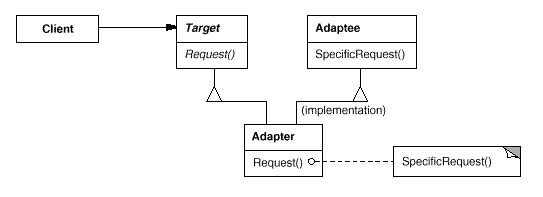
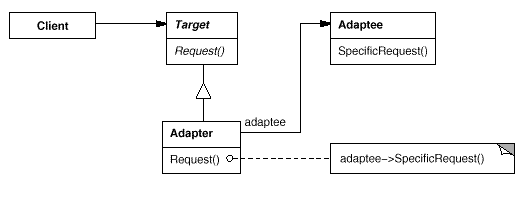

设计模式之美：Adapter（适配器）

**索引**

-   别名

-   意图

-   结构

-   参与者

-   适用性

-   效果

-   相关模式

-   实现

    -   实现方式（一）：简单直接的对象适配器。

    -   实现方式（二）：实现双向类适配器。

**别名**

-   包装器（Wrapper）

**意图**

将一个类的接口转换成客户希望的另外一个接口。

Adapter 模式使得原本由于接口不兼容而不能一起工作的那些类可以一起工作。

Convert the interface of a class into another interface clients expect.

Adapter lets classes work together that couldn't otherwise because of
incompatible interfaces.

**结构**

类适配器使用多重继承对一个接口与另一个接口进行匹配。

对象适配器依赖于对象组合。

**参与者**

Target

-   定义 Client 使用的与特定领域相关的接口。

Client

-   与符合 Target 接口的对象协同。

Adaptee

-   定义一个已经存在的接口，这个接口需要适配。

Adapter

-   对 Adaptee 的接口与 Target 接口进行适配。

**适用性**

在以下情况下可以使用 Adapter 模式：

-   你想使用一个已经存在的类，而它的接口不符合你的需求。

-   你想创建一个可以复用的类，该类可以与其他不相关的类或不可预见的类协同工作。

-   你想使用一些已经存在的类，但是不可能对每一个都进行子类化匹配它们的接口。对象适配器可以适配它的父类的接口。

**效果**

-   允许一个 Adapter 与多个 Adaptee （Adaptee 本身及它的子类）同时协同。Adapter
    也可以一次给所有的 Adaptee 添加功能。

-   使得重定义 Adaptee 的行为比较困难。这就需要生成 Adaptee 的子类并且使得
    Adapter 引用这个子类而不是引用 Adaptee 自身。

**相关模式**

-   Bridge 模式的结构与对象 Adapter 模式类似，但是 Bridge
    模式的出发点不同：Bridge
    目的是将接口部分和实现部分分离，从而对它们可以较为容易也相对独立的加以改变。而
    Adapter 则意味着改变一个已有对象的接口。

-   Decorator 模式增强了其他对象的功能而同时又不改变它的接口。因此 Decorator
    对应用程序的透明性比 Adapter 要好。结果是 Decorator 支持递归组合，而 Adapter
    无法实现这一点。

-   Proxy 模式在不改变它的接口的条件下，为另一个对象定义了一个代理。

**实现**

**实现方式（一）：简单直接的对象适配器。**

复制代码

1 namespace AdapterPattern.Implementation1 2 { 3 public class ParentAdaptee 4 {
5 public virtual string SpecificRequest() 6 { 7 return "ParentAdaptee"; 8 } 9 }
10 11 public class ChildAdaptee : ParentAdaptee 12 { 13 public override string
SpecificRequest() 14 { 15 return "ChildAdaptee";16 } 17 } 18 19 public class
Target 20 { 21 public virtual string Request() 22 { 23 return "Target";24 } 25 }
26 27 public class Adapter : Target 28 { 29 private ParentAdaptee \_adaptee; 30
31 public Adapter(ParentAdaptee adaptee) 32 { 33 \_adaptee = adaptee; 34 } 35 36
public override string Request() 37 { 38 return \_adaptee.SpecificRequest(); 39
} 40 } 41 42 public class Client 43 { 44 public void TestCase1() 45 { 46
ParentAdaptee adaptee = new ChildAdaptee(); 47 Target target = new
Adapter(adaptee); 48 var result = target.Request(); 49 } 50 } 51 }

复制代码

**实现方式（二）：实现双向类适配器。**

复制代码

1 namespace AdapterPattern.Implementation2 2 { 3 public class ParentAdaptee 4 {
5 public virtual string SpecificRequest() 6 { 7 return "ParentAdaptee"; 8 } 9 }
10 11 public class ChildAdaptee : ParentAdaptee 12 { 13 public override string
SpecificRequest() 14 { 15 return "ChildAdaptee";16 } 17 } 18 19 public interface
ITarget 20 { 21 string Request(); 22 } 23 24 public class Adapter :
ChildAdaptee, ITarget 25 { 26 public Adapter() 27 { 28 } 29 30 public string
Request() 31 { 32 return base.SpecificRequest();33 } 34 } 35 36 public class
Client 37 { 38 public void TestCase2() 39 { 40 ITarget target = new Adapter();
41 var result = target.Request(); 42 } 43 } 44 }

复制代码
