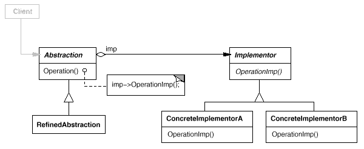

设计模式之美：Bridge（桥接）

**索引**

-   别名

-   意图

-   结构

-   参与者

-   适用性

-   效果

-   相关模式

-   实现

    -   实现方式（一）：使用 Bridge 模式分离抽象部分和实现部分。

**别名**

-   Handle

-   Body

**意图**

将抽象部分与它的实现部分分离，使它们都可以独立地变化。

Decouple an abstraction from its implementation so that the two can vary
independently.

**结构**

**参与者**

Abstraction

-   定义抽象类的接口。

-   维护一个指向 Implementor 类型对象的指针。

RefinedAbstraction

-   扩充由 Abstraction 定义的接口。

Implementor

-   定义实现类的接口，该接口不一定要与 Abstraction
    接口完全一致，甚至可以完全不同。

-   Implementor 接口仅提供基本操作，Abstraction
    则定义了基于这些基本操作的较高层次的操作。

ConcreteImplementor

-   实现 Implementor 接口并定义它的具体实现。

**适用性**

在以下情况下可以使用 Bridge 模式：

-   你不希望在抽象和它的实现部分之间有一个固定的绑定关系。比如需要在程序运行时刻实现部分应可以被选择或者切换。

-   类的抽象以及它的实现都应该可以通过生成子类的方法加以扩充。

-   对一个抽象的实现部分的修改应对客户不产生影响，即客户的代码不必重新编译。

-   你想对客户完全隐藏抽象的实现部分。

-   类的层次需要将一个对象分解成两个部分。

-   你想在多个对象间共享实现，但同时要求客户并不知道这一点。

**效果**

-   分离接口及其实现部分。

-   提高可扩充性。

-   实现细节对客户透明。

**相关模式**

-   Abstract Factory 模式可以用来创建和配置一个特定的 Bridge 模式。

-   Adaptor
    模式用来帮助无关的类协同工作，它通常在系统设计完成后才会被使用。Bridge
    模式则是在系统开始时就被使用，它使得抽象接口和实现部分可以独立进行改变。

-   Bridge 模式的结构与对象 Adapter 模式类似，但是 Bridge
    模式的出发点不同：Bridge
    目的是将接口部分和实现部分分离，从而对它们可以较为容易也相对独立的加以改变。而
    Adapter 则意味着改变一个已有对象的接口。

**实现**

**实现方式（一）：使用 Bridge 模式分离抽象部分和实现部分。**

当一个抽象可能有多个实现时，通常用继承来协调它们。抽象类定义对该抽象的接口，而具体的子类则用不同方式加以实现。

但是此方法有时不够灵活。继承机制将抽象部分与它的实现部分固定在一起，使得难以对抽象部分和实现部分独立地进行修改、扩充和重用。

使用 Bridge 模式，它在抽象类与它的实现直接起到了桥梁作用，使它们可以独立地变化。

复制代码

1 namespace BridgePattern.Implementation1 2 { 3 public class Abstraction 4 { 5
protected IImplementor \_implementor; 6 7 public Abstraction(IImplementor
implementor) 8 { 9 \_implementor = implementor; 10 } 11 12 public virtual void
Operation() 13 { 14 \_implementor.OperationImp1(); 15 } 16 } 17 18 public
interface IImplementor 19 { 20 void OperationImp1(); 21 } 22 23 public class
ConcreteImplementorA : IImplementor 24 { 25 public void OperationImp1() 26 { 27
// do something28 } 29 } 30 31 public class ConcreteImplementorB : IImplementor
32 { 33 public void OperationImp1() 34 { 35 // do something36 } 37 } 38 39
public class ChildAbstraction : Abstraction 40 { 41 public
ChildAbstraction(IImplementor implementor) 42 : base(implementor)43 { 44 } 45 46
public override void Operation() 47 { 48 base.Operation();49 // do some others50
} 51 } 52 53 public class Client 54 { 55 public void TestCase1() 56 { 57
IImplementor implementor1 = new ConcreteImplementorA(); 58 IImplementor
implementor2 = new ConcreteImplementorB(); 59 60 Abstraction abstraction1 = new
Abstraction(implementor1); 61 Abstraction abstraction2 = new
ChildAbstraction(implementor2); 62 63 abstraction1.Operation(); 64
abstraction2.Operation(); 65 } 66 } 67 }

复制代码
