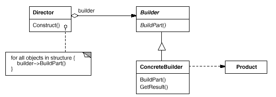
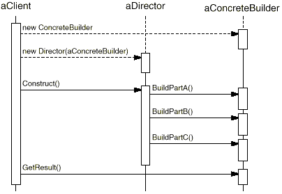

设计模式之美：Builder（生成器）

**索引**

-   意图

-   结构

-   参与者

-   适用性

-   效果

-   相关模式

-   实现

    -   实现方式（一）：Builder 为每个构件定义一个操作。

    -   实现方式（二）：Builder 将构件返回给 Director，Director 将构件传递给
        Builder 中的下一个步骤。

**意图**

将一个复杂对象的构建与它的表示分离，使得同样的构建过程可以创建不同的表示。

Separate the construction of a complex object from its representation so that
the same construction process can create different representations.

**结构**

**参与者**

Builder

-   为创建一个 Product 对象的各个部件指定抽象接口。

ConcreteBuilder

-   实现 Builder 的接口以构造和装配该产品的各个部件。

-   定义并明确它所创建的表示。

-   提供一个检索产品的接口。

Director

-   构造一个使用 Builder 接口的对象。

Product

-   表示被构造的复杂对象。ConcreteBuilder
    创建该产品的内部表示并定义它的装配过程。

-   包含定义组成部件的类，包括将这些部件装配成最终产品的接口。

**适用性**

在以下情况下可以使用 Builder 模式：

-   当创建复杂对象的算法应该独立于该对象的组成部分以及它们的装配方式时。

-   当构造过程必须允许被构造的对象有不同的表示时。

**效果**

-   它使你可以改变一个产品的内部表示。在改变该产品的内部表示时所要做的只是定义一个新的
    ConcreteBuilder。

-   它将构造代码和表示代码分开，提高了对象的模块性。客户不需要知道定义产品内部结构的类的所有信息。

-   它使你可以对构造过程进行更精细的控制。对象是在 Director
    的控制下一步一步构造的，仅当产品构造完成时 Director 才从 Builder 中取回它。

**相关模式**

-   Abstract Factory 和 Builder 相似，因为它也可以创建复杂对象。区别是 Builder
    着重于一步步构造一个复杂对象。而 Abstract Factory
    着重于多个系列的产品对象（或简单或复杂）。Builder
    是在最后一步返回产品，Abstract Factory 是立即返回。

-   Composite 通常是用 Builder 生成的。

**实现**

**实现方式（一）：Builder 为每个构件定义一个操作。**

通常有一个抽象的 Builder 类为 Director 可能要求创建的每一个 "构件"
定义一个操作。这些操作默认情况下什么都不做。一个 ConcreteBuilder 类对它感兴趣的
"构件" 对应的操作进行重定义。

复制代码

1 namespace BuilderPattern.Implementation1 2 { 3 public class ComplexProduct 4 {
5 public string ValueDependOnWeather { get; set; } 6 public string
ValueDependOnFortune { get; set; } 7 } 8 9 public abstract class
AbstractComplexProductBuilder 10 { 11 protected ComplexProduct \_complexProduct;
12 13 public void BeginBuild(ComplexProduct existingComplexProduct = null)14 {
15 if (existingComplexProduct == null)16 \_complexProduct = new
ComplexProduct(); 17 else18 \_complexProduct = existingComplexProduct; 19 } 20
21 public virtual void BuildValueDependOnWeatherPart(string weather) 22 { 23 //
could do nothing by default24 \_complexProduct.ValueDependOnWeather = weather;
25 } 26 27 public virtual void BuildValueDependOnFortunePart(string luck) 28 {
29 // could do nothing by default30 \_complexProduct.ValueDependOnFortune =
luck; 31 } 32 33 public ComplexProduct EndBuild() 34 { 35 return
this._complexProduct;36 } 37 } 38 39 public class ConcreteProductBuilderA :
AbstractComplexProductBuilder 40 { 41 private string \_dayOfWeek; 42 private int
\_luckyNumber; 43 44 public ConcreteProductBuilderA(string dayOfWeek, int
luckyNumber) 45 { 46 \_dayOfWeek = dayOfWeek; 47 \_luckyNumber = luckyNumber; 48
} 49 50 public override void BuildValueDependOnWeatherPart(string weather) 51 {
52 // something customized53 \_complexProduct.ValueDependOnWeather = \_dayOfWeek
\+ " is " + weather; 54 } 55 56 public override void
BuildValueDependOnFortunePart(string luck) 57 { 58 // something customized59 if
(\_luckyNumber == 8)60 \_complexProduct.ValueDependOnFortune = "Supper" + luck;
61 else62 \_complexProduct.ValueDependOnFortune = "Just so so" + luck; 63 } 64 }
65 66 public class GoodWeatherAndGoodLuckDirector 67 { 68 public void
ConstructWithGoodWeatherAndGoodLuck(AbstractComplexProductBuilder builder) 69 {
70 builder.BuildValueDependOnWeatherPart(@"PM2.5 \< 50");71
builder.BuildValueDependOnFortunePart(@"Good Luck");72 } 73 74 public void
ConstructWithBadWeatherAndBadLuck(AbstractComplexProductBuilder builder) 75 { 76
builder.BuildValueDependOnWeatherPart(@"PM2.5 \> 500");77
builder.BuildValueDependOnFortunePart(@"Bad Luck");78 } 79 } 80 81 public class
Client 82 { 83 public void TestCase1() 84 { 85 AbstractComplexProductBuilder
builder = new ConcreteProductBuilderA("Sunday", 9);86
GoodWeatherAndGoodLuckDirector director = new GoodWeatherAndGoodLuckDirector();
87 88 builder.BeginBuild(); 89
director.ConstructWithGoodWeatherAndGoodLuck(builder); 90 ComplexProduct
productWithGoodLuck = builder.EndBuild(); 91 92 builder.BeginBuild(); 93
director.ConstructWithBadWeatherAndBadLuck(builder); 94 ComplexProduct
productWithBadLuck = builder.EndBuild(); 95 } 96 } 97 }

复制代码

**实现方式（二）：Builder 将构件返回给 Director，Director 将构件传递给 Builder
中的下一个步骤。**

Builder
逐步的构造产品，所以其接口必须足够的普遍。如果构造过程中需要访问前面已经构造了的产品构件，则
Builder 将构件返回给 Director，由 Director 将构件传递给 Builder 中的下一个步骤。

复制代码

1 namespace BuilderPattern.Implementation2 2 { 3 public class ComplexProduct 4 {
5 public string ValueDependOnWeather { get; set; } 6 public string
ValueDependOnFortune { get; set; } 7 } 8 9 public abstract class
AbstractComplexProductBuilder 10 { 11 protected ComplexProduct \_complexProduct;
12 13 public void BeginBuild(ComplexProduct existingComplexProduct = null) 14 {
15 if (existingComplexProduct == null) 16 \_complexProduct = new
ComplexProduct(); 17 else 18 \_complexProduct = existingComplexProduct; 19 } 20
21 public virtual string BuildValueDependOnWeatherPart(string weather) 22 { 23
// could do nothing by default 24 \_complexProduct.ValueDependOnWeather =
weather; 25 return \_complexProduct.ValueDependOnWeather; 26 } 27 28 public
virtual string BuildValueDependOnFortunePart(string luck, string
combinedWithWeather) 29 { 30 // could do nothing by default 31
\_complexProduct.ValueDependOnFortune = luck + combinedWithWeather; 32 return
\_complexProduct.ValueDependOnFortune; 33 } 34 35 public ComplexProduct
EndBuild() 36 { 37 return this.\_complexProduct; 38 } 39 } 40 41 public class
ConcreteProductBuilderA : AbstractComplexProductBuilder 42 { 43 private string
\_dayOfWeek; 44 private int \_luckyNumber; 45 46 public
ConcreteProductBuilderA(string dayOfWeek, int luckyNumber) 47 { 48 \_dayOfWeek =
dayOfWeek; 49 \_luckyNumber = luckyNumber; 50 } 51 52 public override string
BuildValueDependOnWeatherPart(string weather) 53 { 54 // something customized 55
\_complexProduct.ValueDependOnWeather = \_dayOfWeek + " is " + weather; 56
return \_complexProduct.ValueDependOnWeather; 57 } 58 59 public override string
BuildValueDependOnFortunePart(string luck, string combinedWithWeather) 60 { 61
// something customized 62 if (\_luckyNumber == 8) 63
\_complexProduct.ValueDependOnFortune = "Supper" + luck + combinedWithWeather;
64 else 65 \_complexProduct.ValueDependOnFortune = "Just so so" + luck +
combinedWithWeather; 66 return \_complexProduct.ValueDependOnFortune; 67 } 68 }
69 70 public class GoodWeatherAndGoodLuckDirector 71 { 72 public void
ConstructWithGoodWeatherAndGoodLuck(AbstractComplexProductBuilder builder) 73 {
74 string weather = builder.BuildValueDependOnWeatherPart(@"PM2.5 \< 50"); 75
builder.BuildValueDependOnFortunePart(@"Good Luck", weather); 76 } 77 78 public
void ConstructWithBadWeatherAndBadLuck(AbstractComplexProductBuilder builder) 79
{ 80 string weather = builder.BuildValueDependOnWeatherPart(@"PM2.5 \> 500"); 81
builder.BuildValueDependOnFortunePart(@"Bad Luck", weather); 82 } 83 } 84 85
public class Client 86 { 87 public void TestCase2() 88 { 89
AbstractComplexProductBuilder builder = new ConcreteProductBuilderA("Sunday",
9); 90 GoodWeatherAndGoodLuckDirector director = new
GoodWeatherAndGoodLuckDirector(); 91 92 builder.BeginBuild(); 93
director.ConstructWithGoodWeatherAndGoodLuck(builder); 94 ComplexProduct
productWithGoodLuck = builder.EndBuild(); 95 96 builder.BeginBuild(); 97
director.ConstructWithBadWeatherAndBadLuck(builder); 98 ComplexProduct
productWithBadLuck = builder.EndBuild(); 99 } 100 } 101 }

复制代码
