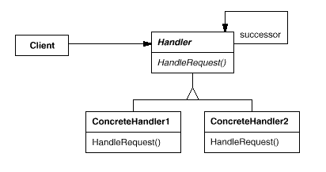
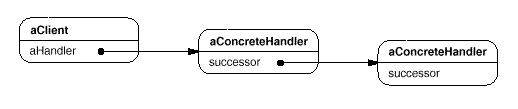

设计模式之美：Chain of Responsibility（职责链）

**索引**

-   意图

-   结构

-   参与者

-   适用性

-   效果

-   相关模式

-   实现

    -   实现方式（一）：实现后继者链。

**意图**

使多个对象都有机会处理请求，从而避免请求的发送者和接收者之间的耦合关系。

将这些对象连成一条链，并沿着这条链传递该请求，直到有一个对象处理它位置。

Avoid coupling the sender of a request to its receiver by giving more than one
object a chance to handle the request.

Chain the receiving objects and pass the request along the chain until an object
handles it.

**结构**

一个典型的对象结构可能如下图所示：

**参与者**

Handler

-   定义一个处理请求的接口。

-   实现后继链

ConcreteHandler

-   处理它所负责的请求。

-   可访问它的后继者。

-   如果可处理该请求，就处理；否则将该请求转发给它的后继者。

Client

-   向链上的具体处理者对象提交请求。

**适用性**

在以下情况下可以使用 Chain of Responsibility 模式：

-   有多个对象可以处理一个请求，哪个对象处理该请求运行时自动确定。

-   你想在不明确指定接收者的情况下，向多个对象中的一个提交一个请求。

-   可处理一个请求的对象集合应被动态指定。

**效果**

-   降低耦合度。对象无需知道哪个一个对象处理其请求，仅需知道对象被处理。

-   增强了给对象指派职责的灵活性。可以运行时对该链进行动态增加或修改。

**相关模式**

-   Chain of Resposibility 常与 Composite
    一起使用。一个构件的父构件可作为它的后继。

**实现**

**实现方式（一）：实现后继者链。**

复制代码

1 namespace ChainOfResponsibilityPattern.Implementation1 2 { 3 public enum
RequestCategory 4 { 5 Category1, 6 Category2, 7 } 8 9 public abstract class
Request 10 { 11 public abstract RequestCategory Category { get; } 12 public bool
IsHandled { get; set; } 13 } 14 15 public class ConcreteRequest1 : Request 16 {
17 public override RequestCategory Category 18 { 19 get { return
RequestCategory.Category1; } 20 } 21 } 22 23 public class ConcreteRequest2 :
Request 24 { 25 public override RequestCategory Category 26 { 27 get { return
RequestCategory.Category2; } 28 } 29 } 30 31 public abstract class Handler 32 {
33 private Handler \_successor; 34 35 public Handler() 36 { 37 } 38 39 public
Handler(Handler successor) 40 { 41 \_successor = successor; 42 } 43 44 public
void Handle(Request request) 45 { 46 OnHandle(request); 47 48 if
(!request.IsHandled) 49 { 50 if (_successor != null) 51 { 52 // pass request to
successor 53 \_successor.Handle(request); 54 } 55 } 56 } 57 58 protected
abstract void OnHandle(Request request); 59 } 60 61 public class
ConcreteHandler1 : Handler 62 { 63 public ConcreteHandler1() 64 { 65 } 66 67
public ConcreteHandler1(Handler successor) 68 : base(successor) 69 { 70 } 71 72
protected override void OnHandle(Request request) 73 { 74 if (request.Category
== RequestCategory.Category1) 75 { 76 // handle the request which category is
Category1 77 request.IsHandled = true; 78 } 79 } 80 } 81 82 public class
ConcreteHandler2 : Handler 83 { 84 public ConcreteHandler2() 85 { 86 } 87 88
public ConcreteHandler2(Handler successor) 89 : base(successor) 90 { 91 } 92 93
protected override void OnHandle(Request request) 94 { 95 if (request.Category
== RequestCategory.Category2) 96 { 97 // handle the request which category is
Category2 98 request.IsHandled = true; 99 } 100 } 101 } 102 103 public class
Client 104 { 105 public void TestCase1() 106 { 107 Request request1 = new
ConcreteRequest1(); 108 Request request2 = new ConcreteRequest2(); 109 110
Handler handler2 = new ConcreteHandler2(); 111 Handler handler1 = new
ConcreteHandler1(handler2); 112 113 handler1.Handle(request1); 114
handler1.Handle(request2); 115 } 116 } 117 }

复制代码
