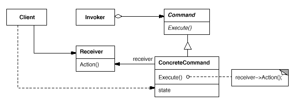
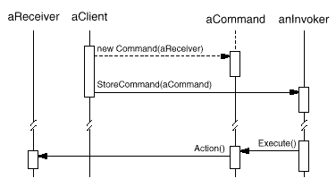

设计模式之美：Command（命令）

**索引**

-   别名

-   意图

-   结构

-   参与者

-   适用性

-   效果

-   相关模式

-   实现

    -   实现方式（一）：直接注入 Receiver 对象，Command 决定调用哪个方法。

    -   实现方式（二）：注入 Receiver 的指定方法，Command 仅能调用该方法。

    -   实现方式（三）：参数化 Command 构造。

    -   实现方式（四）：使用泛型减少 Command 子类。

    -   实现方式（五）：使用弱引用代替对 Receiver 的强引用。

    -   实现方式（六）：使 Command 支持 Undo 和 Redo。

    -   实现方式（七）：使 MacroCommand 来管理 Command 序列。

**别名**

-   Action

-   Transaction

**意图**

将一个请求封装为一个对象，从而使你可用不同的请求对客户进行参数化；对请求排队或记录请求日志，以及支持可撤销的操作。

Encapsulate a request as an object, thereby letting you parameterize clients
with different requests, queue or log requests, and support undoable operations.

**结构**

**参与者**

Command

-   声明 Execute 操作的接口。

ConcreteCommand

-   将一个接收者对象绑定于一个动作。

-   调用接收者相应的操作，以实现 Execute。

Client

-   创建一个具体 Command 对象并设定它的接收者。

Invoker

-   要求 Command 执行请求。

Receiver

-   知道如何实施与执行一个请求相关的操作。任何类都可能作为一个接收者。

**适用性**

在以下情况下可以使用 Command 模式：

-   Command
    模式是回调（callback）机制的一个面向对象的替代品。所谓回调函数是指函数先在某处注册，而它将在稍后某个需要的时候被调用。

-   在不同的时刻指定、排列和执行请求。Command
    对象可以有一个与初始请求无关的生存期。

-   支持取消操作。需要定义 Unexecute 操作来取消 Execute 操作调用的效果。

-   支持修改日志，这样当系统崩溃时，这些修改可以被重做一遍。

-   用构建在原语操作上的高层操作构造一个系统。例如构建事务（Transaction）系统。

**效果**

-   Command 模式将调用操作的对象与知道如何实现该操作的对象解耦。

-   Command 是 first-class 对象。它们可像其他的对象一样被操纵和扩展。

-   可以将多个 Command 装配成一个复合 Command。

-   增加新的 Command 很容易，因为无需改变已有的类

**相关模式**

-   Composite 模式可被用来实现 MacroCommand。

-   Memento 模式可用来保持某个状态，Command 用这一状态来取消它的效果。

-   可以使用 Prototype 来拷贝 Command 对象。

**实现**

**实现方式（一）：直接注入 Receiver 对象，Command 决定调用哪个方法。**

复制代码

1 namespace CommandPattern.Implementation1 2 { 3 public abstract class Command 4
{ 5 public abstract void Execute(); 6 } 7 8 public class ConcreteCommand :
Command 9 { 10 private Receiver \_receiver; 11 12 public
ConcreteCommand(Receiver receiver) 13 { 14 \_receiver = receiver; 15 } 16 17
public override void Execute() 18 { 19 \_receiver.Action(); 20 } 21 } 22 23
public class Receiver 24 { 25 public void Action() 26 { 27 // do something28 }
29 } 30 31 public class Invoker 32 { 33 private Command \_cmd; 34 35 public void
StoreCommand(Command cmd) 36 { 37 \_cmd = cmd; 38 } 39 40 public void Invoke()
41 { 42 if (\_cmd != null)43 { 44 \_cmd.Execute(); 45 } 46 } 47 } 48 49 public
class Client 50 { 51 public void TestCase1() 52 { 53 Receiver receiver = new
Receiver(); 54 Command cmd = new ConcreteCommand(receiver); 55 56 Invoker
invoker = new Invoker(); 57 invoker.StoreCommand(cmd); 58 59 invoker.Invoke();
60 } 61 } 62 }

复制代码

**实现方式（二）：注入 Receiver 的指定方法，Command 仅能调用该方法。**

复制代码

1 namespace CommandPattern.Implementation2 2 { 3 public abstract class Command 4
{ 5 public abstract void Execute(); 6 } 7 8 public class ConcreteCommand :
Command 9 { 10 private Action \_action; 11 12 public ConcreteCommand(Action
action) 13 { 14 \_action = action; 15 } 16 17 public override void Execute() 18
{ 19 \_action.Invoke(); 20 } 21 } 22 23 public class Receiver 24 { 25 public
void Action() 26 { 27 // do something28 } 29 } 30 31 public class Invoker 32 {
33 private Command \_cmd; 34 35 public void StoreCommand(Command cmd) 36 { 37
\_cmd = cmd; 38 } 39 40 public void Invoke() 41 { 42 if (\_cmd != null)43 { 44
\_cmd.Execute(); 45 } 46 } 47 } 48 49 public class Client 50 { 51 public void
TestCase2() 52 { 53 Receiver receiver = new Receiver(); 54 Command cmd = new
ConcreteCommand(receiver.Action); 55 56 Invoker invoker = new Invoker(); 57
invoker.StoreCommand(cmd); 58 59 invoker.Invoke(); 60 } 61 } 62 }

复制代码

**实现方式（三）：参数化 Command 构造。**

复制代码

1 namespace CommandPattern.Implementation3 2 { 3 public abstract class Command 4
{ 5 public abstract void Execute(); 6 } 7 8 public class ConcreteCommand :
Command 9 { 10 private Action\<string\> \_action;11 private string \_state; 12
13 public ConcreteCommand(Action\<string\> action, string state) 14 { 15
\_action = action; 16 \_state = state; 17 } 18 19 public override void Execute()
20 { 21 \_action.Invoke(_state); 22 } 23 } 24 25 public class Receiver 26 { 27
public void Action(string state) 28 { 29 // do something30 } 31 } 32 33 public
class Invoker 34 { 35 private Command \_cmd; 36 37 public void
StoreCommand(Command cmd) 38 { 39 \_cmd = cmd; 40 } 41 42 public void Invoke()
43 { 44 if (\_cmd != null)45 { 46 \_cmd.Execute(); 47 } 48 } 49 } 50 51 public
class Client 52 { 53 public void TestCase3() 54 { 55 Receiver receiver = new
Receiver(); 56 Command cmd = new ConcreteCommand(receiver.Action, "Hello
World");57 58 Invoker invoker = new Invoker(); 59 invoker.StoreCommand(cmd); 60
61 invoker.Invoke(); 62 } 63 } 64 }

复制代码

**实现方式（四）：使用泛型减少 Command 子类。**

复制代码

1 namespace CommandPattern.Implementation4 2 { 3 public abstract class Command 4
{ 5 public abstract void Execute(); 6 } 7 8 public class ConcreteCommand\<T, S\>
: Command 9 { 10 private Action\<T, S\> \_action; 11 private T \_state1; 12
private S \_state2; 13 14 public ConcreteCommand(Action\<T, S\> action, T
state1, S state2) 15 { 16 \_action = action; 17 \_state1 = state1; 18 \_state2 =
state2; 19 } 20 21 public override void Execute() 22 { 23
\_action.Invoke(_state1, \_state2); 24 } 25 } 26 27 public class Receiver 28 {
29 public void Action(string state1, int state2) 30 { 31 // do something32 } 33
} 34 35 public class Invoker 36 { 37 private Command \_cmd; 38 39 public void
StoreCommand(Command cmd) 40 { 41 \_cmd = cmd; 42 } 43 44 public void Invoke()
45 { 46 if (\_cmd != null)47 { 48 \_cmd.Execute(); 49 } 50 } 51 } 52 53 public
class Client 54 { 55 public void TestCase4() 56 { 57 Receiver receiver = new
Receiver(); 58 Command cmd = new ConcreteCommand\<string, int\>(59
receiver.Action, "Hello World", 250);60 61 Invoker invoker = new Invoker(); 62
invoker.StoreCommand(cmd); 63 64 invoker.Invoke(); 65 } 66 } 67 }

复制代码

**实现方式（五）：使用弱引用代替对 Receiver 的强引用。**

复制代码

1 namespace CommandPattern.Implementation5 2 { 3 public class WeakAction 4 { 5
public WeakAction(Action action) 6 { 7 Method = action.Method; 8 Reference = new
WeakReference(action.Target); 9 } 10 11 protected MethodInfo Method { get;
private set; }12 protected WeakReference Reference { get; private set; }13 14
public bool IsAlive 15 { 16 get { return Reference.IsAlive; } 17 } 18 19 public
object Target 20 { 21 get { return Reference.Target; } 22 } 23 24 public void
Invoke() 25 { 26 if (Method != null && IsAlive) 27 { 28 Method.Invoke(Target,
null);29 } 30 } 31 } 32 33 public abstract class Command 34 { 35 public abstract
void Execute(); 36 } 37 38 public class ConcreteCommand : Command 39 { 40
private WeakAction \_action; 41 42 public ConcreteCommand(Action action) 43 { 44
\_action = new WeakAction(action); 45 } 46 47 public override void Execute() 48
{ 49 \_action.Invoke(); 50 } 51 } 52 53 public class Receiver 54 { 55 public
void Action() 56 { 57 // do something58 } 59 } 60 61 public class Invoker 62 {
63 private Command \_cmd; 64 65 public void StoreCommand(Command cmd) 66 { 67
\_cmd = cmd; 68 } 69 70 public void Invoke() 71 { 72 if (\_cmd != null)73 { 74
\_cmd.Execute(); 75 } 76 } 77 } 78 79 public class Client 80 { 81 public void
TestCase5() 82 { 83 Receiver receiver = new Receiver(); 84 Command cmd = new
ConcreteCommand(receiver.Action); 85 86 Invoker invoker = new Invoker(); 87
invoker.StoreCommand(cmd); 88 89 invoker.Invoke(); 90 } 91 } 92 }

复制代码

**实现方式（六）：使 Command 支持 Undo 和 Redo。**

如果 Command 提供方法逆转操作，例如 Undo
操作，就可以取消执行的效果。为达到这个目的，ConcreteCommand
类可能需要存储额外的状态信息。

这个状态包括：

接收者对象，它真正执行处理该请求的各操作。

接收者上执行操作的参数。

如果处理请求的操作会改变接收者对象中的某些值，那么这些值也必须先存储起来。接收者还必须提供一些操作，以使该命令可将接收者恢复到它先前的状态。

复制代码

1 namespace CommandPattern.Implementation6 2 { 3 public abstract class Command 4
{ 5 public abstract void Execute(); 6 public abstract void Unexecute(); 7 public
abstract void Reexecute(); 8 } 9 10 public class ConcreteCommand : Command 11 {
12 private Receiver \_receiver; 13 private string \_state; 14 private string
\_lastState; 15 16 public ConcreteCommand(Receiver receiver, string state) 17 {
18 \_receiver = receiver; 19 \_state = state; 20 } 21 22 public override void
Execute() 23 { 24 \_lastState = \_receiver.Name; 25
\_receiver.ChangeName(_state); 26 } 27 28 public override void Unexecute() 29 {
30 \_receiver.ChangeName(\_lastState); 31 \_lastState = string.Empty;32 } 33 34
public override void Reexecute() 35 { 36 Unexecute(); 37 Execute(); 38 } 39 } 40
41 public class Receiver 42 { 43 public string Name { get; private set; }44 45
public void ChangeName(string name) 46 { 47 // do something48 Name = name; 49 }
50 } 51 52 public class Invoker 53 { 54 private Command \_cmd; 55 56 public void
StoreCommand(Command cmd) 57 { 58 \_cmd = cmd; 59 } 60 61 public void Invoke()
62 { 63 if (\_cmd != null)64 { 65 \_cmd.Execute(); 66 } 67 } 68 69 public void
UndoInvoke() 70 { 71 if (\_cmd != null)72 { 73 \_cmd.Unexecute(); 74 } 75 } 76 }
77 78 public class Client 79 { 80 public void TestCase6() 81 { 82 Receiver
receiver = new Receiver(); 83 Command cmd = new ConcreteCommand(receiver, "Hello
World");84 85 Invoker invoker = new Invoker(); 86 invoker.StoreCommand(cmd); 87
88 invoker.Invoke(); 89 invoker.UndoInvoke(); 90 } 91 } 92 }

复制代码

**实现方式（七）：使 MacroCommand 来管理 Command 序列。**

MacroCommand 需要提供增加和删除子 Command 的操作。

复制代码

1 namespace CommandPattern.Implementation7 2 { 3 public abstract class Command 4
{ 5 public abstract void Execute(); 6 } 7 8 public class MacroCommand : Command
9 { 10 private List\<Command\> \_cmdList = new List\<Command\>(); 11 12 public
MacroCommand() 13 { 14 } 15 16 public void Add(Command cmd) 17 { 18
\_cmdList.Add(cmd); 19 } 20 21 public void Remove(Command cmd) 22 { 23
\_cmdList.Remove(cmd); 24 } 25 26 public override void Execute() 27 { 28 foreach
(var cmd in \_cmdList) 29 { 30 cmd.Execute(); 31 } 32 } 33 } 34 35 public class
ConcreteCommand1 : Command 36 { 37 private Receiver \_receiver; 38 39 public
ConcreteCommand1(Receiver receiver) 40 { 41 \_receiver = receiver; 42 } 43 44
public override void Execute() 45 { 46 \_receiver.Action1(); 47 } 48 } 49 50
public class ConcreteCommand2 : Command 51 { 52 private Receiver \_receiver; 53
54 public ConcreteCommand2(Receiver receiver) 55 { 56 \_receiver = receiver; 57
} 58 59 public override void Execute() 60 { 61 \_receiver.Action2(); 62 } 63 }
64 65 public class Receiver 66 { 67 public void Action1() 68 { 69 // do
something 70 } 71 72 public void Action2() 73 { 74 // do something 75 } 76 } 77
78 public class Invoker 79 { 80 private Command \_cmd; 81 82 public void
StoreCommand(Command cmd) 83 { 84 \_cmd = cmd; 85 } 86 87 public void Invoke()
88 { 89 if (\_cmd != null) 90 { 91 \_cmd.Execute(); 92 } 93 } 94 } 95 96 public
class Client 97 { 98 public void TestCase7() 99 { 100 Receiver receiver = new
Receiver(); 101 Command cmd1 = new ConcreteCommand1(receiver); 102 Command cmd2
= new ConcreteCommand2(receiver); 103 MacroCommand macro = new MacroCommand();
104 macro.Add(cmd1); 105 macro.Add(cmd2); 106 107 Invoker invoker = new
Invoker(); 108 invoker.StoreCommand(macro); 109 110 invoker.Invoke(); 111 } 112
} 113 }
