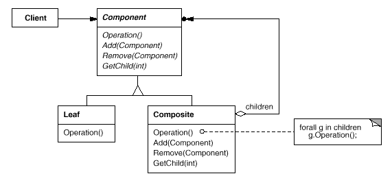
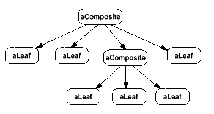

设计模式之美：Composite（组合）

**索引**

-   意图

-   结构

-   参与者

-   适用性

-   缺点

-   效果

-   相关模式

-   实现

    -   实现方式（一）：在 Component 中定义公共接口以保持透明性但损失安全性。

**意图**

将对象组合成树形结构以表示 “部分-整体” 的层次结构。

Composite 使得用户对于单个对象和组合对象的使用具有一致性。

Compose objects into tree structures to represent part-whole hierarchies.

Composite lets clients treat individual objects and compositions of objects
uniformly.

**结构**

典型的 Composite 对象结构：

**参与者**

Component

-   为组合中的对象声明接口。

-   在适当的情况下，实现所有类共有接口的缺省行为

-   声明一个接口用于访问和管理 Component 的子组件。

-   在递归结构中定义一个接口，用于访问一个父部件，并在合适的情况下实现它。

Leaf

-   在组合中表示叶节点对象，叶节点没有子节点。

-   在组合中定义图元对象的行为。

Composite

-   定义有子部件的那些部件的行为。

-   在 Composite 接口中实现与子部件有关的操作。

Client

-   通过 Component 接口操纵组合部件的对象。

**适用性**

在以下情况下可以使用 Composite 模式：

-   你想表示对象的 “部分-整体” 层次结构。

-   你希望用户忽略组合对象与单个对象的不同，用户将统一地使用组合结构中的所有对象。

**缺点**

-   与类层次结构设计原则冲突

Composite 模式的目的之一是使得用户不知道它们正在使用具体的 Leaf 和 Composite
类。

为达到这一目的，Component 需要为 Leaf 和 Composite
定义一些公共操作，并提供缺省的实现，而 Leaf 和 Composite
子类可以对它们进行重定义。

然而，这个目标会与类层次结构设计原则冲突，该原则规定：一个类只能定义那些对它的子类有意义的操作。

**效果**

-   定义了包含基本对象和组合对象的类层次结构。

-   简化客户代码。

-   使得更容易增加新类型的组件。

-   使你的设计变得更加一般化。

**相关模式**

-   Command 模式描述了如何用一个 MacroCommand Composite 类组成一些 Command
    对象，并对它们进行排序。

-   通常 “部件-父部件” 连接用于 Responsibility of Chain 模式。

-   Decorator 模式经常与 Composite 模式一起使用。它们通常有一个公共的父类。

-   Flyweight 让你共享组件，但不再能引用它们的父部件。

-   Iterator 可以用来遍历 Composite。

-   Visitor 将本来应该分布在 Composite 和 Leaf 类中的操作和行为局部化。

**实现**

**实现方式（一）：在 Component 中定义公共接口以保持透明性但损失安全性。**

在 Component 中定义 Add 和 Remove 操作需要考虑安全性和透明性。

在类层次结构的根部定义子节点管理接口的方法具有良好的透明性，但是这一方法是以安全性为代价的，因为客户有可能会做一些无意义的事情，例如在
Leaf 中 Add 对象等。

在 Composite
类中定义管理子部件的方法具有良好的安全性，但是这又损失了透明性，因为 Leaf 和
Composite 具有不同的接口。

复制代码

1 namespace CompositePattern.Implementation1 2 { 3 public abstract class
Component 4 { 5 protected List\<Component\> \_children = new
List\<Component\>(); 6 7 public abstract void Operation(); 8 9 public virtual
void Add(Component component) 10 { 11 \_children.Add(component); 12 } 13 14
public virtual void Remove(Component component) 15 { 16
\_children.Remove(component); 17 } 18 19 public virtual IEnumerable\<Component\>
GetChildren() 20 { 21 return \_children; 22 } 23 } 24 25 public class Leaf :
Component 26 { 27 public override void Operation() 28 { 29 // do something30 }
31 32 public override void Add(Component component) 33 { 34 throw new
InvalidOperationException(); 35 } 36 37 public override void Remove(Component
component) 38 { 39 throw new InvalidOperationException(); 40 } 41 42 public
override IEnumerable\<Component\> GetChildren() 43 { 44 throw new
InvalidOperationException(); 45 } 46 } 47 48 public class Composite : Component
49 { 50 public override void Operation() 51 { 52 foreach (var child in
\_children) 53 { 54 child.Operation(); 55 } 56 // may do something57 } 58 } 59
60 public class Client 61 { 62 public void TestCase1() 63 { 64 Component
component1 = new Leaf(); 65 Component component2 = new Composite(); 66 67
component2.Add(component1); 68 69 component1.Operation(); 70
component2.Operation(); 71 } 72 } 73 }

复制代码
