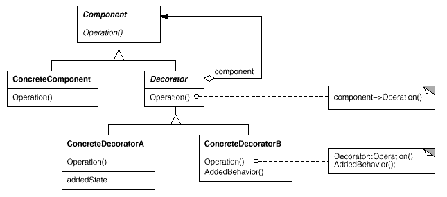
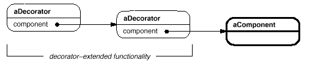

设计模式之美：Decorator（装饰）

**索引**

-   别名

-   意图

-   结构

-   参与者

-   适用性

-   缺点

-   效果

-   相关模式

-   实现

    -   实现方式（一）：Decorator 对象的接口必须与它所装饰的 Component
        的接口保持一致。

    -   实现方式（二）：省略抽象的 Decorator 类。

**别名**

-   包装器（Wrapper）

**意图**

动态地给一个对象添加一些额外的职责。

就增加功能来说，Decorator 模式相比生成子类更为灵活。

Attach additional responsibilities to an object dynamically.

Decorators provide a flexible alternative to subclassing for extending
functionality.

**结构**

**参与者**

Component

-   定义一个对象接口，可以给这些对象动态地添加职责。

ConcreteComponent

-   定义一个对象，可以给这个对象添加一些职责。

Decorator

-   维持一个指向 Component 对象的指针，并定义一个与 Component 接口一致的接口。

ConcreteDecorator

-   向组件添加职责。

**适用性**

在以下情况下可以使用 Decorator 模式：

-   在不影响其他对象的情况下，以动态、透明的方式给单个对象添加职责。

-   处理那些可以撤销的职责。

-   当不能采用生成子类的方法进行扩充时。

**缺点**

-   Decorator 是一个透明的包装，其与 Component 还是有些差别的。

-   采用 Decorator
    模式进行系统设计往往会产生许多看上去类似的小对象。导致很难学习系统，排错也很困难。

**效果**

-   比静态继承更灵活。

-   避免在层次结构高层的类有太多的特征。

**相关模式**

-   Decorator 模式不同于 Adapter 模式，因为 Decorator
    仅改变对象的职责而不改变它的接口，而 Adapter 将给对象一个全新的接口。

-   可以将 Decorator 视为一个退化的、仅有一个组件的 Composite。然而，Decorator
    仅给对象添加额外的职责，它的目的不在于对象聚集。

-   用一个 Decorator 可以改变对象的外表，而 Strategy
    模式使得你可以改变对象的内核。这是改变对象的两种途径。

-   当 Component 类原本就很庞大时，使用 Decorator 模式的代价太高，Strategy
    模式相对更好一些。

**实现**

**实现方式（一）：Decorator 对象的接口必须与它所装饰的 Component
的接口保持一致。**

所有的 ConcreteDecorator 类必须有一个公共的父类。

使用 Decorator
模式仅从外部改变组件，因此组件无需对它的装饰有任何了解，也就是说，这些装饰对该组件是透明的。

复制代码

1 namespace DecoratorPattern.Implementation1 2 { 3 public abstract class
Component 4 { 5 public abstract void Operation(); 6 } 7 8 public class
ConcreteComponent : Component 9 { 10 public override void Operation() 11 { 12 //
do something13 } 14 } 15 16 public abstract class Decorator : Component 17 { 18
private Component \_component; 19 20 public Decorator(Component component) 21 {
22 \_component = component; 23 } 24 25 public override void Operation() 26 { 27
\_component.Operation(); 28 } 29 } 30 31 public class ConcreteDecorator :
Decorator 32 { 33 public ConcreteDecorator(Component component) 34 :
base(component)35 { 36 } 37 38 public override void Operation() 39 { 40
base.Operation();41 AddedBehavior(); 42 } 43 44 private void AddedBehavior() 45
{ 46 // do some other things47 } 48 } 49 50 public class Client 51 { 52 public
void TestCase1() 53 { 54 Component component1 = new ConcreteComponent(); 55
Component component2 = new ConcreteDecorator(component1); 56 57
component2.Operation(); 58 } 59 } 60 }

复制代码

**实现方式（二）：省略抽象的 Decorator 类。**

当仅需要添加一个职责是，没有必要定义抽象的 Decorator 类。

这时可以把 Decorator 向 Component 转发请求的职责合并到 ConcreteDecorator 中。

复制代码

1 namespace DecoratorPattern.Implementation2 2 { 3 public abstract class
Component 4 { 5 public abstract void Operation(); 6 } 7 8 public class
ConcreteComponent : Component 9 { 10 public override void Operation() 11 { 12 //
do something13 } 14 } 15 16 public class ConcreteDecorator : Component 17 { 18
private Component \_component; 19 20 public ConcreteDecorator(Component
component) 21 { 22 \_component = component; 23 } 24 25 public override void
Operation() 26 { 27 \_component.Operation(); 28 AddedBehavior(); 29 } 30 31
private void AddedBehavior() 32 { 33 // do some other things34 } 35 } 36 37
public class Client 38 { 39 public void TestCase1() 40 { 41 Component component1
= new ConcreteComponent(); 42 Component component2 = new
ConcreteDecorator(component1); 43 44 component2.Operation(); 45 } 46 } 47 }

复制代码
