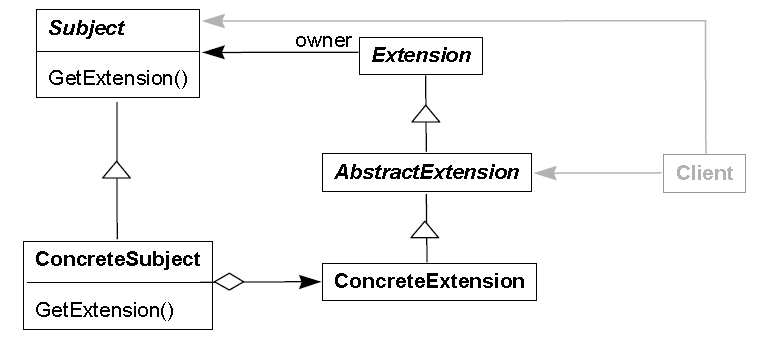

**索引**

-   意图

-   结构

-   参与者

-   适用性

-   效果

-   相关模式

-   实现

    -   实现方式（一）：使用示例结构实现 Extension Object。

    -   实现方式（二）：使用泛型实现 IExtensibleObject\<T\> 接口。

**意图**

预期对象的接口将在未来被扩展。通过额外的接口来定义扩展对象。

Anticipate that an object’s interface needs to be extended in the future.

Additional interfaces are defined by extension objects..

**结构**

**参与者**

Subject

-   定义抽象主体对象。其定义用于查询是否包含特定扩展的接口。

Extension

-   所有扩展类的抽象基类。可以定义负责管理扩展自身的操作。

-   Extension 知道其是谁的扩展。

ConcreteSubject

-   具体的主体类。实现基类定义的 GetExtension 方法并返回相应的扩展对象。

AbstractExtension

-   特定种类的扩展类的抽象基类。

ConcreteExtension

-   继承并实现 AbstractionExtension 类。实现特定的扩展功能。

**适用性**

当以下情况成立时可以使用 Extension Object 模式：

-   当需要为已有对象额外添加全新的或无法预见的接口时。

-   抽象的主要接口在不同的客户类中拥有不同的角色时。

-   无法通过子类型化来扩展接口行为时。

**效果**

-   扩展对象促进了增加新扩展功能。

-   类的主要抽象接口不会过于膨胀。

-   接口的主要抽象在不同的子系统中可实现不同的角色。

-   客户类变得更加复杂。

-   需要控制对扩展对象的滥用。

**相关模式**

-   Visitor 模式可以为层级的类结构增加新的行为。Visitor 模式与 Extension Object
    模式拥有类似的益处。相比 Visitor 模式，Extension Object
    模式不需要一个稳固的类层级结构，并且也不引入循环依赖。

-   Decorator 模式是另一个可以扩展类的行为的模式。客户类在使用 Decorator
    对象时的透明性比使用 Extension Object
    更好。在使用窄接口或需要增强已知接口时更适合使用 Decorator 模式。

-   Adapter 模式支持适配一个已知接口。Extension Object
    模式支持附加的接口。当对象需要对扩展接口进行适配时可以同时使用 Extension
    Object 模式和 Adapter 模式。

**实现**

**实现方式（一）：使用示例结构实现 Extension Object。**

复制代码

1 namespace ExtensionObjectPattern.Implementation1 2 { 3 public abstract class
Subject 4 { 5 public abstract void Operation1(); 6 public abstract Extension
GetExtension(string extensionType); 7 } 8 9 public abstract class Extension 10 {
11 protected Subject \_owner; 12 13 public Extension(Subject owner) 14 { 15
\_owner = owner; 16 } 17 18 public abstract void DoSomething(); 19 } 20 21
public abstract class AbstractExtension : Extension 22 { 23 public
AbstractExtension(Subject owner) 24 : base(owner)25 { 26 } 27 } 28 29 public
class ConcreteExtension : AbstractExtension 30 { 31 public
ConcreteExtension(Subject owner) 32 : base(owner)33 { 34 } 35 36 public override
void DoSomething() 37 { 38 // do something39 \_owner.Operation1(); 40 } 41 } 42
43 public class ConcreteSubject : Subject 44 { 45 private ConcreteExtension
\_extension; 46 47 public ConcreteSubject() 48 { 49 \_extension = new
ConcreteExtension(this);50 } 51 52 public override void Operation1() 53 { 54 //
do something55 } 56 57 public override Extension GetExtension(string
extensionType) 58 { 59 if (extensionType == "some type")60 { 61 return
this._extension;62 } 63 64 return null;65 } 66 } 67 68 public class Client 69 {
70 public void TestCase1() 71 { 72 Subject subject = new ConcreteSubject(); 73
Extension extension = subject.GetExtension("some type");74
extension.DoSomething(); 75 } 76 } 77 }

复制代码

**实现方式（二）：使用泛型实现 IExtensibleObject\<T\> 接口。**

复制代码

1 namespace ExtensionObjectPattern.Implementation2 2 { 3 public abstract class
Subject : IExtensibleObject\<Subject\> 4 { 5 public abstract void Operation1();
6 public abstract IEnumerable\<IExtension\<Subject\>\> Extensions { get; } 7 } 8
9 public interface IExtensibleObject\<T\> 10 where T : class,
IExtensibleObject\<T\>11 { 12 IEnumerable\<IExtension\<T\>\> Extensions { get;
}13 } 14 15 public interface IExtension\<T\> 16 where T : class,
IExtensibleObject\<T\>17 { 18 void Attach(T owner); 19 void Detach(T owner); 20
} 21 22 public abstract class Extension : IExtension\<Subject\> 23 { 24
protected List\<Subject\> \_owners; 25 26 public void Attach(Subject owner) 27 {
28 \_owners.Add(owner); 29 } 30 31 public void Detach(Subject owner) 32 { 33
\_owners.Remove(owner); 34 } 35 36 public abstract void DoSomething(); 37 } 38
39 public class ConcreteExtension : Extension 40 { 41 public override void
DoSomething() 42 { 43 // do something44 foreach (var item in \_owners) 45 { 46
item.Operation1(); 47 } 48 } 49 } 50 51 public class ConcreteSubject : Subject
52 { 53 private List\<Extension\> \_extensions = new List\<Extension\>(); 54 55
public ConcreteSubject() 56 { 57 Extension extension = new ConcreteExtension();
58 extension.Attach(this);59 60 \_extensions.Add(extension); 61 } 62 63 public
override void Operation1() 64 { 65 // do something66 } 67 68 public override
IEnumerable\<IExtension\<Subject\>\> Extensions 69 { 70 get71 { 72 return
\_extensions; 73 } 74 } 75 } 76 77 public class Client 78 { 79 public void
TestCase1() 80 { 81 Subject subject = new ConcreteSubject(); 82 83 foreach (var
extension in subject.Extensions) 84 { 85 (extension as Extension).DoSomething();
86 } 87 } 88 } 89 }
