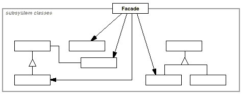

设计模式之美：Facade（外观）

**索引**

-   意图

-   结构

-   参与者

-   适用性

-   效果

-   相关模式

-   实现

    -   实现方式（一）：用抽象类定义 Facade 而使子类对应于不同的子系统。

**意图**

为子系统中的一组接口提供一个一致的界面，Facade
模式定义了一个高层接口，这个接口使得这一子系统更加容易使用。

Provide a unified interface to a set of interfaces in a subsystem. Facade
defines a higher-level interface that makes the subsystem easier to use.

**结构**

**参与者**

Facade

-   知道哪些子系统类负责处理请求。

-   将客户的请求代理给适当的子系统对象。

Subsystem Classes

-   实现子系统的功能。

-   处理由 Facade 对象指派的任务。

-   没有 Facade 的任何相关信息。

**适用性**

在以下情况下可以使用 Facade 模式：

-   当你要为一个复杂子系统提供一个简单接口时。

-   客户程序与抽象类的实现部分之间存在着很大的依赖性。

-   当你需要构建一个层次结构的子系统时，使用 Facade
    模式定义子系统中每层的入口点。

**效果**

-   它对客户屏蔽子系统组件，使用 Facade 的客户程序不需要直接访问子系统对象。

-   它实现了子系统与客户之间的松耦合关系，而子系统内部的功能组件往往是紧耦合的。

-   如果应用需要，它并不限制它们使用子系统类。因此你可以在系统易用性和通用性之间加以选择。

**相关模式**

-   Abstract Factory 模式可以与 Facade
    模式一起使用以提供一个接口，这一接口可用来以一种子系统独立的方式创建子系统对象。

-   Mediator 模式与 Facade
    模式的相似之处是，它抽象了一些已有的类的功能。Mediator
    的目的是对同事之间的任意通讯进行抽象，通常集中不属于任何单个对象的功能。Facade
    模式仅对子系统接口进行抽象，并不定义新功能。

-   通常来讲，可能仅需要一个 Facade 对象，因此可以用 Singleton 模式定义 Facade。

**实现**

**实现方式（一）：用抽象类定义 Facade 而使子类对应于不同的子系统。**

将一个系统划分成若干个子系统有利于降低系统的复杂性。一个常见的设计目标是使子系统间的通信和相互依赖关系达到最小。

大多数模式使用时都会产生更多更小的类。这使得子系统更具可重用性，也更容易对子系统进行定制，但这也给那些不需要定制子系统的用户带来一些使用上的困难。

Facade
可以提供一个简单的缺省视图，这一视图对于大多数用户来说已经足够，而那些需要更多的可定制性的用户可以越过
Facade 层。

用抽象类实现 Facade
而它的具体子类对应于不同的子系统实现，这可以进一步降低客户与子系统的耦合度。

复制代码

1 namespace FacadePattern.Implementation1 2 { 3 public abstract class Facade 4 {
5 public abstract void Operation(); 6 } 7 8 public class ConcreteFacade : Facade
9 { 10 public override void Operation() 11 { 12 // we could use any factory
here13 // or use IoC here14 SubsystemClassA subsystemClassA = new
SubsystemClassA(); 15 SubsystemClassB subsystemClassB = new SubsystemClassB();
16 17 subsystemClassA.BehaviorA(); 18 subsystemClassB.BehaviorB(); 19 } 20 } 21
22 public class SubsystemClassA 23 { 24 public void BehaviorA() 25 { 26 // do
something27 } 28 } 29 30 public class SubsystemClassB 31 { 32 public void
BehaviorB() 33 { 34 // do something35 } 36 } 37 38 public class Client 39 { 40
public void TestCase1() 41 { 42 Facade facade = new ConcreteFacade(); 43
facade.Operation(); 44 } 45 } 46 }

复制代码
