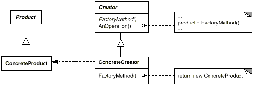

设计模式之美：Factory Method（工厂方法）

**索引**

-   别名

-   意图

-   结构

-   参与者

-   适用性

-   缺点

-   效果

-   相关模式

-   命名约定

-   实现

    -   实现方式（一）：Creator
        类是一个抽象类并且不提供它所声明的工厂方法的实现。

    -   实现方式（二）：Creator 类是一个具体类而且为工厂方法提供一个缺省的实现。

    -   实现方式（三）：参数化工厂方法。

    -   实现方式（四）：使用模板以避免创建子类。

**别名**

-   虚构造器 （Virtual Constructor）

**意图**

定义一个用于创建目标对象的接口，让子类决定实例化哪一个目标类。

Factory Method 使一个类的实例化延迟到其子类。

Define an interface for creating an object, but let subclasses decide which
class to instantiate.

Factory Method lets a class defer instantiation to subclasses.

**结构**

**参与者**

Product

-   定义工厂方法所创建的对象的接口（Interface）。

ConcreteProduct

-   实现 Product 接口。

Creator

-   声明工厂方法，该方法返回一个 Product 类型的对象。 Creator
    也可以定义一个工厂方法的缺省实现，它返回一个缺省的 ConcreteProduct 对象。

-   可以调用工厂方法以创建一个 Product 对象。

ConcreteCreator

-   重定义（Override）工厂方法以创建一个 Product 对象。

**适用性**

在下列情况下可以使用 Factory Method 模式：

-   当一个类不知道它所必须创建的对象的类的时候。

-   当一个类希望由它的子类来指定它所创建的对象的时候。

-   当类将创建对象的职责委托给多个帮助子类中的某一个，并且你希望将哪一个帮助子类是代理者这一信息局部化的时候。

**缺点**

-   客户可能仅仅为了创建一个特定的 ConcreteProduct 对象，就不得不创建 Creator
    的子类。

**效果**

-   为子类提供挂钩

-   连接平行的类层次

**相关模式**

-   Abstract Factory 经常用工厂方法来实现。

-   Factory Method 通常在 [Template
    Method](http://www.cnblogs.com/gaochundong/p/design_pattern_template_method.html)
    中被调用。

-   Prototype 不需要创建 Creator 的子类。但是，它们通常要求一个针对 Product 类的
    Initialize 操作。Creator 使用 Initialize 来初始化对象，而 Factory Method
    不需要这样的操作。

**命名约定**

使用命名约定是一个好习惯，它可以清楚地说明你正在使用工厂方法。（Convention over
Configuration）

例如，总是声明那些定义为工厂方法的抽象操作为 CreateProduct()。

**实现**

**实现方式（一）：Creator 类是一个抽象类并且不提供它所声明的工厂方法的实现。**

需要子类来定义实现，因为没有合理的缺省实现。它避免了不得不实例化不可预见类的问题。

复制代码

1 namespace FactoryMethodPattern.Implementation1 2 { 3 public abstract class
AbstractOrInterfaceOfCreator 4 { 5 public abstract AbstractOrInterfaceOfProduct
CreateProduct(); 6 } 7 8 public abstract class AbstractOrInterfaceOfProduct 9 {
10 } 11 12 public class ConcreteCreator : AbstractOrInterfaceOfCreator 13 { 14
public override AbstractOrInterfaceOfProduct CreateProduct() 15 { 16 return new
ConcreteProduct(); 17 } 18 } 19 20 public class ConcreteProduct :
AbstractOrInterfaceOfProduct 21 { 22 } 23 24 public partial class Test 25 { 26
public void Case1() 27 { 28 AbstractOrInterfaceOfCreator creator = new
ConcreteCreator(); 29 AbstractOrInterfaceOfProduct product =
creator.CreateProduct(); 30 } 31 } 32 }

复制代码

**实现方式（二）：Creator 类是一个具体类而且为工厂方法提供一个缺省的实现。**

具体的 Creator
主要因为灵活性才使用工厂方法。它所遵循的准则是，“用一个独立的操作创建对象，这样子类才能重定义它们的创建方法”。这条准则保证了子类的设计者能够在必要的时候改变父类所实例化的对象的类。

复制代码

1 namespace FactoryMethodPattern.Implementation2 2 { 3 public class
ConcreteCreator 4 { 5 public virtual AbstractOrInterfaceOfProduct
CreateProduct() 6 { 7 return new ConcreteProduct(); 8 } 9 } 10 11 public
abstract class AbstractOrInterfaceOfProduct 12 { 13 } 14 15 public class
ConcreteProduct : AbstractOrInterfaceOfProduct 16 { 17 } 18 19 public partial
class Test 20 { 21 public void Case2() 22 { 23 ConcreteCreator creator = new
ConcreteCreator(); 24 AbstractOrInterfaceOfProduct product =
creator.CreateProduct(); 25 } 26 } 27 }

复制代码

**实现方式（三）：参数化工厂方法。**

使用参数化工厂方法可以创建多种产品。工厂方法采用一个标识要被创建的对象种类的参数。

复制代码

1 namespace FactoryMethodPattern.Implementation3 2 { 3 public enum
ProductCategory 4 { 5 GoodProduct, 6 BadProduct, 7 } 8 9 public class
ConcreteCreator 10 { 11 public virtual AbstractOrInterfaceOfProduct
CreateProduct(ProductCategory category) 12 { 13 switch (category) 14 { 15 case
ProductCategory.GoodProduct: 16 return new ConcreteGoodProduct(); 17 case
ProductCategory.BadProduct: 18 return new ConcreteBadProduct(); 19 default:20
throw new NotSupportedException(); 21 } 22 } 23 } 24 25 public abstract class
AbstractOrInterfaceOfProduct 26 { 27 } 28 29 public class ConcreteGoodProduct :
AbstractOrInterfaceOfProduct 30 { 31 } 32 33 public class ConcreteBadProduct :
AbstractOrInterfaceOfProduct 34 { 35 } 36 37 public partial class Test 38 { 39
public void Case3() 40 { 41 ConcreteCreator creator = new ConcreteCreator(); 42
AbstractOrInterfaceOfProduct product =
creator.CreateProduct(ProductCategory.GoodProduct); 43 } 44 } 45 }

复制代码

**实现方式（四）：使用模板以避免创建子类。**

使用C\#中的泛型实现工厂方法。

复制代码

1 namespace FactoryMethodPattern.Implementation4 2 { 3 public abstract class
AbstractOrInterfaceOfCreator 4 { 5 public abstract AbstractOrInterfaceOfProduct
CreateProduct(); 6 } 7 8 public class GenericConcreteCreator\<T\> :
AbstractOrInterfaceOfCreator 9 where T : AbstractOrInterfaceOfProduct, new()10 {
11 public AbstractOrInterfaceOfProduct CreateProduct() 12 { 13 return new T();
14 } 15 } 16 17 public abstract class AbstractOrInterfaceOfProduct 18 { 19 } 20
21 public class ConcreteGoodProduct : AbstractOrInterfaceOfProduct 22 { 23 } 24
25 public class ConcreteBadProduct : AbstractOrInterfaceOfProduct 26 { 27 } 28
29 public partial class Test 30 { 31 public void Case3() 32 { 33
AbstractOrInterfaceOfCreator creator1 = new
GenericConcreteCreator\<ConcreteGoodProduct\>(); 34 AbstractOrInterfaceOfCreator
creator2 = new GenericConcreteCreator\<ConcreteBadProduct\>(); 35
AbstractOrInterfaceOfProduct product1 = creator1.CreateProduct(); 36
AbstractOrInterfaceOfProduct product2 = creator2.CreateProduct(); 37 } 38 } 39 }

复制代码
