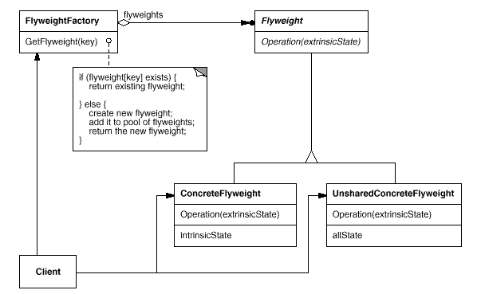
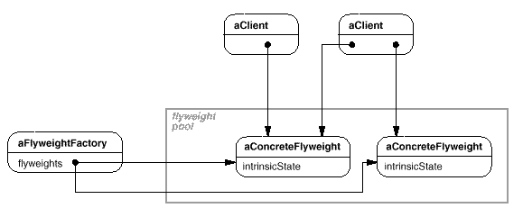

设计模式之美：Flyweight（享元）

**索引**

-   意图

-   结构

-   参与者

-   适用性

-   效果

-   相关模式

-   实现

    -   实现方式（一）：使用 FlyweightFactory 管理 Flyweight 对象。

**意图**

运用共享技术有效地支持大量细粒度的对象。

Use sharing to support large numbers of fine-grained objects efficiently.

**结构**

下面的对象图说明了如何共享 Flyweight：

**参与者**

Flyweight

-   描述一个接口，通过这个接口 Flyweight 可以接受并作用于外部状态。

ConcreteFlyweight

-   实现 Flyweight
    接口，并为内部状态增加存储空间。该对象必须是可共享的。它所存储的状态必须是内部的，即必须独立于对象的场景。

UnsharedConcreteFlyweight

-   并非所有的 Flyweight 子类都需要被共享。Flyweight
    接口使共享成为可能，但它并不强制共享。

FlyweightFactory

-   创建并管理 Flyweight 对象。

-   确保合理地共享 Flyweight。

Client

-   维持一个对 Flyweight 的引用。

-   计算或存储 Flyweight 的外部状态。

**适用性**

Flyweight 模式的有效性很大程度上取决于如何使用它以及在何处使用它。

当以下情况成立时可以使用 Flyweight 模式：

-   一个应用程序使用了大量的对象。

-   完全由于使用大量对象，造成很大的存储开销。

-   对象的大多数状态都可变为外部状态。

-   如果删除对象的外部状态，那么可以用相对较少的共享对象取代很多组对象。

-   应用程序不依赖于对象标识。

**效果**

-   存储空间上的节省抵消了传输、查找和计算外部状态时的开销。节约量随着共享状态的增多而增大。

**相关模式**

-   Flyweight 模式通常和 Composite
    模式结合起来，用共享叶节点的又向无环图实现一个逻辑上的层次结构。

-   通常，最好用 Flyweight 实现 State 和 Strategy 对象。

**实现**

**实现方式（一）：使用 FlyweightFactory 管理 Flyweight 对象。**

Flyweight
模式的可用性在很大程度上取决于是否易识别外部状态并将它从共享对象中删除。

理想的状况是，外部状态可以由一个单独的对象结构计算得到，且该结构的存储要求非常小。

通常，因为 Flyweight 对象是共享的，用户不能直接对它进行实例化，因为
FlyweightFactory 可以帮助用户查找某个特定的 Flyweight 对象。

共享还意味着某种形式的引用计数和垃圾回收。

复制代码

1 namespace FlyweightPattern.Implementation1 2 { 3 public abstract class
Flyweight 4 { 5 public abstract string Identifier { get; } 6 public abstract
void Operation(string extrinsicState); 7 } 8 9 public class ConcreteFlyweight :
Flyweight 10 { 11 public override string Identifier 12 { 13 get { return
"hello"; }14 } 15 16 public override void Operation(string extrinsicState) 17 {
18 // do something19 } 20 } 21 22 public class FlyweightFactory 23 { 24 private
Dictionary\<string, Flyweight\> \_pool25 = new Dictionary\<string,
Flyweight\>();26 27 public Flyweight CreateFlyweight(string identifier) 28 { 29
if (!\_pool.ContainsKey(identifier)) 30 { 31 Flyweight flyweight = new
ConcreteFlyweight(); 32 \_pool.Add(flyweight.Identifier, flyweight); 33 } 34 35
return \_pool[identifier]; 36 } 37 } 38 39 public class Client 40 { 41 public
void TestCase1() 42 { 43 FlyweightFactory factory = new FlyweightFactory(); 44
Flyweight flyweight1 = factory.CreateFlyweight("hello");45 Flyweight flyweight2
= factory.CreateFlyweight("hello");46 flyweight1.Operation("extrinsic state");47
flyweight2.Operation("extrinsic state");48 } 49 } 50 }
