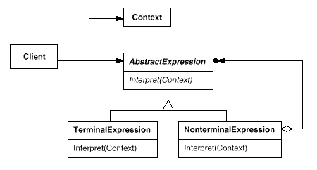

设计模式之美：Interpreter（解释器）

**索引**

-   意图

-   结构

-   参与者

-   适用性

-   效果

-   相关模式

-   实现

    -   实现方式（一）：Interpreter 模式结构样式代码。

    -   实现方式（二）：解释波兰表达式（Polish Notation）。

**意图**

给定一个语言，定义它的文法的一种表示，并定义一个解释器，这个解释器使用该表示来解释语言中的句子。

Given a language, define a represention for its grammar along with an
interpreter that uses the representation to interpret sentences in the language.

**结构**

**参与者**

AbstractExpression

-   声明一个抽象的解释操作，这个接口为抽象语法树中所有的节点所共享。

TerminalExpression

-   实现与文法中的终结符相关联的解释操作。

-   一个句子中的每一个终结符需要该类的一个实例。

NonterminalExpression

-   对文法中的规则的解释操作。

Context

-   包含解释器之外的一些全局信息。

Client

-   构建表示该语法定义的语言中一个特定的句子的抽象语法树。

-   调用解释操作

**适用性**

当有个语言需要解释执行，并且你可将该语言中的句子表示为一个抽象语法树时，可以使用
Interpreter 模式。

当存在以下情况时效果最好：

-   该文法简单对于复杂的文法，文法的类层次变得庞大而无法管理。

-   效率不是一个关键问题，最高效的解释器通常不是通过直接解释语法分析树实现的，而是首先将它们转换成另一种形式。

**效果**

-   易于改变和扩展文法。

-   易于实现文法。

-   复杂的文法难以维护。

-   增加了新的解释表达式的方式。

**相关模式**

-   抽象语法树是一个 Composite 模式的实例。

-   可以使用 Flyweight 模式在抽象语法树中共享终结符。

-   可以使用 Iterator 模式遍历解释器结构。

-   可以使用 Visitor 模式在一个类中维护抽象语法树中的各个节点的行为。

**实现**

**实现方式（一）：Interpreter 模式结构样式代码。**

TerminalExpression：实现解释 Terminal Symbols 的语法。

NonTerminalExpression：聚合一到多个 Expression，Expression 可以是
TerminalExpression，也可以是 NonTerminalExpression。。

复制代码

1 namespace InterpreterPattern.Implementation1 2 { 3 public class Context 4 { 5
public Context(string name) 6 { 7 Name = name; 8 } 9 10 public string Name {
get; private set; }11 } 12 13 public abstract class ExpressionBase 14 { 15
public abstract void Interpret(Context context); 16 } 17 18 public class
TerminalExpression : ExpressionBase 19 { 20 public override void
Interpret(Context context) 21 { 22 Console.WriteLine("Terminal Symbol {0}.",
context.Name);23 } 24 } 25 26 public class NonTerminalExpression :
ExpressionBase 27 { 28 public ExpressionBase Expression1 { get; set; }29 public
ExpressionBase Expression2 { get; set; }30 31 public override void
Interpret(Context context) 32 { 33 Console.WriteLine("Non Terminal Symbol {0}.",
context.Name);34 Expression1.Interpret(context); 35
Expression2.Interpret(context); 36 } 37 } 38 39 public class Client 40 { 41
public void TestCase1() 42 { 43 var context = new Context("Hello World");44 var
root = new NonTerminalExpression 45 { 46 Expression1 = new TerminalExpression(),
47 Expression2 = new TerminalExpression() 48 }; 49 root.Interpret(context); 50 }
51 } 52 }

复制代码

**实现方式（二）：解释波兰表达式（Polish Notation）。**

**中缀表达式**

中缀表达式中，二元运算符总是置于与之相关的两个运算对象之间，根据运算符间的优先关系来确定运算的次序，同时考虑括号规则。

比如： **2 + 3 \* (5 - 1)**

**前缀表达式**

波兰逻辑学家 J.Lukasiewicz 于 1929
年提出了一种不需要括号的表示法，将运算符写在运算对象之前，也就是前缀表达式，即波兰式（Polish
Notation, PN）。

比如：**2 + 3 \* (5 - 1)** 这个表达式的前缀表达式为 **+ 2 \* 3 - 5 1**。

**后缀表达式**

后缀表达式也称为逆波兰式（Reverse Polish Notation,
RPN），和前缀表达式相反，是将运算符号放置于运算对象之后。

比如：**2 + 3 \* (5 - 1)** 用逆波兰式来表示则是：**2 3 5 1 - \* +**。

复制代码

1 namespace InterpreterPattern.Implementation2 2 { 3 public interface
IExpression 4 { 5 int Evaluate(); 6 } 7 8 public class IntegerTerminalExpression
: IExpression 9 { 10 int \_value; 11 12 public IntegerTerminalExpression(int
value) 13 { 14 \_value = value; 15 } 16 17 public int Evaluate() 18 { 19 return
\_value; 20 } 21 22 public override string ToString() 23 { 24 return
\_value.ToString(); 25 } 26 } 27 28 public class AdditionNonterminalExpression :
IExpression 29 { 30 private IExpression \_expr1; 31 private IExpression \_expr2;
32 33 public AdditionNonterminalExpression( 34 IExpression expr1, 35 IExpression
expr2) 36 { 37 \_expr1 = expr1; 38 \_expr2 = expr2; 39 } 40 41 public int
Evaluate() 42 { 43 int value1 = \_expr1.Evaluate(); 44 int value2 =
\_expr2.Evaluate(); 45 return value1 + value2; 46 } 47 48 public override string
ToString() 49 { 50 return string.Format("({0} + {1})", \_expr1, \_expr2); 51 }
52 } 53 54 public class SubtractionNonterminalExpression : IExpression 55 { 56
private IExpression \_expr1; 57 private IExpression \_expr2; 58 59 public
SubtractionNonterminalExpression( 60 IExpression expr1, 61 IExpression expr2) 62
{ 63 \_expr1 = expr1; 64 \_expr2 = expr2; 65 } 66 67 public int Evaluate() 68 {
69 int value1 = \_expr1.Evaluate(); 70 int value2 = \_expr2.Evaluate(); 71
return value1 - value2; 72 } 73 74 public override string ToString() 75 { 76
return string.Format("({0} - {1})", \_expr1, \_expr2); 77 } 78 } 79 80 public
interface IParser 81 { 82 IExpression Parse(string polish); 83 } 84 85 public
class Parser : IParser 86 { 87 public IExpression Parse(string polish) 88 { 89
var symbols = new List\<string\>(polish.Split(' ')); 90 return
ParseNextExpression(symbols); 91 } 92 93 private IExpression
ParseNextExpression(List\<string\> symbols) 94 { 95 int value; 96 if
(int.TryParse(symbols[0], out value)) 97 { 98 symbols.RemoveAt(0); 99 return new
IntegerTerminalExpression(value); 100 } 101 return
ParseNonTerminalExpression(symbols); 102 } 103 104 private IExpression
ParseNonTerminalExpression(List\<string\> symbols)105 { 106 var symbol =
symbols[0];107 symbols.RemoveAt(0);108 109 var expr1 =
ParseNextExpression(symbols); 110 var expr2 = ParseNextExpression(symbols); 111
112 switch (symbol) 113 { 114 case "+":115 return new
AdditionNonterminalExpression(expr1, expr2); 116 case "-":117 return new
SubtractionNonterminalExpression(expr1, expr2); 118 default:119 { 120 string
message = string.Format("Invalid Symbol ({0})", symbol);121 throw new
InvalidOperationException(message); 122 } 123 } 124 } 125 } 126 127 public class
Client 128 { 129 public void TestCase2() 130 { 131 IParser parser = new
Parser(); 132 133 var commands = 134 new string[]135 { 136 "+ 1 2",137 "- 3
4",138 "+ - 5 6 7",139 "+ 8 - 9 1",140 "+ - + - - 2 3 4 + - -5 6 + -7 8 9 0"141
}; 142 143 foreach (var command in commands) 144 { 145 IExpression expression =
parser.Parse(command); 146 Console.WriteLine("{0} = {1}", expression,
expression.Evaluate());147 } 148 149 // Results:150 // (1 + 2) = 3151 // (3 - 4)
= -1152 // ((5 - 6) + 7) = 6153 // (8 + (9 - 1)) = 16154 // (((((2 - 3) - 4) +
((-5 - 6) + (-7 + 8))) - 9) + 0) = -24155 } 156 } 157 }

复制代码
