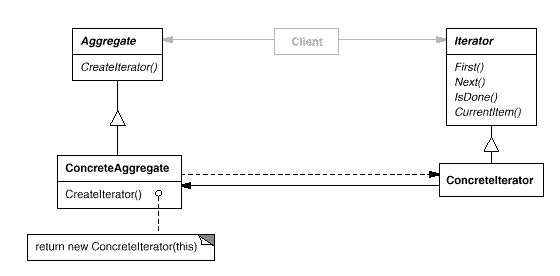

设计模式之美：Iterator（迭代器）

**索引**

-   意图

-   结构

-   参与者

-   适用性

-   效果

-   相关模式

-   实现

    -   实现方式（一）：Iterator 模式结构样式代码。

    -   实现方式（二）：实现 IEnumerable 中序遍历二叉树。

    -   实现方式（三）：实现 BidirectionalConcurrentDictionary 双向并发字典。

    -   实现方式（四）：实现 RoundRobin 循环列表。

**意图**

提供一种方法顺序访问一个聚合对象中各个元素，而又不需暴露该对象的内部表示。

Provide a way to access the elements of an aggregate object sequentially without
exposing its underlying representation.

**结构**

**参与者**

Iterator

-   迭代器定义访问和遍历元素的接口。

ConcreteIterator

-   具体迭代器实现迭代器接口。

-   对该聚合遍历时跟踪当前位置。

Aggregate

-   聚合定义创建相应迭代器对象的接口。

ConcreteAggregate

-   具体聚合实现创建相应迭代器的接口，该操作返回 ConreteIterator 的实例。

**适用性**

在以下情况下可以使用 Iterator 模式：

-   访问一个聚合对象的内容而无需暴露它的内部表示。

-   支持对聚合对象的多种遍历。

-   为遍历不同的聚合结构提供一个统一的接口。

**效果**

-   它支持以不同的方式遍历一个聚合。

-   迭代器简化了聚合的接口。

-   在同一个聚合上可以有多个遍历。

**相关模式**

-   Iterator 常被应用到 Composite 这样的递归结构上。

-   可以使用 Factory Method 模式来实例化多态迭代器。

-   Iterator 可以使用 Memento 来捕获一个迭代的状态，在内部存储 Memento。

**实现**

**实现方式（一）：Iterator 模式结构样式代码。**

复制代码

1 namespace IteratorPattern.Implementation1 2 { 3 public abstract class Iterator
4 { 5 public abstract object First(); 6 public abstract object MoveNext(); 7
public abstract object Current(); 8 public abstract bool IsDone(); 9 public
abstract void Reset(); 10 } 11 12 public abstract class Aggregate 13 { 14 public
abstract Iterator CreateIterator(); 15 } 16 17 public class ConcreteAggregate :
Aggregate 18 { 19 private readonly ArrayList \_items = new ArrayList(); 20 21
public int Count 22 { 23 get { return \_items.Count; } 24 } 25 26 public object
this[int index] 27 { 28 get { return \_items[index]; } 29 set {
\_items.Insert(index, value); } 30 } 31 32 public override Iterator
CreateIterator() 33 { 34 return new ConcreteIterator(this); 35 } 36 } 37 38
public class ConcreteIterator : Iterator 39 { 40 private readonly
ConcreteAggregate \_aggregate; 41 private int \_currentIndex = 0; 42 43 public
ConcreteIterator(ConcreteAggregate aggregate) 44 { 45 \_aggregate = aggregate;
46 } 47 48 public override object First() 49 { 50 if (\_aggregate.Count \> 0) 51
return \_aggregate[0]; 52 else 53 return null; 54 } 55 56 public override object
MoveNext() 57 { 58 object item = null; 59 if (\_currentIndex \<
\_aggregate.Count - 1) 60 { 61 item = \_aggregate[++\_currentIndex]; 62 } 63 64
return item; 65 } 66 67 public override object Current() 68 { 69 return
\_aggregate[\_currentIndex]; 70 } 71 72 public override bool IsDone() 73 { 74
return \_currentIndex \>= \_aggregate.Count; 75 } 76 77 public override void
Reset() 78 { 79 \_currentIndex = 0; 80 } 81 } 82 83 public class Client 84 { 85
public void TestCase1() 86 { 87 var aggregate = new ConcreteAggregate(); 88
aggregate[0] = "Apple"; 89 aggregate[1] = "Orange"; 90 aggregate[2] =
"Strawberry"; 91 92 var iterator = new ConcreteIterator(aggregate); 93 94 object
item = iterator.First(); 95 while (!iterator.IsDone()) 96 { 97
Console.WriteLine(item); 98 item = iterator.MoveNext(); 99 } 100 } 101 } 102 }

复制代码

**实现方式（二）：实现 IEnumerable 中序遍历二叉树。**

复制代码

1 /// \<summary\> 2 /// 二叉树节点 3 /// \</summary\> 4 /// \<typeparam
name="T"\>The item type\</typeparam\> 5 public class BinaryTreeNode\<T\> 6 { 7
\#region Constructors 8 9 /// \<summary\> 10 /// 二叉树节点 11 /// \</summary\>
12 public BinaryTreeNode() 13 { 14 } 15 16 /// \<summary\> 17 /// 二叉树节点 18
/// \</summary\> 19 /// \<param name="value"\>节点中的值\</param\> 20 public
BinaryTreeNode(T value) 21 { 22 this.Value = value; 23 } 24 25 /// \<summary\>
26 /// 二叉树节点 27 /// \</summary\> 28 /// \<param
name="value"\>节点中的值\</param\> 29 /// \<param
name="parent"\>节点的父节点\</param\> 30 public BinaryTreeNode(T value,
BinaryTreeNode\<T\> parent) 31 { 32 this.Value = value; 33 this.Parent = parent;
34 } 35 36 /// \<summary\> 37 /// 二叉树节点 38 /// \</summary\> 39 /// \<param
name="value"\>节点中的值\</param\> 40 /// \<param
name="parent"\>节点的父节点\</param\> 41 /// \<param
name="left"\>节点的左节点\</param\> 42 /// \<param
name="right"\>节点的右节点\</param\> 43 public BinaryTreeNode(T value, 44
BinaryTreeNode\<T\> parent, 45 BinaryTreeNode\<T\> left, 46 BinaryTreeNode\<T\>
right) 47 { 48 this.Value = value; 49 this.Right = right; 50 this.Left = left;
51 this.Parent = parent; 52 } 53 54 \#endregion 55 56 \#region Properties 57 58
/// \<summary\> 59 /// 节点值 60 /// \</summary\> 61 public T Value { get; set;
} 62 63 /// \<summary\> 64 /// 父节点 65 /// \</summary\> 66 public
BinaryTreeNode\<T\> Parent { get; set; } 67 68 /// \<summary\> 69 /// 左节点 70
/// \</summary\> 71 public BinaryTreeNode\<T\> Left { get; set; } 72 73 ///
\<summary\> 74 /// 右节点 75 /// \</summary\> 76 public BinaryTreeNode\<T\>
Right { get; set; } 77 78 /// \<summary\> 79 /// 是否为根节点 80 ///
\</summary\> 81 public bool IsRoot { get { return Parent == null; } } 82 83 ///
\<summary\> 84 /// 是否为叶子节点 85 /// \</summary\> 86 public bool IsLeaf {
get { return Left == null && Right == null; } } 87 88 /// \<summary\> 89 ///
是否为可访问的 90 /// \</summary\> 91 internal bool Visited { get; set; } 92 93
\#endregion 94 95 \#region Public Overridden Functions 96 97 /// \<summary\> 98
/// Returns a \<see cref="System.String"/\> that represents this instance. 99
/// \</summary\>100 /// \<returns\>101 /// A \<see cref="System.String"/\> that
represents this instance. 102 /// \</returns\>103 public override string
ToString() 104 { 105 return Value.ToString(); 106 } 107 108 \#endregion109 }

复制代码

复制代码

1 /// \<summary\> 2 /// 二叉树 3 /// \</summary\> 4 /// \<typeparam
name="T"\>二叉树中节点内容类型\</typeparam\> 5
[SuppressMessage("Microsoft.Naming",
"CA1710:IdentifiersShouldHaveCorrectSuffix")] 6 public class BinaryTree\<T\> :
ICollection\<T\>, IEnumerable\<T\> where T : IComparable\<T\> 7 { 8 \#region
Constructor 9 10 /// \<summary\> 11 /// 二叉树 12 /// \</summary\> 13 public
BinaryTree() 14 { 15 NumberOfNodes = 0; 16 } 17 18 /// \<summary\> 19 /// 二叉树
20 /// \</summary\> 21 /// \<param name="root"\>二叉树根节点\</param\> 22 public
BinaryTree(BinaryTreeNode\<T\> root) 23 : this() 24 { 25 this.Root = root; 26 }
27 28 \#endregion 29 30 \#region Properties 31 32 /// \<summary\> 33 ///
树的根节点 34 /// \</summary\> 35 public BinaryTreeNode\<T\> Root { get; set; }
36 37 /// \<summary\> 38 /// 树中节点的数量 39 /// \</summary\> 40 protected int
NumberOfNodes { get; set; } 41 42 /// \<summary\> 43 /// 树是否为空 44 ///
\</summary\> 45 public bool IsEmpty { get { return Root == null; } } 46 47 ///
\<summary\> 48 /// 获取树中节点的最小值 49 /// \</summary\> 50 public T MinValue
51 { 52 get 53 { 54 if (IsEmpty) 55 return default(T); 56 57 BinaryTreeNode\<T\>
minNode = Root; 58 while (minNode.Left != null) 59 minNode = minNode.Left; 60 61
return minNode.Value; 62 } 63 } 64 65 /// \<summary\> 66 ///
获取树中节点的最大值 67 /// \</summary\> 68 public T MaxValue 69 { 70 get 71 {
72 if (IsEmpty) 73 return default(T); 74 75 BinaryTreeNode\<T\> maxNode = Root;
76 while (maxNode.Right != null) 77 maxNode = maxNode.Right; 78 79 return
maxNode.Value; 80 } 81 } 82 83 \#endregion 84 85 \#region IEnumerable\<T\>
Members 86 87 /// \<summary\> 88 /// Returns an enumerator that iterates through
the collection. 89 /// \</summary\> 90 /// \<returns\> 91 /// A \<see
cref="T:System.Collections.Generic.IEnumerator\`1"\>\</see\> 92 /// that can be
used to iterate through the collection. 93 /// \</returns\> 94 public
IEnumerator\<T\> GetEnumerator() 95 { 96 foreach (BinaryTreeNode\<T\> node in
Traverse(Root)) 97 { 98 yield return node.Value; 99 } 100 } 101 102
\#endregion103 104 \#region IEnumerable Members 105 106 /// \<summary\>107 ///
Returns an enumerator that iterates through a collection. 108 ///
\</summary\>109 /// \<returns\>110 /// An \<see
cref="T:System.Collections.IEnumerator"/\> 111 /// object that can be used to
iterate through the collection. 112 /// \</returns\>113 IEnumerator
IEnumerable.GetEnumerator() 114 { 115 foreach (BinaryTreeNode\<T\> node in
Traverse(Root)) 116 { 117 yield return node.Value; 118 } 119 } 120 121
\#endregion122 123 \#region ICollection\<T\> Members 124 125 /// \<summary\>126
/// 新增节点 127 /// \</summary\>128 /// \<param name="item"\>The object to add
to the129 /// \<see
cref="T:System.Collections.Generic.ICollection\`1"\>\</see\>.\</param\>130 ///
\<exception cref="T:System.NotSupportedException"\>The131 /// \<see
cref="T:System.Collections.Generic.ICollection\`1"\>\</see\> 132 /// is
read-only.\</exception\>133 public void Add(T item) 134 { 135 if (Root ==
null)136 { 137 Root = new BinaryTreeNode\<T\>(item); 138 ++NumberOfNodes; 139 }
140 else141 { 142 Insert(item); 143 } 144 } 145 146 /// \<summary\>147 ///
清除树 148 /// \</summary\>149 public void Clear() 150 { 151 Root = null;152 }
153 154 /// \<summary\>155 /// 树中是否包含此节点 156 /// \</summary\>157 ///
\<param name="item"\>The object to locate in the158 /// \<see
cref="T:System.Collections.Generic.ICollection\`1"\>\</see\>.\</param\>159 ///
\<returns\>160 /// true if item is found in the 161 /// \<see
cref="T:System.Collections.Generic.ICollection\`1"\>\</see\>; otherwise,
false.162 /// \</returns\>163 public bool Contains(T item) 164 { 165 if
(IsEmpty) 166 return false;167 168 BinaryTreeNode\<T\> currentNode = Root; 169
while (currentNode != null)170 { 171 int comparedValue =
currentNode.Value.CompareTo(item); 172 if (comparedValue == 0)173 return
true;174 else if (comparedValue \< 0)175 currentNode = currentNode.Left; 176
else177 currentNode = currentNode.Right; 178 } 179 180 return false;181 } 182
183 /// \<summary\>184 /// 将树中节点拷贝至目标数组 185 /// \</summary\>186 ///
\<param name="array"\>The array.\</param\>187 /// \<param
name="arrayIndex"\>Index of the array.\</param\>188 public void CopyTo(T[]
array, int arrayIndex) 189 { 190 T[] tempArray = new T[NumberOfNodes]; 191 int
counter = 0;192 foreach (T value in this)193 { 194 tempArray[counter] = value;
195 ++counter; 196 } 197 Array.Copy(tempArray, 0, array, arrayIndex, Count);198
} 199 200 /// \<summary\>201 /// 树中节点的数量 202 /// \</summary\>203 public
int Count 204 { 205 get { return NumberOfNodes; } 206 } 207 208 ///
\<summary\>209 /// 树是否为只读 210 /// \</summary\>211 public bool IsReadOnly
212 { 213 get { return false; }214 } 215 216 /// \<summary\>217 /// 移除节点 218
/// \</summary\>219 /// \<param name="item"\>节点值\</param\>220 ///
\<returns\>是否移除成功\</returns\>221 public bool Remove(T item) 222 { 223
BinaryTreeNode\<T\> node = Find(item); 224 if (node == null)225 return false;226
227 List\<T\> values = new List\<T\>(); 228 foreach (BinaryTreeNode\<T\> l in
Traverse(node.Left)) 229 { 230 values.Add(l.Value); 231 } 232 foreach
(BinaryTreeNode\<T\> r in Traverse(node.Right)) 233 { 234 values.Add(r.Value);
235 } 236 237 if (node.Parent.Left == node) 238 { 239 node.Parent.Left =
null;240 } 241 else242 { 243 node.Parent.Right = null;244 } 245 246 node.Parent
= null;247 248 foreach (T v in values) 249 { 250 this.Add(v);251 } 252 253
return true;254 } 255 256 \#endregion257 258 \#region Private Functions 259 260
/// \<summary\>261 /// 查找指定值的节点 262 /// \</summary\>263 /// \<param
name="value"\>指定值\</param\>264 /// \<returns\>265 /// 指定值的节点 266 ///
\</returns\>267 protected BinaryTreeNode\<T\> Find(T value) 268 { 269 foreach
(BinaryTreeNode\<T\> node in Traverse(Root)) 270 if (node.Value.Equals(value))
271 return node; 272 return null;273 } 274 275 /// \<summary\>276 /// 遍历树 277
/// \</summary\>278 /// \<param name="node"\>遍历搜索的起始节点\</param\>279 ///
\<returns\>280 /// The individual items from the tree 281 /// \</returns\>282
[SuppressMessage("Microsoft.Design",
"CA1006:DoNotNestGenericTypesInMemberSignatures")]283 protected
IEnumerable\<BinaryTreeNode\<T\>\> Traverse(BinaryTreeNode\<T\> node) 284 { 285
// 遍历左子树286 if (node.Left != null)287 { 288 foreach (BinaryTreeNode\<T\>
left in Traverse(node.Left)) 289 yield return left; 290 } 291 292 //
中序遍历二叉树, 顺序是 左子树，根，右子树293 yield return node; 294 295 //
遍历右子树296 if (node.Right != null)297 { 298 foreach (BinaryTreeNode\<T\>
right in Traverse(node.Right)) 299 yield return right; 300 } 301 } 302 303 ///
\<summary\>304 /// 插入节点 305 /// \</summary\>306 /// \<param
name="value"\>插入的节点值\</param\>307 protected void Insert(T value) 308 { 309
// 从根节点开始比较310 BinaryTreeNode\<T\> currentNode = Root; 311 312 while
(true)313 { 314 if (currentNode == null)315 throw new
InvalidProgramException("The current tree node cannot be null.");316 317 //
比较当前节点与新节点的值318 int comparedValue =
currentNode.Value.CompareTo(value); 319 if (comparedValue \< 0)320 { 321 //
当前节点值小于新节点值322 if (currentNode.Left == null)323 { 324
currentNode.Left = new BinaryTreeNode\<T\>(value, currentNode); 325
\++NumberOfNodes; 326 return;327 } 328 else329 { 330 currentNode =
currentNode.Left; 331 } 332 } 333 else if (comparedValue \> 0)334 { 335 //
当前节点值大于新节点值336 if (currentNode.Right == null)337 { 338
currentNode.Right = new BinaryTreeNode\<T\>(value, currentNode); 339
\++NumberOfNodes; 340 return;341 } 342 else343 { 344 currentNode =
currentNode.Right; 345 } 346 } 347 else348 { 349 // 当前节点值等于新节点值350
currentNode = currentNode.Right; 351 } 352 } 353 } 354 355 \#endregion356 }

复制代码

**实现方式（三）：实现 BidirectionalConcurrentDictionary 双向并发字典。**

复制代码

1 namespace IteratorPattern.Implementation3 2 { 3 /// \<summary\> 4 /// 双值对 5
/// \</summary\> 6 /// \<typeparam name="TFirst"\>第一个值的类型\</typeparam\> 7
/// \<typeparam name="TSecond"\>第二个值的类型\</typeparam\> 8 [Serializable] 9
public struct FirstSecondPair\<TFirst, TSecond\> 10 { 11 private TFirst first;
12 private TSecond second; 13 14 /// \<summary\> 15 /// 第一个值 16 ///
\</summary\> 17 public TFirst First 18 { 19 get 20 { 21 return this.first; 22 }
23 } 24 25 /// \<summary\> 26 /// 第二个值 27 /// \</summary\> 28 public TSecond
Second 29 { 30 get 31 { 32 return this.second; 33 } 34 } 35 36 /// \<summary\>
37 /// 双值对 38 /// \</summary\> 39 /// \<param
name="first"\>第一个值\</param\> 40 /// \<param
name="second"\>第二个值\</param\> 41 public FirstSecondPair(TFirst first,
TSecond second) 42 { 43 if (first == null) 44 throw new
ArgumentNullException("first"); 45 if (second == null) 46 throw new
ArgumentNullException("second"); 47 48 this.first = first; 49 this.second =
second; 50 } 51 52 /// \<summary\> 53 /// Determines whether the specified \<see
cref="System.Object"/\> is equal to this instance. 54 /// \</summary\> 55 ///
\<param name="obj"\>The \<see cref="System.Object"/\> to compare with this
instance.\</param\> 56 /// \<returns\> 57 /// \<c\>true\</c\> if the specified
\<see cref="System.Object"/\> is equal to this instance; otherwise,
\<c\>false\</c\>. 58 /// \</returns\> 59 public override bool Equals(object obj)
60 { 61 if (obj == null) 62 return false; 63 64 FirstSecondPair\<TFirst,
TSecond\> target = (FirstSecondPair\<TFirst, TSecond\>)obj; 65 return
this.First.Equals(target.First) && this.Second.Equals(target.Second); 66 } 67 68
/// \<summary\> 69 /// Returns a hash code for this instance. 70 ///
\</summary\> 71 /// \<returns\> 72 /// A hash code for this instance, suitable
for use in hashing algorithms and data structures like a hash table. 73 ///
\</returns\> 74 public override int GetHashCode() 75 { 76 return
base.GetHashCode(); 77 } 78 79 /// \<summary\> 80 /// Returns a \<see
cref="System.String"/\> that represents this instance. 81 /// \</summary\> 82
/// \<returns\> 83 /// A \<see cref="System.String"/\> that represents this
instance. 84 /// \</returns\> 85 public override string ToString() 86 { 87
StringBuilder sb = new StringBuilder(); 88 sb.Append('['); 89 90 if (this.First
!= null) 91 { 92 sb.Append(this.First.ToString()); 93 } 94 95 sb.Append(", ");
96 97 if (this.Second != null) 98 { 99 sb.Append(this.Second.ToString());100 }
101 102 sb.Append(']');103 104 return sb.ToString(); 105 } 106 107 ///
\<summary\>108 /// Implements the operator ==. 109 /// \</summary\>110 ///
\<param name="left"\>The left.\</param\>111 /// \<param name="right"\>The
right.\</param\>112 /// \<returns\>113 /// The result of the operator. 114 ///
\</returns\>115 public static bool operator ==(FirstSecondPair\<TFirst,
TSecond\> left, FirstSecondPair\<TFirst, TSecond\> right) 116 { 117 if
(((object)left == null) \|\| ((object)right == null))118 { 119 return false;120
} 121 122 return left.Equals(right); 123 } 124 125 /// \<summary\>126 ///
Implements the operator !=. 127 /// \</summary\>128 /// \<param name="left"\>The
left.\</param\>129 /// \<param name="right"\>The right.\</param\>130 ///
\<returns\>131 /// The result of the operator. 132 /// \</returns\>133 public
static bool operator !=(FirstSecondPair\<TFirst, TSecond\> left,
FirstSecondPair\<TFirst, TSecond\> right) 134 { 135 return !(left == right); 136
} 137 } 138 139 public class BidirectionalConcurrentDictionary\<TFirst,
TSecond\> : IEnumerable\<FirstSecondPair\<TFirst, TSecond\>\> 140 { 141 \#region
Fields 142 143 private ConcurrentDictionary\<TFirst, TSecond\> firstToSecond =
new ConcurrentDictionary\<TFirst, TSecond\>(); 144 private
ConcurrentDictionary\<TSecond, TFirst\> secondToFirst = new
ConcurrentDictionary\<TSecond, TFirst\>(); 145 146 \#endregion147 148 \#region
Public Methods 149 150 public void Add(TFirst first, TSecond second) 151 { 152
if (firstToSecond.ContainsKey(first) \|\| secondToFirst.ContainsKey(second)) 153
throw new ArgumentException("Duplicate first or second");154 155
firstToSecond.Add(first, second); 156 secondToFirst.Add(second, first); 157 }
158 159 public bool ContainsFirst(TFirst first) 160 { 161 return
firstToSecond.ContainsKey(first); 162 } 163 164 public bool
ContainsSecond(TSecond second) 165 { 166 return
secondToFirst.ContainsKey(second); 167 } 168 169 public TSecond
GetByFirst(TFirst first) 170 { 171 TSecond second; 172 if
(!firstToSecond.TryGetValue(first, out second)) 173 throw new
KeyNotFoundException("Cannot find second by first.");174 175 return second; 176
} 177 178 public TFirst GetBySecond(TSecond second) 179 { 180 TFirst first; 181
if (!secondToFirst.TryGetValue(second, out first)) 182 throw new
KeyNotFoundException("Cannot find first by second.");183 184 return first; 185 }
186 187 public void RemoveByFirst(TFirst first) 188 { 189 TSecond second; 190 if
(!firstToSecond.TryGetValue(first, out second)) 191 throw new
KeyNotFoundException("Cannot find second by first.");192 193
firstToSecond.Remove(first); 194 secondToFirst.Remove(second); 195 } 196 197
public void RemoveBySecond(TSecond second) 198 { 199 TFirst first; 200 if
(!secondToFirst.TryGetValue(second, out first)) 201 throw new
KeyNotFoundException("Cannot find first by second.");202 203
secondToFirst.Remove(second); 204 firstToSecond.Remove(first); 205 } 206 207
public bool TryAdd(TFirst first, TSecond second) 208 { 209 if
(firstToSecond.ContainsKey(first) \|\| secondToFirst.ContainsKey(second)) 210
return false;211 212 firstToSecond.Add(first, second); 213
secondToFirst.Add(second, first); 214 return true;215 } 216 217 public bool
TryGetByFirst(TFirst first, out TSecond second) 218 { 219 return
firstToSecond.TryGetValue(first, out second); 220 } 221 222 public bool
TryGetBySecond(TSecond second, out TFirst first) 223 { 224 return
secondToFirst.TryGetValue(second, out first); 225 } 226 227 public bool
TryRemoveByFirst(TFirst first) 228 { 229 TSecond second; 230 if
(!firstToSecond.TryGetValue(first, out second)) 231 return false;232 233
firstToSecond.Remove(first); 234 secondToFirst.Remove(second); 235 return
true;236 } 237 238 public bool TryRemoveBySecond(TSecond second) 239 { 240
TFirst first; 241 if (!secondToFirst.TryGetValue(second, out first)) 242 return
false;243 244 secondToFirst.Remove(second); 245 firstToSecond.Remove(first); 246
return true;247 } 248 249 public int Count 250 { 251 get { return
firstToSecond.Count; } 252 } 253 254 public void Clear() 255 { 256
firstToSecond.Clear(); 257 secondToFirst.Clear(); 258 } 259 260 \#endregion261
262 \#region IEnumerable\<FirstSecondPair\<TFirst,TSecond\>\> Members 263 264
IEnumerator\<FirstSecondPair\<TFirst, TSecond\>\>
IEnumerable\<FirstSecondPair\<TFirst, TSecond\>\>.GetEnumerator() 265 { 266
foreach (var item in firstToSecond) 267 { 268 yield return new
FirstSecondPair\<TFirst, TSecond\>(item.Key, item.Value); 269 } 270 } 271 272
\#endregion273 274 \#region IEnumerable Members 275 276 IEnumerator
IEnumerable.GetEnumerator() 277 { 278 foreach (var item in firstToSecond) 279 {
280 yield return new FirstSecondPair\<TFirst, TSecond\>(item.Key, item.Value);
281 } 282 } 283 284 \#endregion285 } 286 287 public static class
ConcurrentDictionaryExtensions 288 { 289 public static TValue Add\<TKey,
TValue\>(this ConcurrentDictionary\<TKey, TValue\> collection, TKey key, TValue
@value) 290 { 291 TValue result = collection.AddOrUpdate(key, @value, (k, v) =\>
{ return @value; }); 292 return result; 293 } 294 295 public static TValue
Update\<TKey, TValue\>(this ConcurrentDictionary\<TKey, TValue\> collection,
TKey key, TValue @value) 296 { 297 TValue result = collection.AddOrUpdate(key,
@value, (k, v) =\> { return @value; }); 298 return result; 299 } 300 301 public
static TValue Get\<TKey, TValue\>(this ConcurrentDictionary\<TKey, TValue\>
collection, TKey key) 302 { 303 TValue @value = default(TValue);304
collection.TryGetValue(key, out @value); 305 return @value; 306 } 307 308 public
static TValue Remove\<TKey, TValue\>(this ConcurrentDictionary\<TKey, TValue\>
collection, TKey key) 309 { 310 TValue @value = default(TValue);311
collection.TryRemove(key, out @value); 312 return @value; 313 } 314 } 315 }

复制代码

**实现方式（四）：实现 RoundRobin 循环列表。**

复制代码

1 namespace IteratorPattern.Implementation4 2 { 3 /// \<summary\> 4 /// 循环列表
5 /// \</summary\> 6 /// \<typeparam name="T"\>\</typeparam\> 7 public class
RoundRobinCollection\<T\> : IEnumerable\<T\> 8 { 9 private T[] \_items; 10
private int \_head; 11 12 /// \<summary\>13 /// 循环列表 14 /// \</summary\>15
/// \<param name="items"\>供循环的列表项\</param\>16 public
RoundRobinCollection(IEnumerable\<T\> items) 17 { 18 if (items == null \|\|
items.Count\<T\>() == 0)19 { 20 throw new ArgumentException( 21 "One or more
items must be provided", "items");22 } 23 24 // copy the list to ensure it
doesn't change on us25 // (and so we can lock() on our private copy) 26 \_items
= items.ToArray(); 27 } 28 29 /// \<summary\>30 /// 获取循环器 31 ///
\</summary\>32 /// \<returns\>\</returns\>33 public IEnumerator\<T\>
GetEnumerator() 34 { 35 int currentHead; 36 37 lock (_items) 38 { 39 currentHead
= \_head++; 40 41 if (_head == \_items.Length) 42 { 43 // wrap back to the start
44 \_head = 0;45 } 46 } 47 48 // return results [current] ... [last] 49 for (int
i = currentHead; i \< \_items.Length; i++) 50 { 51 yield return \_items[i]; 52 }
53 54 // return wrap-around (if any) [0] ... [current-1] 55 for (int i = 0; i \<
currentHead; i++)56 { 57 yield return \_items[i]; 58 } 59 } 60 61 ///
\<summary\>62 /// 获取循环器 63 /// \</summary\>64 /// \<returns\>\</returns\>65
IEnumerator IEnumerable.GetEnumerator() 66 { 67 return this.GetEnumerator();68 }
69 } 70 }

复制代码
