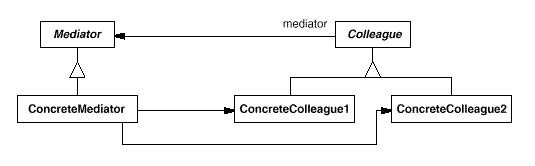

设计模式之美：Mediator（中介者）

**索引**

-   意图

-   结构

-   参与者

-   适用性

-   效果

-   相关模式

-   实现

    -   实现方式（一）：Mediator 模式结构样式代码。

**意图**

用一个中介对象来封装一系列的对象交互。

中介者使各对象不需要显式地相互引用，从而使其耦合松散，而且可以独立地改变它们之间的交互。

Define an object that encapsulates how a set of objects interact.

Mediator promotes loose coupling by keeping objects from referring to each other
explicitly, and it lets you vary their interaction independently.

**结构**

一个典型的对象结构：

**参与者**

Mediator

-   中介者定义一个接口用于与各同事对象通信。

ConcreteMediator

-   具体中介者通过协调各同事对象实现协作行为。

-   了解并维护它的各个同事。

Colleague

-   每一个同事类都知道它的中介者。

-   每一个同事对象在需与其他同事通信时，与它的中介者通信。

**适用性**

在以下情况下可以使用 Mediator 模式：

-   一组对象定义良好但是使用复杂的通信方式。产生的相互依赖关系结构混乱且难以理解。

-   一个对象引用其他很多对象并且直接与这些对象通信，导致难以复用该对象。

-   想定制一个分布在多个类中的行为，而又不想生成太多的子类。

**效果**

-   减少了子类的生成。

-   将各个同事类解耦。

-   它简化了对象协议。

-   它对对象如何协作进行了抽象。

-   它使控制集中化。

**相关模式**

-   Facade 模式与 Mediator
    模式的不同之处在于它是对一个对象子系统进行抽象，从而提供了一个更为方便的接口。它的协议是单向的，即
    Facade 对象对这个子系统类提出要求，但反之则不行。Mediator 提供了各 Colleague
    对象不支持或不能支持的协作行为，而协议是多向的。

-   Colleague 可以使用 Observer 模式与 Mediator 通信。

**实现**

**实现方式（一）：Mediator 模式结构样式代码。**

Colleague-Mediator 的通信中，当一个感兴趣的事件发生时，Colleague 必须与其
Mediator 通信。

一种方式是使用 Observer 模式，将 Mediator 实现为一个 Observer，各 Colleague 作为
Subject。

另一种方式是在 Mediator 中定义一个特殊的通知接口，各 Colleague
在通信时直接调用该接口。

复制代码

1 namespace MediatorPattern.Implementation1 2 { 3 public abstract class
Colleague 4 { 5 protected Mediator \_mediator; 6 7 public Colleague(Mediator
mediator) 8 { 9 \_mediator = mediator; 10 } 11 12 public abstract void
Send(string message); 13 public abstract void Notify(string message); 14 } 15 16
public abstract class Mediator 17 { 18 public abstract void
SendMessage(Colleague sender, string message); 19 } 20 21 public class
ConcreteMediator : Mediator 22 { 23 private ConcreteColleague1 \_colleague1; 24
private ConcreteColleague2 \_colleague2; 25 26 public ConcreteColleague1
Colleague1 27 { 28 set { \_colleague1 = value; } 29 } 30 31 public
ConcreteColleague2 Colleague2 32 { 33 set { \_colleague2 = value; } 34 } 35 36
public override void SendMessage(Colleague sender, string message) 37 { 38 if
(sender == \_colleague1) 39 { 40 \_colleague2.Notify(message); 41 } 42 else if
(sender == \_colleague2) 43 { 44 \_colleague1.Notify(message); 45 } 46 } 47 } 48
49 public class ConcreteColleague1 : Colleague 50 { 51 public
ConcreteColleague1(Mediator mediator) 52 : base(mediator) 53 { 54 } 55 56 public
override void Send(string message) 57 { 58 \_mediator.SendMessage(this,
message); 59 } 60 61 public override void Notify(string message) 62 { 63
Console.WriteLine("Colleague1 gets message: " + message); 64 } 65 } 66 67 public
class ConcreteColleague2 : Colleague 68 { 69 public ConcreteColleague2(Mediator
mediator) 70 : base(mediator) 71 { 72 } 73 74 public override void Send(string
message) 75 { 76 \_mediator.SendMessage(this, message); 77 } 78 79 public
override void Notify(string message) 80 { 81 Console.WriteLine("Colleague2 gets
message: " + message); 82 } 83 } 84 85 public class Client 86 { 87 public void
TestCase1() 88 { 89 var mediator = new ConcreteMediator(); 90 91 var colleague1
= new ConcreteColleague1(mediator); 92 var colleague2 = new
ConcreteColleague2(mediator); 93 94 mediator.Colleague1 = colleague1; 95
mediator.Colleague2 = colleague2; 96 97 colleague1.Send("How are you?"); 98
colleague2.Send("Fine, Thank you!"); 99 } 100 } 101 }

复制代码
