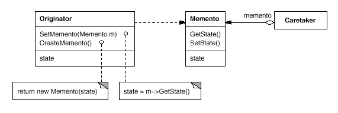
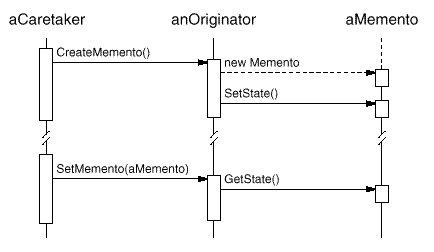

设计模式之美：Memento（备忘录）

**索引**

-   意图

-   结构

-   参与者

-   适用性

-   效果

-   相关模式

-   实现

    -   实现方式（一）：Memento 模式结构样式代码。

**别名**

-   Token

**意图**

在不破坏封装性的前提下，捕获一个对象的内部状态，并在该对象之外保存这个状态。这样以后就可将该对象恢复到原先保存的状态。

Without violating encapsulation, capture and externalize an object's internal
state so that the object can be restored to this state later.

**结构**

**参与者**

Memento

-   Memento 存储 Originator 对象的内部状态。Originator 根据需要决定 Memento
    存储那些内部状态。

-   防止 Originator 以外的其他对象访问 Memento。Memento
    可实现两个接口，Caretaker 只能看到 Memento 的窄接口，Originator
    可以看到宽接口。

Originator

-   Originator 创建一个 Memento，用以记录当前时刻的内部状态。

-   使用 Memento 恢复内部状态。

Caretaker

-   负责保存 Memento。

-   不能对 Memento 的内容进行操作和检查。

**适用性**

在以下情况下可以使用 Memento 模式：

-   必须保存一个对象在某一个时刻的状态，这样以后需要时它才能恢复到先前的状态。

-   如果一个用接口来让其他对象直接得到的这些状态，将会暴露对象的实现细节并破坏对象的封装性。

**效果**

-   保持封装边界。

-   简化了 Originator。

-   定义窄接口和宽接口。

-   使用和维护 Memento 的潜在代价。

**相关模式**

-   可以使用 Memento 存储 Command 的内部状态，以支持撤销操作。

-   Memento 可以使用 Iterator 进行迭代。

**实现**

Caretaker 向 Originator 请求一个 Memento，保留一段时间后，将其送回 Originator。

**实现方式（一）：Memento 模式结构样式代码。**

Memento 有两个接口：一个为 Originator
所使用的宽接口，一个为其他对象所使用的窄接口。

复制代码

1 namespace MementoPattern.Implementation1 2 { 3 public class Memento 4 { 5
private readonly string \_state; 6 7 public Memento(string state) 8 { 9 \_state
= state; 10 } 11 12 public string GetState() 13 { 14 return \_state; 15 } 16 }
17 18 public class Originator 19 { 20 public string State { get; set; }21 22
public Memento CreateMemento() 23 { 24 return (new Memento(State)); 25 } 26 27
public void SetMemento(Memento memento) 28 { 29 State = memento.GetState(); 30 }
31 } 32 33 public class Caretaker 34 { 35 public Memento Memento { get; set; }36
} 37 38 public class Client 39 { 40 public void TestCase1() 41 { 42 var
originator = new Originator { State = "State A" }; 43
Console.WriteLine(originator.State); 44 45 var memento =
originator.CreateMemento(); 46 var caretaker = new Caretaker { Memento = memento
}; 47 48 originator.State = "State B";49 Console.WriteLine(originator.State); 50
51 originator.SetMemento(caretaker.Memento); 52
Console.WriteLine(originator.State); 53 } 54 } 55 }

复制代码
