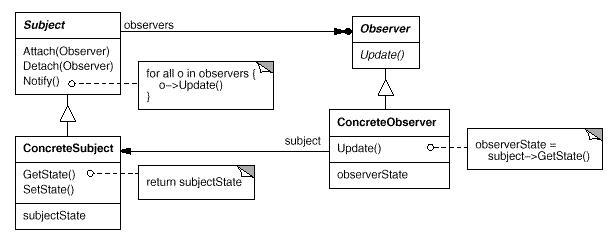
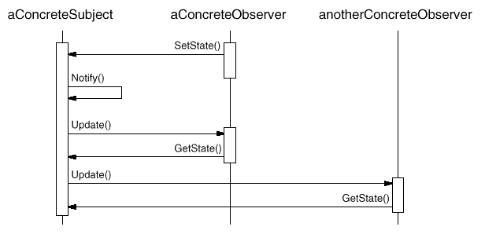

设计模式之美：Observer（观察者）

**索引**

-   意图

-   结构

-   参与者

-   适用性

-   效果

-   相关模式

-   实现

    -   实现方式（一）：Observer 模式结构样式代码。

**别名**

-   Dependency

-   Publish-Subscribe

**意图**

定义对象间的一种一对多的依赖关系，当一个对象的状态发生改变时，所有依赖于它的对象都得到通知并被自动更新。

Define a one-to-many dependency between objects so that when one object changes
state, all its dependents are notified and updated automatically.

**结构**

**参与者**

Subject

-   Subject 知道它的 Observer。可以有任意多个 Observer 观察同一个 Subject。

-   提供注册和删除 Observer 的接口。

Observer

-   为那些在 Subject 发生改变时需要获得通知的对象定义一个 Update 接口。

ConcreteSubject

-   将有关状态存储各个 ConcreteObserver 对象。

-   当它的状态发生改变时，想它的各个 Observer 发出通知。

ConcreteObserver

-   维护一个指向 ConcreteSubject 对象的引用。

-   存储有关状态，这些状态应该与 ConcreteSubject 的状态保持一致。

-   实现 Observer 的更新接口以使自身状态与 ConcreteSubject 状态保持一致。

**适用性**

在以下情况下可以使用 Observer 模式：

-   当一个抽象模型有两个方面，其中一个方面依赖于另一个方面。将这二者封装在独立的对象中以使它们可以各自独立地改变和复用。

-   当对一个对象的改变需要同时改变其他对象，而不知道具体有多少对象有待改变。

-   当一个对象必须通知其他对象，而它又不能假定其他对象时谁。

**效果**

-   目标与观察者间的抽象耦合。

-   支持广播通信。

-   意外的更新。因为 Observer 并不知道其他 Observer 的存在，所以对改变 Subject
    的最终代价一无所知。

**相关模式**

-   可以使用 Mediator 模式封装复杂的更新语义，充当 Subject 与 Observer
    之间的中介者。

**实现**

下面的交互图描述 Subject 与 Observer 之间的协作:

**实现方式（一）：Observer 模式结构样式代码。**

**推模式（Push Model）**：Subject 向 Observer
发送关于改变的详细信息，而不管它们是否需要。

**拉模式（Pull Model）**：Subject 除最小通知外什么也不推送，由 Observer 显式地向
Subject 询问细节。

复制代码

1 namespace ObserverPattern.Implementation1 2 { 3 public abstract class Observer
4 { 5 public abstract void Update(); 6 } 7 8 public abstract class Subject 9 {
10 private List\<Observer\> \_observers = new List\<Observer\>(); 11 12 public
void Attach(Observer observer) 13 { 14 \_observers.Add(observer); 15 } 16 17
public void Detach(Observer observer) 18 { 19 \_observers.Remove(observer); 20 }
21 22 public void Notify() 23 { 24 foreach (var observer in \_observers) 25 { 26
observer.Update(); 27 } 28 } 29 } 30 31 public class ConcreteSubject : Subject
32 { 33 private string \_state; 34 35 public string State 36 { 37 get38 { 39
return \_state; 40 } 41 set42 { 43 \_state = value; 44 Notify(); 45 } 46 } 47 }
48 49 public class ConcreteObserver : Observer 50 { 51 private ConcreteSubject
\_subject; 52 53 public ConcreteObserver(string name, ConcreteSubject subject)
54 { 55 Name = name; 56 \_subject = subject; 57 } 58 59 public string Name {
get; private set; }60 61 public override void Update() 62 { 63 string
subjectState = \_subject.State; 64 Console.WriteLine(Name + ": " +
subjectState); 65 } 66 } 67 68 public class Client 69 { 70 public void
TestCase1() 71 { 72 var subject = new ConcreteSubject(); 73 subject.Attach(new
ConcreteObserver("Observer 1", subject));74 subject.Attach(new
ConcreteObserver("Observer 2", subject));75 subject.Attach(new
ConcreteObserver("Observer 3", subject));76 77 subject.State = "Hello World";78
} 79 } 80 }

复制代码
