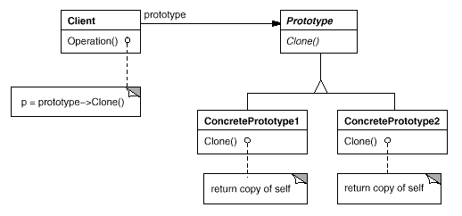

设计模式之美：Prototype（原型）

**索引**

-   别名

-   意图

-   结构

-   参与者

-   适用性

-   缺点

-   效果

-   相关模式

-   命名约定

-   实现

    -   实现方式（一）：使用一个原型管理器。

    -   实现方式（二）：使用浅拷贝实现克隆（Clone）操作。

    -   实现方式（三）：使用深拷贝实现克隆（Clone）操作。

    -   实现方式（四）：初始化克隆对象。

**别名**

-   Clone

**意图**

用原型实例指定创建对象的种类，并且通过拷贝这些原型创建新的对象。

Specify the kinds of objects to create using a prototypical instance, and create
new objects by copying this prototype.

**结构**

**参与者**

Prototype

-   声明一个克隆自身的接口。

ConcretePrototype

-   实现一个克隆自身的操作。

Client

-   让一个原型克隆自身从而创建一个新的对象。

**适用性**

在以下情况下可以使用 Prototype 模式：

-   一个系统要独立于它的产品的创建、构成和表示时。

-   当要实例化的类是在运行时刻指定时，例如：通过动态装载。

-   为了避免创建一个与产品类层次平行的工厂类层次时。

-   当一个类的实例只能有几个不同状态组合中的一种时。建立相应数目的原型并克隆它们可能比每次用合适的状态手工实例化该类更方便一些。

**缺点**

-   每一个 Prototype 子类都必须实现 Clone
    操作。当内部包括一些不支持拷贝或有循环引用的对象时，实现克隆可能也会很困难。

**效果**

-   它对客户隐藏了具体的产品类，因此减少了客户知道的名字的数目。

-   使客户无需改变即可使用与特定应用相关的类。

-   运行时刻增加和删除产品。

-   改变值以指定新对象。

-   改变结构以指定新对象。

-   减少子类的构造。

-   用类动态配置应用。

**相关模式**

-   Abstract Factory 可以用
    [Prototype ](http://www.cnblogs.com/gaochundong/p/design_pattern_prototype.html)来实现。

-   Composite 和
    [Decorator ](http://www.cnblogs.com/gaochundong/p/design_pattern_decorator.html)模式的设计也可以从
    Prototype 获益。

**命名约定**

使用命名约定是一个好习惯，例如，总是声明那些实现克隆的操作为 Clone()。

**实现**

**实现方式（一）：使用一个原型管理器。**

当一个系统中原型数目不固定时，可以保持一个可用原型的注册表，用以存储和检索原型。我们称这个注册表为原型管理器（Prototype
Manager）。

客户在克隆一个原型前会先向注册表请求该原型。

复制代码

1 namespace PrototypePattern.Implementation1 2 { 3 public abstract class
AbstractOrInterfaceOfPrototypeProduct 4 { 5 public int ValueProperty1 { get;
set; } 6 7 public abstract AbstractOrInterfaceOfPrototypeProduct Clone(); 8 } 9
10 public class ConcretePrototypeProductA :
AbstractOrInterfaceOfPrototypeProduct 11 { 12 public override
AbstractOrInterfaceOfPrototypeProduct Clone() 13 { 14 return new
ConcretePrototypeProductA() 15 { 16 ValueProperty1 = this.ValueProperty1,17 };
18 } 19 } 20 21 public class ConcretePrototypeProductB :
AbstractOrInterfaceOfPrototypeProduct 22 { 23 public override
AbstractOrInterfaceOfPrototypeProduct Clone() 24 { 25 return new
ConcretePrototypeProductB() 26 { 27 ValueProperty1 = this.ValueProperty1,28 };
29 } 30 } 31 32 public class ProductPrototypeManager 33 { 34 private
Dictionary\<string, AbstractOrInterfaceOfPrototypeProduct\> \_registry35 = new
Dictionary\<string, AbstractOrInterfaceOfPrototypeProduct\>();36 37 public void
Register(string name, 38 AbstractOrInterfaceOfPrototypeProduct prototypeProduct)
39 { 40 \_registry[name] = prototypeProduct; 41 } 42 43 public void
Unregister(string name) 44 { 45 \_registry.Remove(name); 46 } 47 48 public
AbstractOrInterfaceOfPrototypeProduct Retrieve(string name) 49 { 50 return
\_registry[name]; 51 } 52 53 public bool IsRegisterd(string name) 54 { 55 return
\_registry.ContainsKey(name); 56 } 57 } 58 59 public class Client 60 { 61 public
void TestCase1() 62 { 63 AbstractOrInterfaceOfPrototypeProduct prototypeProduct1
= new ConcretePrototypeProductA(); 64 AbstractOrInterfaceOfPrototypeProduct
prototypeProduct2 = new ConcretePrototypeProductB(); 65 66
ProductPrototypeManager manager = new ProductPrototypeManager(); 67
manager.Register("PrototypeProduct1", prototypeProduct1);68
manager.Register("PrototypeProduct2", prototypeProduct2);69 70
AbstractOrInterfaceOfPrototypeProduct clonedProduct1 =
manager.Retrieve("PrototypeProduct1").Clone();71 72 if
(manager.IsRegisterd("PrototypeProduct2"))73 { 74
AbstractOrInterfaceOfPrototypeProduct clonedProduct2 =
manager.Retrieve("PrototypeProduct2").Clone();75 } 76 } 77 } 78 }

复制代码

**实现方式（二）：使用浅拷贝实现克隆（Clone）操作。**

Prototype 模式最困难的部分在于正确的实现 Clone 操作。

浅拷贝（Shallow
Copy）在拷贝时只复制对象所有字段的值。如果字段是值类型，则复制其值；如果字段是引用类型，则复制引用指针。

复制代码

1 namespace PrototypePattern.Implementation2 2 { 3 public class ReferencedClass
4 { 5 public int ReferencedClassProperty1 { get; set; } 6 } 7 8 public abstract
class AbstractOrInterfaceOfPrototypeProduct 9 { 10 public int ValueProperty1 {
get; set; }11 public ReferencedClass ReferenceProperty2 { get; set; }12 13
public abstract AbstractOrInterfaceOfPrototypeProduct Clone(); 14 } 15 16 public
class ConcreteShallowCopyPrototypeProductA 17 :
AbstractOrInterfaceOfPrototypeProduct 18 { 19 public
ConcreteShallowCopyPrototypeProductA() 20 { 21 this.ReferenceProperty2 = new
ReferencedClass() 22 { 23 ReferencedClassProperty1 = 11124 }; 25 } 26 27 public
override AbstractOrInterfaceOfPrototypeProduct Clone() 28 { 29 return new
ConcreteShallowCopyPrototypeProductA() 30 { 31 ValueProperty1 =
this.ValueProperty1,32 ReferenceProperty2 = this.ReferenceProperty2,33 }; 34 }
35 } 36 37 public class Client 38 { 39 public void TestCase2() 40 { 41
AbstractOrInterfaceOfPrototypeProduct prototypeProduct1 = new
ConcreteShallowCopyPrototypeProductA(); 42 AbstractOrInterfaceOfPrototypeProduct
clonedProduct1 = prototypeProduct1.Clone(); 43 bool areEqual1 =
object.ReferenceEquals(44 prototypeProduct1.ReferenceProperty2, 45
clonedProduct1.ReferenceProperty2); 46 } 47 } 48 }

复制代码

**实现方式（三）：使用深拷贝实现克隆（Clone）操作。**

深拷贝（Deep Copy）涉及对源对象整个结构的拷贝。

深拷贝在拷贝时复制对象的所有字段的值。如果字段是值类型，则复制其值；如果字段是引用类型，则会将这个引用指针指向的对象也克隆一份。

可以通过序列化和反序列化来实现深拷贝。

复制代码

1 namespace PrototypePattern.Implementation3 2 { 3 public class ReferencedClass
4 { 5 public int ReferencedClassProperty1 { get; set; } 6 } 7 8 public abstract
class AbstractOrInterfaceOfPrototypeProduct 9 { 10 public int ValueProperty1 {
get; set; }11 public ReferencedClass ReferenceProperty2 { get; set; }12 13
public abstract AbstractOrInterfaceOfPrototypeProduct Clone(); 14 } 15 16 public
class ConcreteShallowCopyPrototypeProductA 17 :
AbstractOrInterfaceOfPrototypeProduct 18 { 19 public
ConcreteShallowCopyPrototypeProductA() 20 { 21 this.ReferenceProperty2 = new
ReferencedClass() 22 { 23 ReferencedClassProperty1 = 111 24 }; 25 } 26 27 public
override AbstractOrInterfaceOfPrototypeProduct Clone() 28 { 29 return new
ConcreteShallowCopyPrototypeProductA() 30 { 31 ValueProperty1 =
this.ValueProperty1,32 ReferenceProperty2 = this.ReferenceProperty2,33 }; 34 }
35 } 36 37 public class ConcreteDeepCopyPrototypeProductB 38 :
AbstractOrInterfaceOfPrototypeProduct 39 { 40 public
ConcreteDeepCopyPrototypeProductB() 41 { 42 this.ReferenceProperty2 = new
ReferencedClass() 43 { 44 ReferencedClassProperty1 = 222 45 }; 46 } 47 48 public
override AbstractOrInterfaceOfPrototypeProduct Clone() 49 { 50 return new
ConcreteDeepCopyPrototypeProductB() 51 { 52 ValueProperty1 =
this.ValueProperty1,53 ReferenceProperty2 = new ReferencedClass() 54 { 55
ReferencedClassProperty1 = 56 this.ReferenceProperty2.ReferencedClassProperty157
}, 58 }; 59 } 60 } 61 62 public class Client 63 { 64 public void TestCase3() 65
{ 66 AbstractOrInterfaceOfPrototypeProduct prototypeProduct1 = new
ConcreteShallowCopyPrototypeProductA(); 67 AbstractOrInterfaceOfPrototypeProduct
clonedProduct1 = prototypeProduct1.Clone(); 68 bool areEqual1 =
object.ReferenceEquals(69 prototypeProduct1.ReferenceProperty2, 70
clonedProduct1.ReferenceProperty2); 71 72 AbstractOrInterfaceOfPrototypeProduct
prototypeProduct2 = new ConcreteDeepCopyPrototypeProductB(); 73
AbstractOrInterfaceOfPrototypeProduct clonedProduct2 =
prototypeProduct2.Clone(); 74 bool areEqual2 = object.ReferenceEquals(75
prototypeProduct2.ReferenceProperty2, 76 clonedProduct2.ReferenceProperty2); 77
78 Console.WriteLine("{0}, {1}", areEqual1, areEqual2);79 } 80 } 81 }

复制代码

**实现方式（四）：初始化克隆对象。**

客户可能会希望使用一些值来初始化该对象的内部状态。

但在 Clone 操作中传递参数会破坏克隆接口的统一性。

原型的类可以在 Clone 操作之后，调用包含初始化参数的 Initialize
方法来设定对象内部状态。

复制代码

1 namespace PrototypePattern.Implementation4 2 { 3 public class ReferencedClass
4 { 5 public int ReferencedClassProperty1 { get; set; } 6 } 7 8 public abstract
class AbstractOrInterfaceOfPrototypeProduct 9 { 10 public int ValueProperty1 {
get; set; }11 public ReferencedClass ReferenceProperty2 { get; set; }12 13
public abstract AbstractOrInterfaceOfPrototypeProduct Clone(); 14 } 15 16 public
class ConcreteDeepCopyPrototypeProductB 17 :
AbstractOrInterfaceOfPrototypeProduct 18 { 19 public
ConcreteDeepCopyPrototypeProductB() 20 { 21 } 22 23 public void Initialize(int
propertyValue) 24 { 25 this.ValueProperty1 = propertyValue;26
this.ReferenceProperty2.ReferencedClassProperty1 = propertyValue;27 } 28 29
public override AbstractOrInterfaceOfPrototypeProduct Clone() 30 { 31 return new
ConcreteDeepCopyPrototypeProductB() 32 { 33 ValueProperty1 =
this.ValueProperty1,34 ReferenceProperty2 = new ReferencedClass() 35 { 36
ReferencedClassProperty1 = 37 this.ReferenceProperty2.ReferencedClassProperty138
}, 39 }; 40 } 41 } 42 43 public class Client 44 { 45 public void TestCase4() 46
{ 47 AbstractOrInterfaceOfPrototypeProduct prototypeProduct2 = new
ConcreteDeepCopyPrototypeProductB(); 48 ConcreteDeepCopyPrototypeProductB
clonedProduct2 = 49
(ConcreteDeepCopyPrototypeProductB)prototypeProduct2.Clone(); 50 51
clonedProduct2.Initialize(123);52 } 53 } 54 }

复制代码
