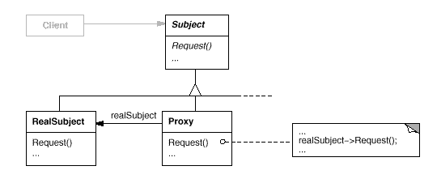
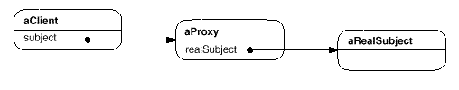

设计模式之美：Proxy（代理）

**索引**

-   别名

-   意图

-   结构

-   参与者

-   适用性

-   效果

-   相关模式

-   实现

    -   实现方式（一）：使用相同 Subject 接口实现 Proxy。

**别名**

-   Surrogate

**意图**

为其他对象提供一种代理以控制对这个对象的访问。

Provide a surrogate or placeholder for another object to control access to it.

**结构**

运行时一种可能的 Proxy 结构的对象图：

**参与者**

Proxy

-   保存一个引用使得代理可以访问实体。若 RealSubject 和 Subject
    的接口相同，Proxy 会引用 Subject。

-   提供一个与 Subject 的接口相同的接口，这样 Proxy 就可以用来代替实体。

-   控制对实体的存取，并可能负责创建和删除它。

-   其他功能依赖于 Proxy 的类型：

    -   远程代理（Remote
        Proxy）负责对请求及其参数进行编码，并向不同地址空间中的实体发送已编码的请求。

    -   虚拟代理（Virtual Proxy）可以缓存实体的附加信息，以便延迟对它的访问。

    -   保护代理（Protection
        Proxy）检查调用者是否具有实现一个请求所必须的访问权限。

Subject

-   定义 RealSubject 和 Proxy 的共用接口，这样就在任何使用 RealSubject
    的地方都可以使用 Proxy。

RealSubject

-   定义 Proxy 所代表的实体。

**适用性**

下面是一些使用 Proxy 模式的常见情况：

-   远程代理（Remote Proxy）为一个对象在不同的地址空间提供局部代表。

-   虚拟代理（Virtual Proxy）根据需要创建开销很大的对象。

-   保护代理（Protection Proxy）控制对原始对象的访问。

-   智能代理（Smart Proxy）在访问对象时执行一些附件操作。

**效果**

-   Proxy 模式在访问对象时引入了一定程度的间接性。

-   Proxy 模式可以对用户隐藏 Copy-On-Write 优化方式。用 Proxy
    延迟对象拷贝过程，仅当这个对象被修改时才进行真正的拷贝，用以大幅度降低拷贝大实体的开销。

**相关模式**

-   Adapter 为它所适配的对象提供了一个不同的接口。Proxy
    提供了与它的实体相同的接口

-   Decorator 的实现与 Proxy 相似，但目的不一样。 Decorator
    为对象添加功能，Proxy 则控制对对象的访问。

**实现**

**实现方式（一）：使用相同 Subject 接口实现 Proxy。**

对一个对象进行访问控制的一个原因是为了只有在我们确实需要这个对象时才对它进行创建和初始化。

复制代码

1 namespace ProxyPattern.Implementation1 2 { 3 public abstract class Subject 4 {
5 public abstract string Name { get; } 6 public abstract void Request(); 7 } 8 9
public class ConcreteSubject : Subject 10 { 11 private string \_name; 12 13
public ConcreteSubject(string name) 14 { 15 \_name = name; 16 } 17 18 public
override string Name { get { return \_name; } } 19 20 public override void
Request() 21 { 22 // do something23 } 24 } 25 26 public class Proxy : Subject 27
{ 28 private Subject \_realSubject = null;29 private string \_name; 30 31 public
Proxy(string name) 32 { 33 \_name = name; 34 } 35 36 public override string Name
{ get { return \_name; } } 37 38 public override void Request() 39 { 40 if
(\_realSubject == null)41 LoadRealSubject(); 42 43 \_realSubject.Request(); 44 }
45 46 private void LoadRealSubject() 47 { 48 // do some heavy things49
\_realSubject = new ConcreteSubject(_name); 50 } 51 } 52 53 public class Client
54 { 55 public void TestCase1() 56 { 57 Subject subject = new
Proxy("SubjectName");58 var subjectName = subject.Name; 59 subject.Request(); 60
} 61 } 62 }

复制代码
