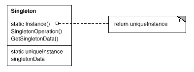

设计模式之美：Singleton（单件）

**索引**

-   意图

-   结构

-   参与者

-   适用性

-   缺点

-   效果

-   相关模式

-   实现

    -   实现方式（一）：使用 Static 变量初始化 Singleton。

    -   实现方式（二）：使用 Lazy Initialization 来实现 Singleton。

    -   实现方式（三）：使用 Reset 来重置 Singleton。

    -   实现方式（四）：使用 Double-Check Locking 技术实现 Singleton。

    -   实现方式（五）：使用注册表机制创建和查询 Singleton 类的子类实例。

**意图**

保证一个类仅有一个实例，并提供一个访问它的全局访问点。

Ensure a class only has one instance, and provide a global point of access to
it.

**结构**

**参与者**

Singleton

-   定义一个 Instance 操作，允许客户访问它的唯一实例。Instance 是一个类操作。

-   可能负责创建它自己的唯一实例。

**适用性**

在以下情况下可以使用 Singleton 模式：

-   当类只能有一个实例并且客户可以从一个众所周知的访问点访问它时。

-   当这个唯一实例应该是通过子类化可扩展的，并且客户应该无需更改代码就能使用一个扩展的实例时。

**缺点**

-   系统检查开销。实现中可能每次都需要检查实例是否存在，这个问题可以通过 Static
    实例来解决。

-   系统资源开销。通常 Singleton
    中的对象一旦被创建，不会被及时销毁。可以通过提供 Reset 操作来重置。

-   引起开发混淆。如果类包括 public 构造函数可以在外部构造，当使用 Singleton
    对象时，开发人员需要记住不能使用 new 关键字来实例化对象。

-   不易于测试。通常使用 Singleton
    时需要考虑是否是反模式，设计是否存在问题。引入 Singleton 或静态实例会为 Unit
    Testing 带来困难。

**效果**

-   对唯一实例的受控访问。

-   缩小名空间。避免存储唯一实例的全局变量污染名空间

-   允许对操作和表示的精化。Singleton
    类可以有子类，通过扩展类在运行时刻配置应用。

-   允许可变数目的实例。控制应用所使用的实例的数目。

-   比类操作更灵活。比如使用静态成员函数。

**相关模式**

-   很多模式可以使用 Singleton 模式实现。例如：Abstract Factory 可以设计为
    Singleton 实例。

**实现**

**实现方式（一）：使用 Static 变量初始化 Singleton。**

在类加载时即创建实例。缺点是无论使用与否实例均被创建。

复制代码

1 namespace SingletonPattern.Implementation1 2 { 3 public class Singleton 4 { 5
private static Singleton \_instance = new Singleton(); 6 7 // the constructor
should be protected or private 8 protected Singleton() 9 { 10 } 11 12 public
static Singleton Instance() 13 { 14 return \_instance; 15 } 16 } 17 }

复制代码

**实现方式（二）：使用 Lazy Initialization 来实现 Singleton。**

通常将创建类的唯一实例的操作隐藏在一个类操作后面，由它保证只有一个实例被创建。这个操作可以访问保存唯一实例的变量，保证在它的首次使用前被创建和初始化。

复制代码

1 namespace SingletonPattern.Implementation2 2 { 3 public class Singleton 4 { 5
private static Singleton \_instance; 6 7 // the constructor should be protected
or private 8 protected Singleton() 9 { 10 } 11 12 public static Singleton
Instance() 13 { 14 if (_instance == null)15 { 16 // use lazy initialization17
\_instance = new Singleton(); 18 } 19 20 return \_instance; 21 } 22 } 23 }

复制代码

**实现方式（三）：使用 Reset 来重置 Singleton。**

可以使用 Reset 操作来将已创建的实例销毁掉。

复制代码

1 namespace SingletonPattern.Implementation3 2 { 3 public class Singleton 4 { 5
private static Singleton \_instance; 6 7 // the constructor should be protected
or private 8 protected Singleton() 9 { 10 } 11 12 public static Singleton
Instance() 13 { 14 if (_instance == null)15 { 16 // use lazy initialization17
\_instance = new Singleton(); 18 } 19 20 return \_instance; 21 } 22 23 public
void Reset() 24 { 25 \_instance = null;26 } 27 } 28 }

复制代码

**实现方式（四）：使用 Double-Check Locking 技术实现 Singleton。**

Singleton 的实现如果需要保证线程安全性，则可以使用 Double-Check Locking 技术。

复制代码

1 namespace SingletonPattern.Implementation4 2 { 3 public class Singleton 4 { 5
private static Singleton \_instance; 6 private static readonly object \_syncRoot
= new object(); 7 8 // the constructor should be protected or private 9
protected Singleton() 10 { 11 } 12 13 public static Singleton Instance() 14 { 15
// double-check locking16 if (_instance == null)17 { 18 lock (\_syncRoot) 19 {
20 if (_instance == null)21 { 22 // use lazy initialization23 \_instance = new
Singleton(); 24 } 25 } 26 } 27 28 return \_instance; 29 } 30 } 31 }

复制代码

**实现方式（五）：使用注册表机制创建和查询 Singleton 类的子类实例。**

如果系统中定义了多个 Singleton
的子类，可以实现一个注册表机制，用于存储子类的映射。

复制代码

1 namespace SingletonPattern.Implementation5 2 { 3 public class Singleton 4 { 5
private static Dictionary\<string, Singleton\> \_registry 6 = new
Dictionary\<string, Singleton\>(); 7 private static Singleton \_instance; 8 9 //
the constructor should be protected or private10 protected Singleton() 11 { 12 }
13 14 public static Singleton Instance(string name) 15 { 16 if
(!\_registry.ContainsKey(name)) 17 { 18 if (name == "Apple")19 { 20
\_registry.Add(name, new AppleSingleton()); 21 } 22 else if (name == "Orange")23
{ 24 \_registry.Add(name, new OrangeSingleton()); 25 } 26 } 27 28 return
\_registry[name]; 29 } 30 } 31 32 public class AppleSingleton : Singleton 33 {
34 } 35 36 public class OrangeSingleton : Singleton 37 { 38 } 39 }

复制代码
