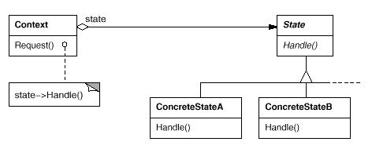

设计模式之美：State（状态）

**索引**

-   意图

-   结构

-   参与者

-   适用性

-   效果

-   相关模式

-   实现

    -   实现方式（一）：由 ConcreteState 指定它的后继 State。

**意图**

允许一个对象在其内部状态改变时改变它的行为。对象看起来似乎修改了它的类。

Allow an object to alter its behavior when its internal state changes. The
object will appear to change its class.

**结构**

**参与者**

Context

-   定义客户感兴趣的接口。

-   维护一个 ConcreteState 子类的实例，这个实例定义当前状态。

State

-   定义一个接口以封装与 Context 的一个特定状态相关的额行为。

ConcreteState

-   每一个子类实现一个与 Context 的一个状态相关的行为。

**适用性**

在以下情况下可以使用 State 模式：

-   一个对象的行为取决于它的状态，并且它必须在运行时根据状态改变它的行为。

-   一个操作中含有庞大的多分支的条件语句，且这些分支依赖于该对象的状态。这个状态通常用一个或多个枚举常量表示。

**效果**

-   它将与特定状态相关的行为局部化。

-   它使得状态转换显式化。

-   State 对象可被共享。

**相关模式**

-   使用 Flyweight 模式共享状态对象。

-   使用 Singleton 模式实现状态对象。

**实现**

**实现方式（一）：由 ConcreteState 指定它的后继 State。**

State 模式不指定哪一个参与者定义状态转换规则。

如果该转换规则是固定的，那么它们可在 Context 中完全实现。

然而若让 State 子类自身指定它们的后继状态以及何时进行转换，通常更为灵活。

这需要 Context 增加一个接口，可以显示地设定 State。

这种实现的缺点是，一个 State
子类至少拥有一个其他子类的信息，使子类间产生了依赖。

复制代码

1 namespace StatePattern.Implementation1 2 { 3 public abstract class State 4 { 5
public abstract string Name { get; } 6 public abstract void Handle(Context
context); 7 } 8 9 public class Context 10 { 11 private State \_state; 12 13
public Context() 14 { 15 } 16 17 public void SetState(State state) 18 { 19
\_state = state; 20 Console.WriteLine("Current State: {0}", \_state.Name);21 }
22 23 public void Request() 24 { 25 \_state.Handle(this);26 } 27 } 28 29 public
class ConcreteStateA : State 30 { 31 public override string Name { get { return
"StateA"; } }32 33 public override void Handle(Context context) 34 { 35
Console.WriteLine(Name + " is handling context.");36 37 // change context
state38 context.SetState(new ConcreteStateB()); 39 } 40 } 41 42 public class
ConcreteStateB : State 43 { 44 public override string Name { get { return
"StateB"; } }45 46 public override void Handle(Context context) 47 { 48
Console.WriteLine(Name + " is handling context.");49 50 // change context
state51 context.SetState(new ConcreteStateA()); 52 } 53 } 54 55 public class
Client 56 { 57 public void TestCase1() 58 { 59 var context = new Context(); 60
context.SetState(new ConcreteStateA()); 61 62 context.Request(); 63
context.Request(); 64 } 65 } 66 }

复制代码
