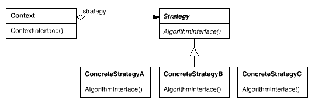

设计模式之美：Strategy（策略）

**索引**

-   意图

-   结构

-   参与者

-   适用性

-   效果

-   相关模式

-   实现

    -   实现方式（一）：使用不同的 Strategy 处理内部状态。

**别名**

-   Policy

**意图**

定义一系列的算法，把它们一个个封装起来，并且使它们可以相互替换。使得算法可独立于使用它的客户而变化。

Define a family of algorithms, encapsulate each one, and make them
interchangeable.

Strategy lets the algorithm vary independently from clients that use it.

**结构**

**参与者**

Strategy

-   定义所有支持的算法的公共接口。Context 使用这个接口来调用 ConcreteStrategy
    定义的算法。

ConcreteStrategy

-   实现 Strategy 接口和具体算法。

Context

-   用一个 ConcreteStrategy 对象来配置。

-   维护一个对 Strategy 对象的引用。

-   可定义一个接口来让 Strategy 访问它的数据。

**适用性**

在以下情况下可以使用 Strategy 模式：

-   许多相关的类仅仅是行为有异。Strategy
    提供了一种用多个行为中的一个行为来配置一个类的方法。

-   需要使用一个算法的不同变体。

-   算法使用客户不应该知道的数据。

-   一个类定义了多种行为，并且这些行为在这个类的操作中以多个条件语句的形式出现。将相关条件分支移入它们各自的
    Strategy 类中以代替。

**缺点**

-   客户必须了解不同的 Strategy。要选择合适的 Strategy 就必须知道这些 Strategy
    有何不同。

-   Strategy 和 Context 之间的通信开销。Context 可能创建一些 ConcreteStrategy
    不使用的参数。

-   增加了对象的数目。

**效果**

-   相关算法系列。

-   一个替代继承的方法。

-   消除了一些条件语句。

-   实现的选择。相同行为的不同实现。

**相关模式**

-   使用 Flyweight 模式实现 Strategy。

**实现**

**实现方式（一）：使用不同的 Strategy 处理内部状态。**

Strategy 和 Context 接口必须使得 ConcreteStrategy 能够有效的访问它所需要的
Context 中的任何数据。

一种办法是让 Context 将数据放在参数中传递给 Strategy 操作。这使得 Strategy 和
Context 解耦。

但另一方面，Context 可能发送一些 Strategy 不需要的数据。

另一种办法是让 Context 将自身作为一个参数传递给 Strategy，该 Strategy
再显式地向该 Context 请求数据。

或者 Strategy 可以直接保存对 Context 的引用。

这种情况下，Strategy 可以请求到它需要的数据。但这使得 Strategy 和 Context
更紧密的耦合在一起。

复制代码

1 namespace StrategyPattern.Implementation1 2 { 3 public abstract class Strategy
4 { 5 public abstract void AlgorithmInterface(string state); 6 } 7 8 public
class ConcreteStrategyA : Strategy 9 { 10 public override void
AlgorithmInterface(string state) 11 { 12 Console.WriteLine("Use Concrete
Strategy A to handle " + state); 13 } 14 } 15 16 public class ConcreteStrategyB
: Strategy 17 { 18 public override void AlgorithmInterface(string state) 19 { 20
Console.WriteLine("Use Concrete Strategy B to handle " + state); 21 } 22 } 23 24
public class Context 25 { 26 private Strategy \_strategy; 27 28 public void
SetStrategy(Strategy strategy) 29 { 30 \_strategy = strategy; 31 } 32 33 public
string State { get; set; }34 35 public void ContextInterface() 36 { 37
\_strategy.AlgorithmInterface(State); 38 } 39 } 40 41 public class Client 42 {
43 public void TestCase1() 44 { 45 var context = new Context(); 46 context.State
= "Hello World";47 48 context.SetStrategy(new ConcreteStrategyA()); 49
context.ContextInterface(); 50 51 context.SetStrategy(new ConcreteStrategyB());
52 context.ContextInterface(); 53 } 54 } 55 }

复制代码
