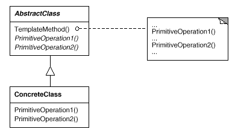

设计模式之美：Template Method（模板方法）

**索引**

-   意图

-   结构

-   参与者

-   适用性

-   效果

-   相关模式

-   实现

    -   实现方式（一）：Template Method 模式结构样式代码。

**意图**

定义一个操作中的算法的骨架，而将一些步骤延迟到子类中。

Template Method 使得子类可以不改变一个算法的结构即可重定义该算法的某些特定步骤。

Define the skeleton of an algorithm in an operation, deferring some steps to
subclasses.

Template Method lets subclasses redefine certain steps of an algorithm without
changing the algorithm's structure.

**结构**

**参与者**

AbstractClass

-   定义抽象的原语操作（Primitive
    Operation），具体的子类将重定义它们以实现一个算法的各步骤。

-   实现一个模板方法，定义一个算法的骨架。该模板方法不仅调用原语操作，也调用定义在类中的其他操作。

ConcreteClass

-   实现原语操作以完成算法中与特定子类相关的步骤。

**适用性**

在以下情况下可以使用 Template Method 模式：

-   一次性实现一个算法的不变的部分，并将可变的行为留给子类来实现。

-   各子类中公共的行为应被提取出来并集中到一个公共父类中以避免代码重复。

-   控制子类扩展。只允许特定的点进行扩展。

**效果**

-   模板方法是一种代码复用的基本技术。

-   “好莱坞法则：Don't call us, we'll call
    you.”，一个父类调用一个子类的操作，而不是相反。

**相关模式**

-   Factory Method 常被 Template Method 调用。

-   Template Method 使用继承来改变算法的一部分。Strategy
    使用委托来改变整个算法。

**实现**

Template Method 可调用下列类型的操作：

-   对客户的操作

-   具体的 AbstractClass 中的操作

-   Factory Method 方法

-   抽象操作（Primitive Operation）(must be overridden)

-   钩子操作（Hook Operation）(may be overridden)，通常提供默认实现。

Template Method 需要指明哪些是 Hook Operation，哪些是 Primitive
Operation。例如使用命名约定等方式指明。

**实现方式（一）：Template Method 模式结构样式代码。**

定义 Template Method
的一个重要的目的是尽量减少一个子类具体实现该算法时必须重定义的那些原语操作的数目。

需要重定义的操作越多，客户程序就越冗长。

复制代码

1 namespace TemplateMethodPattern.Implementation1 2 { 3 public abstract class
Algorithm 4 { 5 public void TemplateMethod() 6 { 7 Step1CanNotBeCustomized(); 8
Step2(); 9 Step3WithDefault(); 10 } 11 12 private void Step1CanNotBeCustomized()
13 { 14 Console.WriteLine("Step1");15 } 16 17 protected abstract void Step2();
18 19 protected virtual void Step3WithDefault() 20 { 21
Console.WriteLine("Default Step3");22 } 23 } 24 25 public class
ConcreteAlgorithmA : Algorithm 26 { 27 protected override void Step2() 28 { 29
Console.WriteLine("ConcreteAlgorithmA.Step2");30 } 31 } 32 33 public class
ConcreteAlgorithmB : Algorithm 34 { 35 protected override void Step2() 36 { 37
Console.WriteLine("ConcreteAlgorithmB.Step2");38 } 39 40 protected override void
Step3WithDefault() 41 { 42 Console.WriteLine("ConcreteAlgorithmB.Step3");43 } 44
} 45 46 public class Program 47 { 48 public void TestCase1() 49 { 50 var
algorithm1 = new ConcreteAlgorithmA(); 51 algorithm1.TemplateMethod(); 52 53 var
algorithm2 = new ConcreteAlgorithmB(); 54 algorithm2.TemplateMethod(); 55 } 56 }
57 }

复制代码
