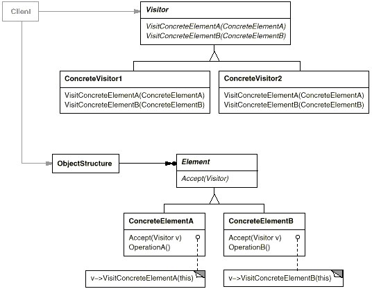

设计模式之美：Visitor（访问者）

**索引**

-   意图

-   结构

-   参与者

-   适用性

-   效果

-   相关模式

-   实现

    -   实现方式（一）：Visitor 模式结构样式代码。

    -   实现方式（二）：使用 Visitor 模式解构设计。

    -   实现方式（三）：使用 Acyclic Visitor 模式解构设计。

**意图**

表示一个作用于某对象结构中的各元素的操作。

Visitor 使你可以在不改变各元素的类的前提下定义作用于这些元素的新操作。

Represent an operation to be performed on the elements of an object structure.

Visitor lets you define a new operation without changing the classes of the
elements on which it operates.

**结构**

**参与者**

Visitor

-   为该对象结构中 ConcreteElement 的每一个类声明一个 Visit
    操作。该操作的名字和特征标识了发送 Visit 请求给该访问者的那个类。

ConcreteVisitor

-   实现每个由 Visitor 声明的操作。

Element

-   定义一个 Accept 操作，它以一个 Visitor 为参数。

ConcreteElement

-   实现 Accept 操作，该操作以一个 Visitor 为参数。

ObjectStructure

-   能枚举 Element。

-   可以提供一个高层的接口以允许该 Visitor 访问它的元素。

-   可以是一个 Composite 或是一个集合、列表或无序集合。

**适用性**

在以下情况下可以使用 Visitor 模式：

-   一个对象结构包含很多类操作，它们有不同的接口，而你想对这些对象实施一些依赖于其具体类的操作。

-   需要对一个对象结构中的对象进行很多不同的并且不相关的操作，而你想避免让这些操作污染这些对象的类。

-   定义对象结构的类很少改变，但经常需要在此结构上定义新的操作。

**缺点**

-   增加新的 ConcreteElement 类很困难。添加新的 ConcreteElement 都要在 Visitor
    中添加一个新的抽象操作。

-   可能破坏封装。Visitor 假定 ConcreteElement 接口的功能足够强，足以让 Visitor
    进行它的工作。但有时会迫使你提供 ConcreteElement 的内部状态的公共操作。

**效果**

-   Visitor 模式使得易于增加新的操作。

-   Visitor 集中相关的操作而分离无关的操作。

**相关模式**

-   Visitor 可以用于对一个 Composite 模式定义的对象结构进行操作。

-   Visitor 可以用于 Interpreter 解释。

**实现**

**实现方式（一）：Visitor 模式结构样式代码。**

复制代码

1 namespace VisitorPattern.Implementation1 2 { 3 public abstract class Element 4
{ 5 public abstract void Accept(Visitor visitor); 6 } 7 8 public abstract class
Visitor 9 { 10 public abstract void Visit(ConcreteElementA element); 11 public
abstract void Visit(ConcreteElementB element); 12 } 13 14 public class
ObjectStructure 15 { 16 private List\<Element\> \_elements = new
List\<Element\>(); 17 18 public void Attach(Element element) 19 { 20
\_elements.Add(element); 21 } 22 23 public void Detach(Element element) 24 { 25
\_elements.Remove(element); 26 } 27 28 public void Accept(Visitor visitor) 29 {
30 foreach (var element in \_elements) 31 { 32 element.Accept(visitor); 33 } 34
} 35 } 36 37 public class ConcreteElementA : Element 38 { 39 public string Name
{ get; set; } 40 41 public override void Accept(Visitor visitor) 42 { 43
visitor.Visit(this); 44 } 45 } 46 47 public class ConcreteElementB : Element 48
{ 49 public string ID { get; set; } 50 51 public override void Accept(Visitor
visitor) 52 { 53 visitor.Visit(this); 54 } 55 } 56 57 public class
ConcreteVisitorA : Visitor 58 { 59 public override void Visit(ConcreteElementA
element) 60 { 61 Console.WriteLine( 62 "ConcreteVisitorA visited
ConcreteElementA : {0}", 63 element.Name); 64 } 65 66 public override void
Visit(ConcreteElementB element) 67 { 68 Console.WriteLine( 69 "ConcreteVisitorA
visited ConcreteElementB : {0}", 70 element.ID); 71 } 72 } 73 74 public class
ConcreteVisitorB : Visitor 75 { 76 public override void Visit(ConcreteElementA
element) 77 { 78 Console.WriteLine( 79 "ConcreteVisitorB visited
ConcreteElementA : {0}", 80 element.Name); 81 } 82 83 public override void
Visit(ConcreteElementB element) 84 { 85 Console.WriteLine( 86 "ConcreteVisitorB
visited ConcreteElementB : {0}", 87 element.ID); 88 } 89 } 90 91 public class
Client 92 { 93 public void TestCase1() 94 { 95 var objectStructure = new
ObjectStructure(); 96 97 objectStructure.Attach(new ConcreteElementA()); 98
objectStructure.Attach(new ConcreteElementB()); 99 100
objectStructure.Accept(new ConcreteVisitorA()); 101 objectStructure.Accept(new
ConcreteVisitorB()); 102 } 103 } 104 }

复制代码

**实现方式（二）：使用 Visitor 模式解构设计。**

假设我们有一个 Employee 类，Employee 分为按时薪计算的 Employee 和按月薪计算的
Employee。

复制代码

1 public class Employee 2 { 3 public abstract string GetHoursAndPayReport(); 4 }
5 6 public class HourlyEmployee : Employee 7 { 8 public override string
GetHoursAndPayReport() 9 { 10 // generate the line for this hourly employee11
return "100 Hours and \$1000 in total.";12 } 13 } 14 15 public class
SalariedEmployee : Employee 16 { 17 public override string
GetHoursAndPayReport() 18 { 19 // do nothing20 return string.Empty;21 } 22 }

复制代码

这段代码的问题是，Employee 类及子类耦合了 Salary Report
相关的职责，这侵犯了单一职责原则（Single Responsibility
Principle），因为其导致每次需要更改 Report 相关的职责时，都需要修改 Employee
类。

我们是用 Visitor 模式来解决这个问题。

复制代码

1 namespace VisitorPattern.Implementation2 2 { 3 public abstract class Employee
4 { 5 public abstract string Accept(EmployeeVisitor visitor); 6 } 7 8 public
class HourlyEmployee : Employee 9 { 10 public override string
Accept(EmployeeVisitor visitor) 11 { 12 return visitor.Visit(this);13 } 14 } 15
16 public class SalariedEmployee : Employee 17 { 18 public override string
Accept(EmployeeVisitor visitor) 19 { 20 return visitor.Visit(this);21 } 22 } 23
24 public abstract class EmployeeVisitor 25 { 26 public abstract string
Visit(HourlyEmployee employee); 27 public abstract string Visit(SalariedEmployee
employee); 28 } 29 30 public class HoursPayReport : EmployeeVisitor 31 { 32
public override string Visit(HourlyEmployee employee) 33 { 34 // generate the
line of the report.35 return "100 Hours and \$1000 in total.";36 } 37 38 public
override string Visit(SalariedEmployee employee) 39 { 40 // do nothing41 return
string.Empty;42 } 43 } 44 }

复制代码

**实现方式（三）：使用 Acyclic Visitor 模式解构设计。**

我们注意到 Employee 类依赖于 EmployeeVisitor 基类。而 EmployeeVisitor 类为每个
Employee 的子类都提供了一个 Visit 方法。

因此，这里形成了一个依赖关系的环。这导致 Visitor 在响应变化时变得复杂。

Visitor
模式在类继承关系不是经常变化时可以工作的很好，但在子类衍生频繁的情况下会增加复杂度。

此时，我们可以应用 Acyclic Visitor 模式，抽象出窄接口，以使 Employee
子类仅依赖于该窄接口。

复制代码

1 namespace VisitorPattern.Implementation3 2 { 3 public abstract class Employee
4 { 5 public abstract string Accept(EmployeeVisitor visitor); 6 } 7 8 public
class HourlyEmployee : Employee 9 { 10 public override string
Accept(EmployeeVisitor visitor) 11 { 12 try13 { 14 IHourlyEmployeeVisitor
hourlyEmployeeVisitor = (IHourlyEmployeeVisitor)visitor; 15 return
hourlyEmployeeVisitor.Visit(this);16 } 17 catch (InvalidCastException ex) 18 {
19 Console.WriteLine(ex.Message); 20 } 21 22 return string.Empty;23 } 24 } 25 26
public class SalariedEmployee : Employee 27 { 28 public override string
Accept(EmployeeVisitor visitor) 29 { 30 try31 { 32 ISalariedEmployeeVisitor
salariedEmployeeVisitor = (ISalariedEmployeeVisitor)visitor; 33 return
salariedEmployeeVisitor.Visit(this);34 } 35 catch (InvalidCastException ex) 36 {
37 Console.WriteLine(ex.Message); 38 } 39 40 return string.Empty;41 } 42 } 43 44
public interface IHourlyEmployeeVisitor 45 { 46 string Visit(HourlyEmployee
employee); 47 } 48 49 public interface ISalariedEmployeeVisitor 50 { 51 string
Visit(SalariedEmployee employee); 52 } 53 54 public abstract class
EmployeeVisitor 55 { 56 } 57 58 public class HoursPayReport : EmployeeVisitor,
IHourlyEmployeeVisitor 59 { 60 public string Visit(HourlyEmployee employee) 61 {
62 // generate the line of the report.63 return "100 Hours and \$1000 in
total.";64 } 65 } 66 67 public class SalariedPayReport : EmployeeVisitor,
ISalariedEmployeeVisitor 68 { 69 public string Visit(SalariedEmployee employee)
70 { 71 return "Something";72 } 73 } 74 }

复制代码
