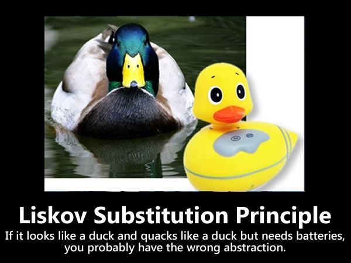
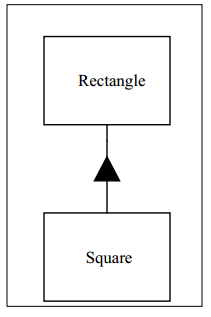

里氏替换原则（Liskov Substitution Principle）

开放封闭原则（Open Closed
Principle）是构建可维护性和可重用性代码的基础。它强调设计良好的代码可以不通过修改而扩展，新的功能通过添加新的代码来实现，而不需要更改已有的可工作的代码。抽象（Abstraction）和多态（Polymorphism）是实现这一原则的主要机制，而继承（Inheritance）则是实现抽象和多态的主要方法。

那么是什么设计规则在保证对继承的使用呢？优秀的继承层级设计都有哪些特征呢？是什么在诱使我们构建了不符合开放封闭原则的层级结构呢？这些就是本篇文章将要回答的问题。

**里氏替换原则（LSP: The Liskov Substitution Principle）**

使用基类对象指针或引用的函数必须能够在不了解衍生类的条件下使用衍生类的对象。

>   **Functions that use pointers or references to base classes must be able to
>   use objects of derived classes without knowing it.**

Barbara Liskov 在 1988 年提出了这一原则：

>   What is wanted here is something like the following substitution property:
>   If for each object o1 of type S there is an object o2 of type T such that
>   for all programs P defined in terms of T, the behavior of P is unchanged
>   when o1 is substituted for o2 then S is a subtype of T.

**违背 LSP 原则的一个简单示例**

一个非常明显地违背 LSP原则的示例就是使用 RTTI（Run Time Type
Identification）来根据对象类型选择函数执行。

复制代码

1 void DrawShape(const Shape& s) 2 { 3 if (typeid(s) == typeid(Square)) 4
DrawSquare(static_cast\<Square&\>(s)); 5 else if (typeid(s) == typeid(Circle)) 6
DrawCircle(static_cast\<Circle&\>(s)); 7 }

复制代码

显然 DrawShape 函数的设计存在很多问题。它必须知道所有 Shape
基类的衍生子类，并且当有新的子类被创建时就必须修改这个函数。事实上，很多人看到这个函数的结构都认为是在诅咒面向对象设计。

**正方形和长方形，违背原则的微妙之处**

很多情况下对 LSP 原则的违背方式都十分微妙。设想在一个应用程序中使用了 Rectangle
类，描述如下：

复制代码

1 public class Rectangle 2 { 3 private double \_width; 4 private double
\_height; 5 6 public void SetWidth(double w) { \_width = w; } 7 public void
SetHeight(double w) { \_height = w; } 8 public double GetWidth() { return
\_width; } 9 public double GetHeight() { return \_height; } 10 }

复制代码

试想这个应用程序可以良好地工作，并且已被部署到了多个位置。就像所有成功的软件一样，它的用户提了新的需求。假设某一天用户要求该应用程序除了能够处理长方形（Rectangle）之外还要能够处理正方形（Square）。

通常来说，继承关系是 is-a 的关系。换句话讲，如果一种新的对象与一种已有对象满足
is-a 的关系，那么新的对象的类应该是从已有对象的类继承来的。

很明显一个正方形是一个长方形，可以满足所有常规的目的和用途。因此这就建立了 is-a
的关系，Square 的逻辑模型可以从 Rectangle 衍生。

对 is-a 关系的使用是面向对象分析（Object Oriented
Analysis）的基本技术之一。一个正方形是一个（is-a）长方形，所有 Square 类应当从
Rectangle
类衍生。然而这种思考方式将引起一些微妙的却很严重的问题。通常在我们没有实际使用这些代码之前，这些问题是无法被预见的。

关于这个问题，我们的第一个线索可能是Square 类并不需要 \_height 和 \_width
成员变量，尽管无论如何它都继承了它们。可以看出这是一种浪费，而且如果我们持续创建成百上千个
Square 对象，这种浪费就会表现的十分明显。

尽管如此，我们也可以假设我们并不是十分关心内存的开销。那还有什么问题吗？当然！Square
类将继承 SetWidth 和 SetHeight 方法。这些方法对于 Square
来说是完全不适当的，因为一个正方形的长和宽是一样的。这就应该是另一个显著的线索了。然而，有一种方法可以规避这个问题。我们可以覆写SetWidth
和 SetHeight 方法。如下所示：

复制代码

1 public class Square : Rectangle 2 { 3 public void SetWidth(double w) 4 { 5
base.SetWidth(w); 6 base.SetHeight(w); 7 } 8 public void SetHeight(double w) 9 {
10 base.SetWidth(w);11 base.SetHeight(w);12 } 13 }

复制代码

现在，无论谁设置 Square 对象的 Width，它的 Height 也会相应跟着变化。而当设置
Height 时，Width 也同样会改变。这样做之后，Square 看起来很完美了。Square
对象仍然是一个看起来很合理的数学中的正方形。

1 public void TestCase1() 2 { 3 Square s = new Square(); 4 s.SetWidth(1); //
Fortunately sets the height to 1 too.5 s.SetHeight(2); // sets width and heigt
to 2, good thing.6 }

但现在看下下面这个方法：

1 void f(Rectangle r) 2 { 3 r.SetWidth(32); // calls Rectangle::SetWidth4 }

如果我们传递一个 Square 对象的引用到这个方法中，则 Square 对象将被损坏，因为它的
Height 将不会被更改。这里明确地违背了 LSP
原则，此函数在衍生对象为参数的条件下无法正常工作。而失败的原因是因为在父类
Rectangle 中没有将 SetWidth 和 SetHeight 设置为 virtual 函数。

我们也能很容易的解决这个问题。但尽管这样，当创建一个衍生类将导致对父类做出修改，通常意味着这个设计是有缺陷的，具体的说就是它违背了
OCP 原则。我们可能会认为真正的设计瑕疵是忘记了将SetWidth 和 SetHeight 设置为
virtual 函数，而且我们已经修正了这个问题。但是，其实也很难自圆其说，因为设置
Rectangle 的 Height 和 Width
已经不再是一个原子操作。无论是何种原因我们将它们设置为 virtual，我们都将无法预期
Square 的存在。

还有，假设我们接收了这个参数，并且解决了这些问题。我们最终得到了下面这段代码：

复制代码

1 public class Rectangle 2 { 3 private double \_width; 4 private double
\_height; 5 6 public virtual void SetWidth(double w) { \_width = w; } 7 public
virtual void SetHeight(double w) { \_height = w; } 8 public double GetWidth() {
return \_width; } 9 public double GetHeight() { return \_height; } 10 } 11 12
public class Square : Rectangle 13 { 14 public override void SetWidth(double w)
15 { 16 base.SetWidth(w);17 base.SetHeight(w);18 } 19 public override void
SetHeight(double w) 20 { 21 base.SetWidth(w);22 base.SetHeight(w);23 } 24 }

复制代码

**问题的根源**

此时此刻我们有了两个类，Square 和 Rectangle，而且看起来可以工作。无论你对 Square
做什么，它仍可以保持与数学中的正方形定义一致。而且也不管你对 Rectangle
对象做什么，它也将符合数学中长方形的定义。并且当你传递一个 Square
对象到一个可以接收 Rectangle 指针或引用的函数中时，Square
仍然可以保证正方形的一致性。

既然这样，我们可能得出结论了，这个模型现在是自洽的（self-consistent）和正确的。但是，这个结论其实是错误的。一个自洽的模型不一定对它的所有用户都保持一致！

*（注：自洽性即逻辑自洽性和概念、观点等的前后一贯性。首先是指建构一个科学理论的若干个基本假设之间，基本假设和由这些基本假设逻辑地导出的一系列结论之间，各个结论之间必须是相容的，不相互矛盾的。逻辑自洽性也要求构建理论过程中的所有逻辑推理和数学演算正确无误。逻辑自洽性是一个理论能够成立的必备条件。）*

试想下面这个方法：

1 void g(Rectangle r) 2 { 3 r.SetWidth(5);4 r.SetHeight(4);5
Assert.AreEqual(r.GetWidth() \* r.GetHeight(), 20);6 }

这个函数调用了 SetWidth 和 SetHeight 方法，并且认为这些函数都是属于同一个
Rectangle。这个函数对 Rectangle 是可以工作的，但是如果传递一个 Square
参数进去则会发生断言错误。

所以这才是真正的问题所在：写这个函数的程序员是否完全可以假设更改一个 Rectangle
的 Width 将不会改变 Height 的值？

很显然，写这个函数 g 的程序员做了一个非常合理的假设。而传递一个 Square
到这样的函数中才会引发问题。因此，那些已存在的接收 Rectangle
对象指针或引用的函数也同样是不能对 Square 对象正常操作的。这些函数揭示了对 LSP
原则的违背。此外，Square 从 Rectangle 衍生也破坏了这些函数，所以也违背了 OCP
原则。

**有效性不是内在的**

这引出了一个非常重要的结论。从孤立的角度看，一个模型无法自己进行有意义地验证。模型的正确性仅能通过它的使用者来表达。例如，孤立地看
Square 和
Rectangle，我们发现它们是自洽的并且是有效的。但当我们从一个对基类做出合理假设的程序员的角度来看待它们时，这个模型就被打破了。

因此，当考虑一个特定的设计是否合理时，决不能简单的从孤立的角度来看待它，而**必须从该设计的使用者的合理假设的角度来分析**。

**到底哪错了？**

那么到底发生了什么呢？为什么看起来很合理的 Square 和
Rectangle模型变坏了呢？难道说一个 Square 是一个 Rectangle 不对吗？is-a
的关系不存在吗？

不！一个正方形可以是一个长方形，但一个 Square 对象绝对不是一个 Rectangle
对象。为什么呢？因为一个 Square 对象的行为与一个 Rectangle
对象的行为是不一致的。从行为的角度来看，一个 Square 不是一个 Rectangle
！而软件设计真正关注的就是行为（behavior）。

LSP 原则使我们了解了 OOD 中 is-a
关系是与行为有关的。不是内在的私有的行为，而是外在的公共的行为，是使用者依赖的行为。例如，上述函数
g 的作者依赖了一个基本事实，那就是 Rectangle 的 Width 和 Height
彼此之间的变化是无依赖关系的。而这种无依赖的关系就是一种外在的公共的行为，并且其他程序员有可能也会这么想。

为了仍然遵守 LSP 原则，并同时符合 OCP
原则，**所有的衍生类必须符合使用者所期待的基类的行为**。

**契约式设计（Design by Contract）**

Bertrand Meyer 在 1988 年阐述了 LSP
原则与契约式设计之间的关系。使用契约式设计，类中的方法需要声明前置条件和后置条件。前置条件为真，则方法才能被执行。而在方法调用完成之前，方法本身将确保后置条件也成立。

我们可以看到 Rectangle 的 SetWidth 方法的后置条件是：

1 Contract.Ensures((_width == w) && (_height ==
Contract.OldValue\<double\>(_height)));

为衍生类设置前置条件和后置条件的规则是，Meyer 描述的是：

>   …when redefining a routine [in a derivative], you may only replace its
>   precondition by a weaker one, and its postcondition by a stronger one.

换句话说，当通过基类接口使用对象时，客户类仅知道基类的前置条件和后置条件。因此，衍生类对象不能期待客户类服从强于基类中的前置条件。也就是说，它们必须接受任何基类可以接受的条件。而且，衍生类必须符合基类中所定义的后置条件。也就是说，它们的行为和输出不能违背任何已经与基类建立的限制。基类的客户类绝不能对衍生类的输出产生任何疑惑。

显然，后置条件 Square::SetWidth(double w) 要弱于 Rectangle::SetWidth(double
w)，因为它不符合基类的中的条件子句 "(_height ==
Contract.OldValue\<double\>(_height))"。所以，Square::SetWidth(double w)
违背了基类定立的契约。

有些编程语言，对前置条件和后置条件有直接的支持。你可以直接定义这些条件，然后在运行时验证系统。如果编程语言不能直接支持条件定义，我们也可以考虑手工定义这些条件。

**总结**

开放封闭原则（Open Closed
Principle）是许多面向对象设计启示思想的核心。符合该原则的应用程序在可维护性、可重用性和鲁棒性等方面会表现的更好。[里氏替换原则（Liskov
Substitution
Principle）](http://www.cnblogs.com/gaochundong/p/liskov_substitution_principle.html)则是实现
OCP
原则的重要方式。只有当衍生类能够完全替代它们的基类时，使用基类的函数才能够被安全的重用，然后衍生类也可以被放心的修改了。

**面向对象设计的原则**

|  SRP |  [单一职责原则](http://www.cnblogs.com/gaochundong/p/single_responsibility_principle.html) |  [Single Responsibility Principle](http://www.cnblogs.com/gaochundong/p/single_responsibility_principle.html) |
|------|--------------------------------------------------------------------------------------------|---------------------------------------------------------------------------------------------------------------|
|  OCP |  [开放封闭原则](http://www.cnblogs.com/gaochundong/p/open_closed_principle.html)           |  [Open Closed Principle](http://www.cnblogs.com/gaochundong/p/open_closed_principle.html)                     |
|  LSP |  [里氏替换原则](http://www.cnblogs.com/gaochundong/p/liskov_substitution_principle.html)   |  Liskov Substitution Principle                                                                                |
|  ISP |  [接口隔离原则](http://www.cnblogs.com/gaochundong/p/interface_segregation_principle.html) |  [Interface Segregation Principle](http://www.cnblogs.com/gaochundong/p/interface_segregation_principle.html) |
|  DIP |  [依赖倒置原则](http://www.cnblogs.com/gaochundong/p/dependency_inversion_principle.html)  |  [Dependency Inversion Principle](http://www.cnblogs.com/gaochundong/p/dependency_inversion_principle.html)   |
|  LKP |  [最少知识原则](http://www.cnblogs.com/gaochundong/p/least_knowledge_principle.html)       |  [Least Knowledge Principle](http://www.cnblogs.com/gaochundong/p/least_knowledge_principle.html)             |

**参考资料**

-   *LSP：The Liskov Substitution Principle by Robert C. Martin “Uncle Bob”*

-   *The SOLID Principles, Explained with Motivational Posters*

-   *Dangers of Violating SOLID Principles in C\#*

-   *An introduction to the SOLID principles of OO design*
