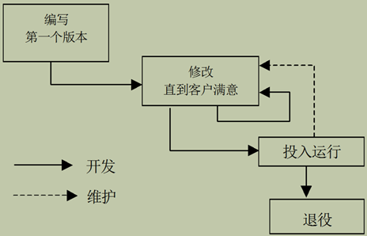
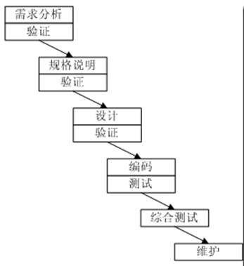
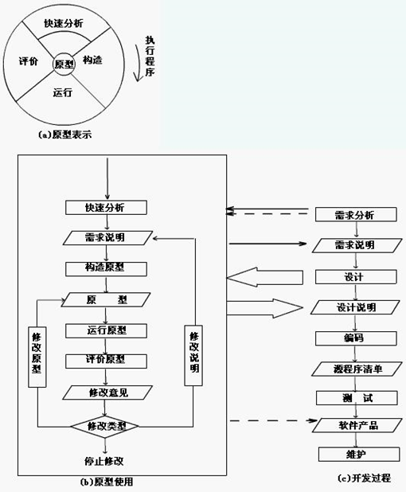
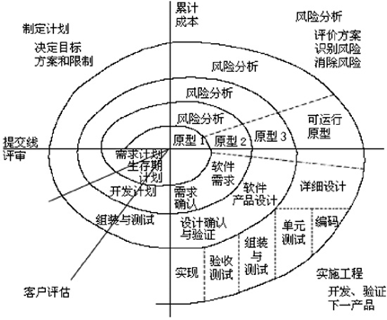
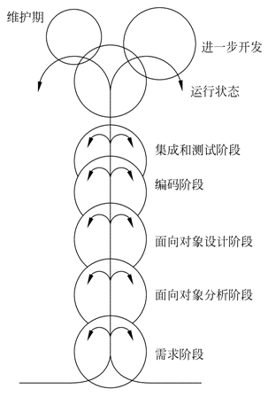
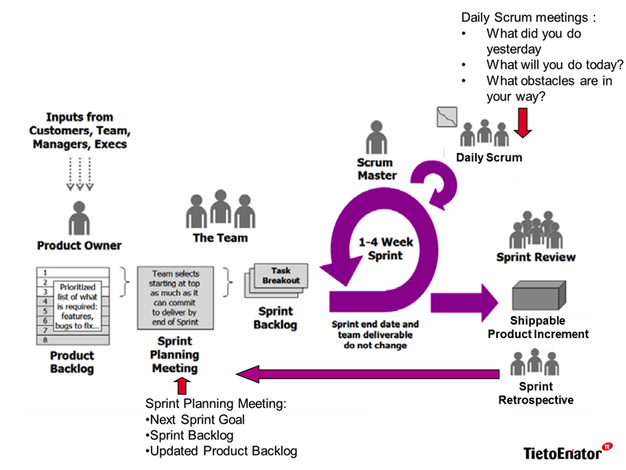
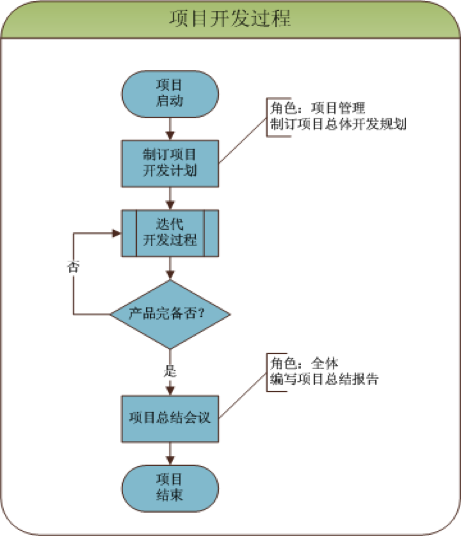
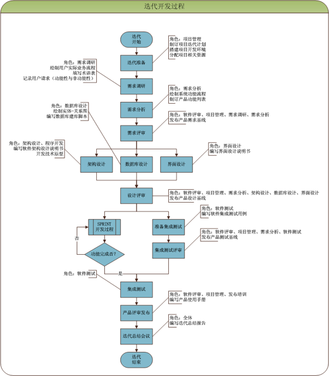
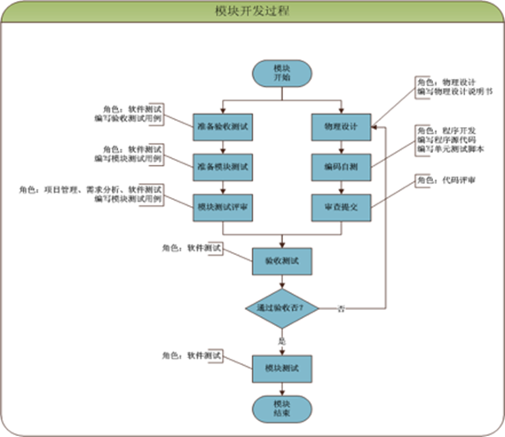

## 传统的软件过程
| 生命周期模型 | 强    项 | 弱    项 |
|---|---|---|
| 构造与调试模型 | 适合小程序，不需要维护的程序 | 几乎没有软件工程的概念，不适合任何稍大的程序 |
| 瀑布模型 | 有纪律的方法，文档驱动 | 交付的产品可能无法满足用户的要求 |
| 快速原型模型 | 快速体现用户需求，确保交付的产品满足用户的要求，非常适合界面和人机交互的系统的快速开发 | 原型通常只是一个参考。很多软件的原型很难做 |
| 增量模型 | 早期投入得到最大化的回报，提升可维护性 | 要求体系结构必须开放，可能退化为建造和调试模型 |
| 螺旋模型 | 结合上述的所有优点 | 只能用于大规模的内部产品，开发者必须有风险分析和回避的能力 |
| 喷泉模型 | 支持每个阶段内部的迭代以及阶段间的并行工作 | 可能退化为CABTAB（code a bit, test a bit） |

## 构造与调试

## 瀑布模型

## 快速原型模型

## 增量模型

## 螺旋模型

## 喷泉模型

## 敏捷开发
—个体和交互  胜过  过程和工具
—可以工作的软件  胜过  面面俱到的文档
—客户合作  胜过  合同谈判
—响应变化  胜过  遵循计划

## Scrum敏捷开发过程
步骤：项目开发——迭代——冲刺——模块
一次完整的项目开发过程由若干次迭代开发过程组成，每次迭代完成后将发布一个功能有限的软件产品，经历若干次迭代后，最终发布功能完备的软件产品。

一次迭代开发过程需要在需求稳定的前提下开展，分别经历需求分析、架构设计、数据库设计（可选）、界面设计、若干次冲刺开发过程，以及集成测试，最终发布产品

一次冲刺开发过程由若干次模块开发过程组成，本次冲刺中包含的所有模块开发完成后，本次冲刺开发过程结束。

一次模块开发过程需经历物理设计、编码自测、代码评审、验收测试、模块测试等活动，最终以通过模块测试为结束依据。

