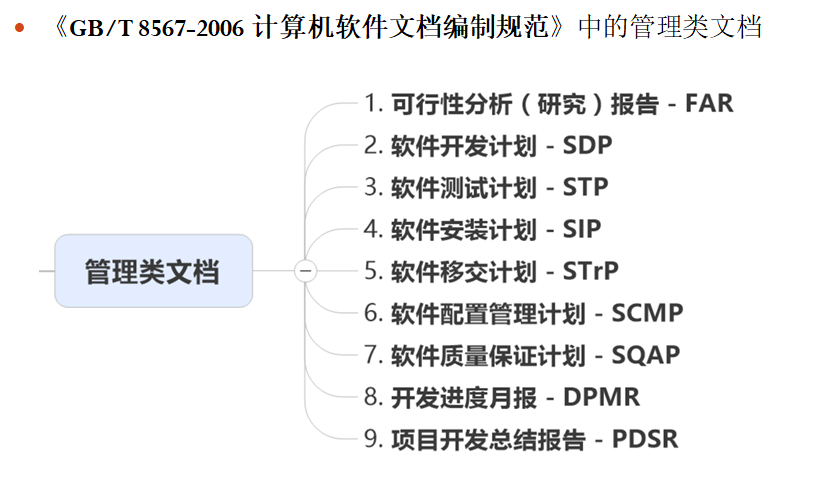

## 管理类文档的作用
软件开发阶段工作成果的体现。
把软件开发过程可视化
记录开发过程中的技术信息
掌握开发过程，控制开发质量和维护工作提供原始信息
提供团队内外之间相互沟通、协调的窗口，有利于把我软件的正确性和可用性。

## 管理类文档的分类

## 各类文档说明
### 《可行性分析报告FAR》
项目初期策划的结果，分析了项目的要求、目标和环境；提出了集中可供选择的方案；并从技术、经济和法律各方面进行了可行性分析。
建议内容包括：可行性分析的前提、可选方案、所建议的系统、经济可行性、技术可行性、法律可行性、用户使用可行性。
### 《软件开发计划SDP》
了解和监督软件开发过程、所使用的方法、每项活动的途径、项目的安排、组织及资源的一种手段。

建议内容包括：
* 《软件测试计划STP》
* 《软件安装计划SIP》
* 《软件移交计划STRP》
* 《软件配置管理计划SCMP》
* 《软件质量保证计划SQAP》
* 《开发进度月报DPMR》
* 《项目开发总结报告PDSR》