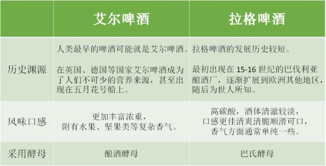

# 啤酒

## 1 基本介绍

啤酒（Beer）是一种以小麦芽和大麦芽为主要原料，并加啤酒花，经过液态糊化和糖化，再经过液态发酵酿制而成的酒精饮料。

啤酒的酒精含量较低，含有二氧化碳、多种氨基酸、维生素、低分子糖、无机盐和各种酶。其中，低分子糖和氨基酸很易被消化吸收，在体内产生大量热能，因此往往啤酒被人们称为“液体面包”。1L12°Bx的啤酒，可产生3344kJ热量，相当于3～5个鸡蛋或210g面包所产生热量，一个轻体力劳动者，如果一天能饮用1L啤酒，即可获得所需热量的三分之一。

### 按酵母分
世界公认的啤酒分类方法为两大类：顶部发酵（Ale 艾尔）和底部发酵（Lager 拉格）
* 顶部发酵（Top Fermenting / Top Fermentation，又称为Ale）。使用该酵母发酵的啤酒在发酵过程中，液体表面大量聚集泡沫发酵。这种方式发酵的啤酒适合温度高的环境16～24°C。
* 底部发酵（Bottom Fermenting / Bottom Fermentation，又称为Lager）。顾名思义，该啤酒酵母在底部发酵，发酵温度要求较低，酒精含量较低。这类啤酒的代表就是国内常喝的窖藏啤酒（Lager）。

艾尔啤酒发酵温度更高，大致在 16-24 °C，酵母大都在酒液的上层，且发酵时产生的泡沫较多；而拉格啤酒发酵温度更低，温度大多在 7-13 °C，酵母大都在酒液的底部，发酵时产生的泡沫较少。

一般来说，艾尔啤酒最佳适应饮温度是室温，啤酒的颜色越淡以及酒体越轻，适饮温度越低；拉格啤酒适饮温度较低，但博克啤酒（Bock）室温饮用口感最佳。
### 工艺分类
* 纯生啤酒采用特殊的酿造工艺，严格控制微生物指标，使用包括0.45微米微孔过滤的三级过滤，不进行热杀菌让啤酒保持较高的生物、非生物、风味稳定性。这种啤酒非常新鲜、可口，保质期达半年以上。
* 干啤酒 该啤酒的发酵度高，残糖低，二氧化碳含量高。故具有口味干爽、杀口力强的特点。由于糖的含量低，属于低热量啤酒。
* 全麦芽啤酒 酿造中遵循德国的纯酿法，原料全部采用麦芽，不添加任何辅料。生产出的啤酒成本较高，麦芽香味突出。
* 头道麦汁啤酒 即利用过滤所得的麦汁直接进行发酵，而不掺入冲洗残糖的二道麦汁。具有口味醇爽、后味干净的特点。
* 黑啤酒 麦芽原料中加入部分焦香麦芽酿制成的啤酒。具有色泽深、苦味重、泡沫好、酒精含量高的特点，并具有焦糖香味。

## 2 制造原料

啤酒以大麦芽﹑酒花﹑水为主要原料﹐经酵母发酵作用酿制而成的饱含二氧化碳的低酒精度酒。

现在国际上的啤酒大部分均添加辅助原料。有的国家规定辅助原料的用量总计不超过麦芽用量的50%。在德国，除出口啤酒外，德国国内销售啤酒一概不使用辅助原料。

## 3 产地品牌

* 青岛啤酒
* 西藏青稞酒
* 乌苏酒
* 雪花啤酒
* 燕京啤酒
* 哈尔滨啤酒

* 百威
* 喜力
* 科罗娜
* 嘉士伯
* 1664
* 小粉象

## 4 饮用口感

* 一打，12瓶

